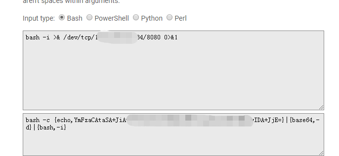
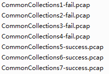

## JBoss 5.x/6.x 反序列化漏洞(CVE-2017-12149)

## 环境搭建

https://github.com/vulhub/vulhub/tree/master/jboss/CVE-2017-12149

附件pcaps 为分别用 ysoserial.jar 的 CommonsCollections1-7 根据下面工具利用反弹shell payload模拟attack 抓取的pcap。

## java.lang.Runtime.exec() Payload Workarounds 工具

[java.lang.Runtime.exec() Payload Workarounds 工具](http://www.jackson-t.ca/runtime-exec-payloads.html)

使用方法：

## 参考资料

[绕过exec获取反弹shell](https://blog.spoock.com/2018/11/25/getshell-bypass-exec/)

