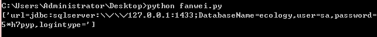

## 概述

攻击者可通过存在漏洞的页面直接获取到数据库配置信息。如果攻击者可直接访问数据库，则可直接获取用户数据，甚至可以直接控制数据库服务器。

## 复现

e-cology poc.py

## 影响范围

漏洞涉及范围包括不限于8.0、9.0版

## 修复建议

禁止访问/mobile/dbconfigreader.jsp这个页面

## 参考链接

[泛微ecology OA数据库配置信息泄露漏洞复现](https://mp.weixin.qq.com/s/u8GIfMBRZFAN3HANSSSgQA)

