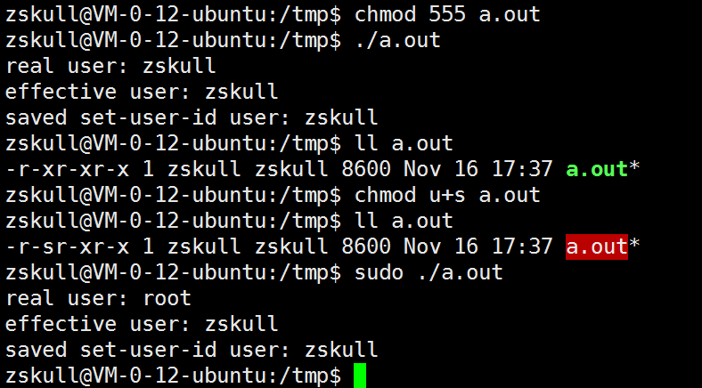

	
	/* sample1.c， 打印本进程的ruid, euid, suid */
	#include <stdio.h>
	#include <unistd.h>
	#include <sys/types.h>
	#include <errno.h>
	#include <string.h>
	#include <fcntl.h>
	#include <pwd.h>
	int main()
	{
		struct passwd* ruser = NULL;
		struct passwd* euser = NULL;
		struct passwd* suser = NULL;
		uid_t uid, euid, suid;
		/* get uid euid suid */
		if(getresuid(&uid, &euid, &suid) != 0)
		{
			perror(0);
			return 1;
		}
		/* get name of id */
		ruser = getpwuid(uid);
		printf("real user: %s\n", ruser->pw_name);
		euser = getpwuid(euid);
		printf("effective user: %s\n", euser->pw_name);
		suser = getpwuid(suid);
		printf("saved set-user-id user: %s\n", suser->pw_name);
		return 0;
	}

编译生成a.out

执行sudo  ./a.out， rid为登录用户，euid/suid和a.out文件的uid一致，此时进程虽然用sudo启动，但读写文件时只具有普通用户(euid: zskull)的权限： 

## reference

[Linux进程权限的研究——real user id, effective user id, saved set-user-id](https://blog.csdn.net/ybxuwei/article/details/23563423)