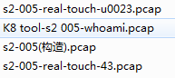

## 原理

s2-005漏洞的起源源于S2-003(受影响版本: 低于Struts 2.0.12)，struts2会将http的每个参数名解析为OGNL语句执行(可理解为java代码)。OGNL表达式通过#来访问struts的对象，struts框架通过过滤#字符防止安全问题，然而通过unicode编码(\u0023)或8进制(\43)即绕过了安全限制，对于S2-003漏洞，官方通过增加安全配置(禁止静态方法调用和类方法执行等)来修补，但是安全配置被绕过再次导致了漏洞，攻击者可以利用OGNL表达式将这2个选项打开。

```#``` ascii 转16进制是 0x23 ，unicode编码(\u0023)，23转8进制是43

[在线16进制转8进制](https://tool.lu/hexconvert/)

* S2-003 使用\u0023绕过s2对#的防御

* S2-003 后官方增加了安全模式（沙盒）

* S2-005 使用OGNL表达式将沙盒关闭，继续执行代码

## 环境

https://github.com/vulhub/vulhub/blob/master/struts2/s2-005/README.zh-cn.md

启动docker:

	docker run -d -p 8080:8080 --name s2-005 home_struts2

## 影响版本

影响版本: 2.0.0 - 2.1.8.1 漏洞详情: http://struts.apache.org/docs/s2-005.html

## 工具

K8tools S2-005 (带回显，命令执行)

## ids rules

如下两条规则可以命中sxf数据包和k8 tools数据包

	alert http any any -> any any (msg:"s2-005/CVE-2010-1870"; flow:to_server,established; content:"allowStaticMethodAccess"; content:"denyMethodExecution"; distance:51;  classtype:cve-exploit; sid:XXXXXX;)

	alert http any any -> any any (msg:"s2-005/CVE-2010-1870"; flow:to_server,established; content:"GET"; http_method; content:"MethodAccessor.denyMethodExecution"; http_uri;  classtype:cve-exploit; sid:XXXXXX;)

下面这条规则仅可命中post content_type application/x-www-form-urlencoded，数据包

	#alert http any any -> any any (msg:"s2-005"; flow:to_server,established; content:"allowStaticMethodAccess"; content:"denyMethodExecution"; distance:51; http_content_type; content:"application/x-www-form-urlencoded"; classtype:cve-exploit; sid:XXXXXX;)

