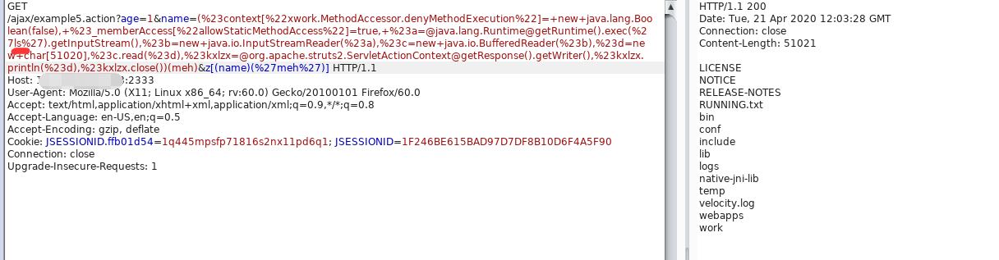

## 原理

Struts2对s2-003的修复方法是禁止#号，于是s2-005通过使用编码\u0023或\43来绕过；

Struts2对s2-005的修复方法是禁止\等特殊符号，使用户不能提交反斜线。

如果当前action中接受了某个参数example，这个参数将进入OGNL的上下文。所以，我们可以将OGNL表达式放在example参数中，然后使用/helloword.acton?example=<OGNL statement>&(example)('xxx')=1的方法来执行它，从而绕过官方对```#、\```等特殊字符的防御。

## 环境

https://github.com/vulhub/vulhub/tree/master/struts2/s2-009

	docker-compose up -d

docker 重命名容器

	docker rename home_struts2_1 s2-009


	docker run -d -p 8080:8080 --name s2-005 home_struts2


命令执行：



**注意**

用完s2-005用别的，得把原来的struts2镜像删除重新拉才好使(它是把对应版本的s2的war包复制到tomcat下再重新生成一个新的镜像，不删除旧的，重新build永远是原来的)，浪费了一下午时间 :)


## 数据包特征


 


这两句话的顺序可以随意调换。

## 影响版本

影响版本: 2.1.0 - 2.3.1.1

## 修复方法

修复方法就是，进一步减少ParameterInterceptor中白名单包含的内容，并且禁止参数名执行正则表达式

## 后记

1. 这个漏洞的利用方法，存在局限性，目标代码需要有一个私有成员变量可以直接通过http参数赋值。同时，攻击者需要知道
这个私有成员的名字。不过从代码审计的角度来看，先对容易发现这种问题。但是，由于大部分使用struts框架搭建的网站都是闭源
的，导致很难进行白盒测试。

2. 据说黑盒情况下，这个洞也不是限制特别大。只要在正常业务中找到传参的地方，就用该参数名可以试试。

3. 之前有人称findValue为struts中的eval函数，明显的有些狭隘了。
Ognl表达式才称得上是eval函数，在代码的编写的过程中要小心的处理它的表达式。

