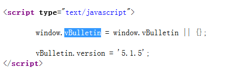
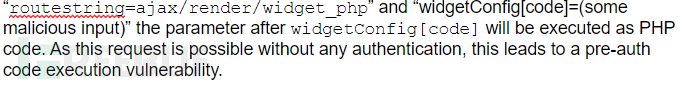
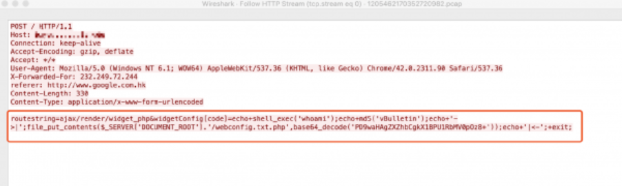
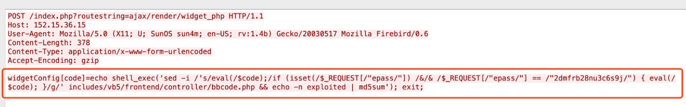
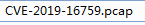

# CVE-2019-16759：vBulletin预认证远程代码执行漏洞

## 概述

vBulletin v 5.0.0版本中引入的一个Ajax渲染函数，而这个函数将引发PHP服务器端模板注入，并最终导致这个预认证远程代码执行漏洞出现。

目前，使用了vBulletin的网站数量大约有10万多个，其中包括很多大型企业、组织和论坛。但在fofa 下载 vBulletin 6000多个host，发现大多使用3.X-4.X，使用5.X的网站占样本少数。 

## 环境

	docker pull co0ontty/vbulletin_5.x_rce
	
	docker run -it -p 8080:80 -d co0ontty/vbulletin_5.x_rce

在网页中查看 版本：

根据资料代码审计，最后会走到 PHP eval()函数执行。 造成 代码执行漏洞。

使用params参数构造的请求如下：

下图显示的是攻击者尝试在目标服务器的Web根目录中创建一个名为“webconfig.txt.php”的文件：

下图显示的是攻击者尝试了覆盖bbcode.php文件：

## 影响版本

v5.0.0至v5.5.4

## 修复

[补丁](https://forum.vbulletin.com/forum/vbulletin-announcements/vbulletin-announcements_aa/4422707-vbulletin-security-patch-released-versions-5-5-2-5-5-3-and-5-5-4)

## 参考资料

[CVE-2019-16759：vBulletin预认证远程代码执行漏洞分析](https://www.freebuf.com/vuls/218880.html)

