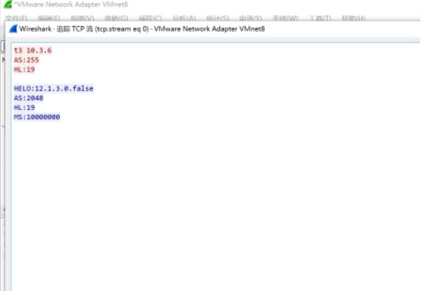

Weblogic在利用T3协议进行远程资源加载调用时，默认会进行黑名单过滤以保证反序列化安全。漏洞CVE-2019-2890绕过了Weblogic的反序列化黑名单，使攻击者可以通过T3协议对存在漏洞的Weblogic组件实施远程攻击，但该漏洞利用条件较高，官方也归类为需要身份认证。

这个漏洞需要满足以下两个条件，才能触发成功,较为鸡肋。

1.Weblogic开启t3协议

2.可以获取到SerializedSystemIni.dat文件

**但是在实际环境中，如果部署在weblogic的站点存在 任意文件下载 或者 任意文件读取 ，那么配合上该漏洞即可执行任意命令。**

## 影响版本

WebLogic Server 10.3.6.0

WebLogic Server 12.1.3.0

WebLogic Server 12.2.1.3

## 漏洞分析

漏洞代码位于weblogic.jar中weblogic.wsee.jaxws.persistence.PersistentContext.class文件，它的readObject函数调用了readSubject函数，readSubject函数中使用了ObjectInputStream.readObject来反序列化对象。


[参考链接](https://www.secpulse.com/archives/117343.html)

PersistentContext.java 调用了EncryptionUtil.java 进行解密。


weblogic.security.internal.SerializedSystemIni.class 告诉我们 

要构造 security 文件夹 , 与src同级目录, 并在其中放置 SerializedSystemIni.dat 文件。


SerializedSystemIni.dat 在 源码Oracle/Middleware/user_projects/domains/base_domain/security


	md5sum SerializedSystemIni.dat

	a50f1784f1f5b12cccb8b231d6b36223  SerializedSystemIni.dat

不同域下的 SerializedSystemIni.dat秘钥文件应该不同，docker容器内的此文件MD5一样，这可能是我后面在docker未复现成功的原因。

复制到宿主机

	docker cp weblogic_1:/root/Oracle/Middleware/user_projects/domains/base_domain/security/SerializedSystemIni.dat /home

**由于SerializedSystemIni.dat是密钥文件，各不相同且无法猜解，这里也就是这个漏洞需要身份认证的原因。**


weblogic每个数据域的加密方式是不同的，也就是说每个数据域下的加密文件只适用于当前数据域。

[Weblogic用户名密码获取](https://www.cnblogs.com/fx-blog/p/7418193.html)

## 复现

### docker 复现

复现失败，发t3数据包，没成功。恶意服务器未收到请求。可能是t3 默认无法穿透nat网络。

### 内网 linux 服务器复现

复现失败，此内网vps是上一步承载docker的环境，这次恶意服务器收到请求，但未成功执行命令，说明payload已经传递，报错日志见 附件 ```AdminServer.log```,推测可能是网络的问题。

### 内网 windows 个人pc复现

安装：

去Oracle官网下载Weblogic 10.3.6,选择Generic版本，各版本选择下载地址：http://www.oracle.com/technetwork/middleware/weblogic/downloads/wls-main-097127.html

Weblogic 10.3.6 下载地址：http://download.oracle.com/otn/nt/middleware/11g/wls/1036/wls1036_generic.jar

下载完成后，打开命令提示符，在命令提示符下使用下面命令安装64位的Weblogic：

	java -D64 -jar wls1036_generic.jar


复现成功。应该是我windwows笔记本不涉及nat网络。

vps恶意服务器开启监听：


**经测试，必须先发送T3协议头数据包，再发送JAVA序列化数据包，才能使weblogic进行JAVA反序列化，进而触发漏洞。如果只发送JAVA序列化数据包，不先发送T3协议头数据包，无法触发漏洞。**

用网上的t3 脚本发带有payload的t3数据包。

攻击机发送payload


靶机弹出计算器(多个，可能有bug)

## 数据包分析

这里分别抓取了二次攻击成功的数据包。

分别记录攻击机向靶机发送payload，靶机与恶意服务器通讯。

第一次实验数据包：


第二次实验数据包：


参考 https://mp.weixin.qq.com/s?__biz=MzUzNTEyMTE0Mw==&mid=2247483706&idx=1&sn=80c98ffda812e37a950cae914d745436&chksm=fa8b1ca2cdfc95b426b6437387c03b55f0f655bc09e18f22c613507895c0be7fd32005d60b03&scene=0&xtrack=1#rd
的数据包：



[**通过T3协议识别weblogic版本**](https://www.dazhuanlan.com/2020/01/06/5e12c56966860/)

## 参考资料

[手动安装weblogic](https://www.cnblogs.com/Jackie-Chen/p/10539660.html)

https://xz.aliyun.com/t/6904

http://gv7.me/articles/2019/cve-2019-2890-vulnerability-analysis/

[weblogic t3协议回显穿透nat以及获取内网地址](https://mp.weixin.qq.com/s?__biz=MzUzNTEyMTE0Mw==&mid=2247483706&idx=1&sn=80c98ffda812e37a950cae914d745436&chksm=fa8b1ca2cdfc95b426b6437387c03b55f0f655bc09e18f22c613507895c0be7fd32005d60b03&scene=0&xtrack=1#rd)

## 总结

这个环境搞了2天，踩了好多坑。以前weblogic都是用的docker，这次先使用docekr搭weblogic复现不成功。

于是乎第一次在物理机搭环境。最初在内网linux服务器搭建。 用jdk1.6和 weblogic war包 wls1036_generic.jar，搭建过程还算顺利。不一会搭建完了，修改配置文件 setDomainEnv.sh/setDomainEnv.cmd 配置 jdk 路径。 可是无法复现，网络流向为，攻击机->内网服务器靶机可达，靶机->攻击机不可达，靶机->恶意服务器可达。

仔细看了下网上复现成功的资料，都是在windows下安装weblogic，弹个计算器，于是乎在内网windows搭建一个环境。 攻击机->内网服务器靶机可达，靶机->攻击机不可达，靶机->恶意服务器可达。安装过程也算顺利，可视化界面安装，这里还有一个小坑，jdk 安装默认在 c盘 Program Files (x86) 下，运行weblogic的时候，因为jdk路径有这个括号，报错```:)```,windows下还是应该注意特殊符号和中文文件夹名称的问题。

疑问一：为啥在windows 个人pc下可以复现成功，在linux 内网vps上没有复现成功，是网络的问题吗?据说如果有nat，会出问题。

疑问二：还有t3发包结束后，为何恶意服务器还会收到靶机的请求，靶机会弹出多个计算器？是t3 脚本编写的问题吗？


第一次成功弹出计算器


第二次成功弹出计算器


