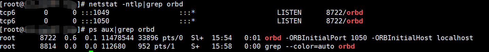
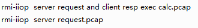

CORBA全称（Common ObjectRequest Broker Architecture）也就是公共对象请求代理体系结构，是OMG（对象管理组织）制定的一种标准的面向对象应用程序体系规范。其提出是为了解决不同应用程序间的通信(实现远程对象的调用)，曾是分布式计算的主流技术。

CORBA的数据传递与传统的序列化传输方式不同，即在二进制流中没有```ac ed 00 05```的标识，所以单纯从流量的角度是很难识别的，只能从流量上下文中进行识别。

CORBA用来进行数据传输的协议是什么:

GIOP全称（General Inter-ORB Protocol）通用对象请求协议。**GIOP针对不同的通信层有不同的具体实现，而针对于TCP/IP层，其实现名为IIOP（Internet Inter-ORB Protocol）。所以说通过TCP协议传输的GIOP数据可以称为IIOP。**而ORB与GIOP的关系是GIOP起初就是为了满足ORB（Object Request Broker）间的通信的协议。所以也可以说ORB是CORBA通信的媒介。(orb就是对象请求代理，充当客户端与服务端通信的媒介)

orba的iiop需要字节编写idl接口，并且编译成java类，比较麻烦，所以有了rmi-iiop，结合了rmi的优点，RMI-IIOP克服了RMI只能用于Java的缺点和CORBA的复杂性（可以不用掌握IDL)

Weblogic RMI和Web服务共用7001端口

可直接传入t3://或者rmi://或者ldap://等，JNDI会自动根据协议创建上下文环境

## 复现

代码：[rmi-jndi-ldap-jrmp-jmx-jms-master](https://github.com/longofo/rmi-jndi-ldap-jrmp-jmx-jms)

远程orbd服务 10.20.24.56：

	orbd -ORBInitialPort 1050 -ORBInitialHost ip



server、client 端 ip: 127.0.0.1

找到 rmi-jndi-ldap-jrmp-jmx-jms-master/rmi-iiop 代码，

server端 启动,client端启动，弹出计算器，抓包。

## 流量

server 请求 orbd , client 请求 orbd ，执行 class。 client 执行依赖于server。

未抓取客户端和服务端间的流量。

## reference

[weblogic-CVE-2020-2551-IIOP反序列化学习记录](https://www.cnblogs.com/tr1ple/p/12483235.html)


[rmi-jndi-ldap-jrmp-jmx-jms-master](https://github.com/longofo/rmi-jndi-ldap-jrmp-jmx-jms)


[Tutorial: Getting Started Using RMI-IIOP](https://docs.oracle.com/javase/8/docs/technotes/guides/rmi-iiop/tutorial.html#7738)

[漫谈-Weblogic-CVE-2020-2551](https://blog.csdn.net/shuteer_xu/article/details/105885420)

## 后记

linux 启动 orbd:

	orbd -ORBInitialPort 1050 -ORBInitialHost localhost

rmi-server 连接 orbd 服务时，java 一直报一个奇怪的错误：

	一月 07, 2022 3:34:43 下午 com.sun.corba.se.impl.transport.SocketOrChannelConnectionImpl <init>
	警告: "IOP00410201: (COMM_FAILURE) Connection failure: socketType: IIOP_CLEAR_TEXT; hostname: 10.10.20.136; port: 1049"
	org.omg.CORBA.COMM_FAILURE:   vmcid: SUN  minor code: 201  completed: No

一直没有找到ip和端口是哪来的。在linux执行 ```hostname -i``` 竟然返回：

	# hostname -i
	10.10.20.136

这个地址往往和ifconfig显示的ip地址不相同。

接着执行：```cat /etc/hosts```

	# cat /etc/hosts
	127.0.0.1   localhost localhost.localdomain localhost4 localhost4.localdomain4
	::1         localhost localhost.localdomain localhost6 localhost6.localdomain6
	10.10.20.136 ics_audit
	127.0.0.1   dblab

于是修改 ```/etc/hosts``` 文件中的ip地址为本机ip 10.20.24.56解决。




