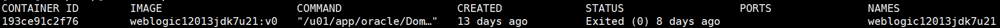

## weblogic docker build

[github WeblogicEnvironment](https://github.com/QAX-A-Team/WeblogicEnvironment)

	docker build --build-arg JDK_PKG=jdk-7u21-linux-x64.tar.gz --build-arg WEBLOGIC_JAR=fmw_12.1.3.0.0_wls.jar  -t weblogic12013jdk7u21:v0 .


	docker run -d -p 7001:7001 -p 8453:8453 -p 5556:5556 --name weblogic12013jdk7u21 weblogic12013jdk7u21:v0





针对weblogic T3 协议的漏洞：

**经测试，必须先发送T3协议头数据包，再发送JAVA序列化数据包，才能使weblogic进行JAVA反序列化，进而触发漏洞。如果只发送JAVA序列化数据包，不先发送T3协议头数据包，无法触发漏洞。**


## t3 协议特征

t3 开头

## java 序列化特征

java 序列化特征： wireshark 使用 "tcp contains ac:ed:00:05" 条件过滤出包含JAVA序列化数据的数据包

16进制 ```ac ed``` 开头。

目前看到的都是以 ```fe 01 00 00``` 结尾，不确定。

## 参考资料

[**修复weblogic的JAVA反序列化漏洞的多种方法 && weblogic T3数据包分析**](http://drops.xmd5.com/static/drops/web-13470.html)

[**weblogic T3协议（附python脚本）**](https://blog.csdn.net/he_and/article/details/97924679)

[【入坑JAVA安全】手把手教你写反序列化POC](https://blog.csdn.net/he_and/article/details/105531729)