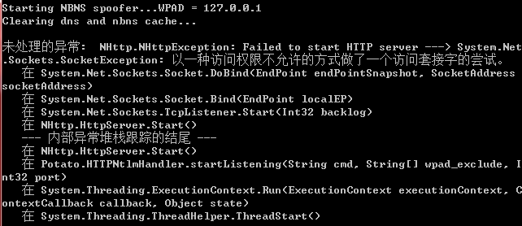

hot potato

https://github.com/foxglovesec/Potato   Latest commit20765f5on 13 Feb 2016

## potato 原理

在windows默认配置下进行本地权限提升。实际是利用了NTLM重放(更确切的说是HTTP->SMB重放)，和NBNS欺骗。利用这种技术，从最低权限提升到“NTAUTHORITY\SYSYTEM”-windows机器上的最高级别。获取对主机的高访问权限在渗透测试中都是至关重要的一步，并且通常都是以特殊的方式来完成的，因为没有已知的公开的exp或者技术能保证一定能完成这一步。

本exp组合的使用了一些微软大概2000年就知道的技术。但是不幸的是，如果不破坏向后兼容性，就很难对其进行修复，而且攻击者利用这些技术已经超过15年了。

该exp由3部分构成，每个部分都可以通过命令行中的相关参数进行配置。每一个部分对应一个已经被使用了多年的攻击。

http://blog.sina.com.cn/s/blog_406a91a00102xbrh.html

	Potato.exe -ip 192.168.1.84 -cmd "net localgroup administrators username /add" -disable_exhaust true

win7 失败

RottenPotato

https://github.com/foxglovesec/RottenPotato   Latest commit 9157e63 on 29 Dec 2017

不好用，vs2013 编译失败。直接执行原有的exe，因为没给说明文档。

RottenPotatoNG (RottenPotato 的迁移地址)

https://github.com/breenmachine/RottenPotatoNG

Juicy Potato本地特权提升工具（RottenPotatoNG加强版）

https://github.com/ohpe/juicy-potato        Latest commit 226b9d0 on 14 Jan 2019

https://www.freebuf.com/column/181549.html

## juicy-potato 概述

Juicy Potato是一个本地特权提升工具，是RottenPotatoNG的加强版。RottenPotatoNG及其变体利用了基于在127.0.0.1:6666上具有MiTM侦听器的BITS服务，以及当你拥有 SeImpersonate 或 SeAssignPrimaryToken 权限时的特权提升链。在Windows构建审核期间，我们找到了一个设置，其中有意禁用了BITS并使用了6666端口。

查看当前用户权限

	whoami /priv

[Rotten Potato - Privilege Escalation from Service Accounts to SYSTEM theory](https://foxglovesecurity.com/2016/09/26/rotten-potato-privilege-escalation-from-service-accounts-to-system/)

我们发现除了BITS之外，还有一些我们可以滥用的COM服务器。只需满足以下条件即可：

可由当前用户实例化，通常是具有模拟（ impersonation）权限的“服务用户”

实现IMarshal接口

以特权用户身份运行（SYSTEM，Administrator，…）

## reference

[cve-2019-1388复现+烂土豆+CVE-2019-0803](https://www.cnblogs.com/-zhong/p/12275922.html)

[WindowsElevation Public](https://github.com/Al1ex/WindowsElevation)