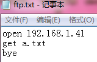
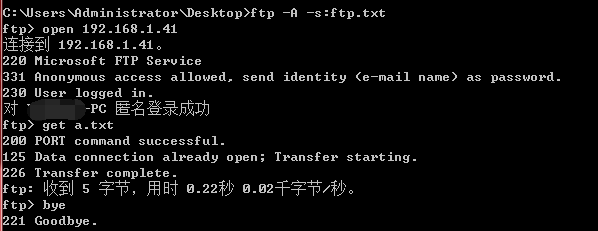

一个FTP的传输过程不仅仅只需要21一个端口，而是2个端口，21端口只是一个命令端口，其实另外还有一个数据端口

在主动模式中，FTP的两个端口是相对固定的，如果命令端口是x的话，那数据端口就是x-1，也就是说默认情况下，命令端口是21，数据端口就是20;

你把命令端口改成了600，那么数据端口就是599。

这样使用防火墙就很方便了，只要开通这两个端口就可以了，但是如果客户端是共享上网的话那岂不是不能正常使用FTP了，这样还是不行，一定需要被动模式。


在被动模式中就麻烦了些，默认情况下命令端口是21，但是数据端口是随机的，被动模式中数据端口的范围是可以自定义的，

以Serv-U 6.1.0.5版为例，在/Local Server/Settings/Advanced/中，这下好了，把被动模式中的端口范围也设置为20-20，

那么不管客户端使用何种模式来访问我的FTP，都只需要开通这两个端口了，

再加上SQL Server的1433，一台服务器总共才开了3个端口，这下应该比较安全了，装上防火墙。

<br><br/>

连接远程服务器，下载 a.txt

```echo open 192.168.1.41 >ftp.txt & echo get a.txt>>ftp.txt &echo bye>>ftp.txt```



```ftp -A -s:ftp.txt```


