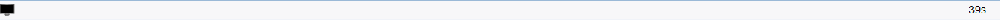
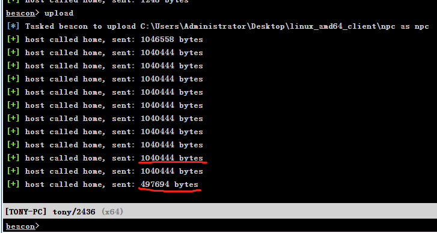

注册免费域名 

my.freenom.com

可能需要代理


http://freedns.afraid.org/


## dnscat2


git clone https://github.com/iagox86/dnscat2.git


	cd dnscat2

	cd server

gem是管理这些基于ruby程序的程序

	yum install gem

bundler是一个很好的管理ruby项目gems的工具。当然也是一个ruby gem.

	gem install bundler

如果报错 bundler requires Ruby version >= 2.3.0.

centos7 换源安装

	yum install centos-release-scl-rh

	yum install rh-ruby23  -y

	scl  enable  rh-ruby23 bash

	ruby -v

	bundle install

Could not locate Gemfile

生成一个新的Gemfile文件

	bundle init

Writing new Gemfile to /root/Gemfile

	bundle install

/opt/rh/rh-ruby23/root/usr/share/rubygems/rubygems/core_ext/kernel_require.rb:55:in `require': cannot load such file -- salsa20 (LoadError)


	yum install ruby-devel


**每次打开xshell后先切换ruby版本为ruby2.3，否则默认加载2.0版本**

	scl  enable  rh-ruby23 bash

	ruby -v

https://blog.csdn.net/localhost01/article/details/86591685


## centos 7 配置DNS (该方法失败)

	#更改主机名称
	# vi /etc/sysconfig/network
	# Created by anaconda
	NETWORKING=yes
	HOSTNAME=bigcloud.local
	#修改文件/etc/hosts,内容如下：
	127.0.0.1   localhost localhost.localdomain localhost4 localhost4.localdomain4
	::1         localhost localhost.localdomain localhost6 localhost6.localdomain6
	192.168.188.135  bigcloud bigcloud.localdomain
	#修改DNS配置
	# vi /etc/resolv.conf
	添加如下
	DNS1=192.168.188.11
	DNS2=192.168.188.12
	DOMAIN=bigcloud.local
	安装bind
	yum install bind

## VPS安装DNSmasq搭建自己的DNS服务器

	yum -y install dnsmasq

vim /etc/dnsmasq.conf

修改

	resolv-file=/etc/resolv.dnsmasq.conf

	listen-address=0.0.0.0, 0.0.0.0改成服务器公网IP


需要新建一个resolv.dnsmasq.conf文件,这个是配置上流DNS，也就是真正的大众DNS

	vi /etc/resolv.dnsmasq.conf

内容如次

	nameserver 119.29.29.29
	
	nameserver 1.2.4.8


service dnsmasq  start

如果是在内网搭建DNSmasq，不只可以进步解析速率，还可以有效的防备DNS绑架，完成屏蔽海报等功能。如果是在公网搭建DNSmasq，还可以对指定的域名解析hosts指向，从而制止DNS净化，完成fq。

没搭建成功..

## 实现工具及检测

DNS Tunneling从提出到现在已经有了很多的实现工具，历史比较早的有NSTX，Ozymandns，目前比较活跃的有iodine，dnscat2，其他的还有DeNise，dns2tcp，Heyoka等。不同工具的核心原理相似，但在编码，实现细节和目标应用场景方面存在一定的差异性。

目前已经提出了多种检测技术，例如通过请求和相应包的大小进行监测，通常dns tunneling为了取得较大的带宽，会选择构造尽量大的dns请求和响应。还可以通过分析一定时间窗口内所产生的FQDN数，通常DNS Tunneling的FQDN数在一定时间窗口内会远高于正常的DNS流量。另外在Detecting DNS Tunnels Using Character Frequency Analysis论文中，证明了还可以通过词频的检测识别DNS Tunneling的流量。根据Zipf定律，在自然语言的语料库里，一个单词出现的次数与它在频率表里的排名成反比。正常的域名也符合这个定律。而在这篇论文中，证明了DNS Tunneling中由于域名做了编码，不符合Zipf定律，整个分布趋于平稳。另外很多DNS Tunneling使用TXT记录类型发送请求和响应，而在正常的DNS网络流量中，TXT记录的比例可能只有1%-2%，如果时间窗口内，TXT记录的比例激增，那么也意味着存在异常。


https://www.cnblogs.com/bonelee/p/7651746.html


## cs 搭建dns 隧道

查看开放端口

	netstat -ntlpu

dns 要使用 53端口，如果53端口被占用，则不可用 cs搭建 dns隧道


## 原理

大致运作原理：

* teamserver为一个团队服务器，众多cs客户端连上它，以进行协同工作，里面有一个内置聊天室

* cobaltstrike为客户端工具，启动时需指定要连接的teamserver

* 在cobaltstrike工具上，生成一个木马（支持多种类型，如ps1、exe、java、dll、python等15种类型），扔到被控机上运行。（体现后渗透）

* 该木马定期给teamserver发送心跳，证明我还活着（默认一分钟一次，可修改）!同时根据teamserver回应的不同，判断teamserver是否有新任务。
* 如有，则再次请求任务明细，在被控机上执行后，返回回显给teamserver。


## 监听器

cs的核心点，就是监听器。监听器分两种：

* beacon cs内置监听器。也就是说，当我们在被控机上成功运行木马后，会弹回一个beacon shell给cs。

该shell所支持的通信协议主要包括这几种：dns,https,http,smb[pipe]
另外，beacon shell的其他内置功能也非常多

* foreign 主要是提供给外部使用的一些监听器。比如你想利用cs派生一个meterpreter shell回来，以继续后面的内网渗透，这时就选择使用外部监听器

## 具体使用

### 创建监听器

点击左上角的Cobalt Strike菜单   

选中Listeners
 
点击Add按钮会自动跳出监听器的配置框，选择一个监听器（如果创建dns隧道，需要选择beacon_dns/reserve_dns_txt类型的监听器）（前者传送的数据小后者传送的数据多）


设置好host（teamserver的ip）、端口，选择payload类型，后面会继续弹出一个框，填写在DNSPod

设置的teamserver域名，没有就填ip（一般用域名最好，不会变）

### 生成木马

Attacks菜单

选择Packages

选择Windows Excutable（表示Windows可执行文件，powershell当然更好，易过杀软）

Listener选择你创建的listener（注意如果是dns，选择括号带有dns的那个）

**如果靶机是win64位，当选择Use x64 payload时，可能会提示does not have an x64 stager！这时，可以考虑改为PowerShell方式！**

将生成的木马，扔到靶机上执行，即可上线


(1)Packages


HTML Application 　　　　　　 生成恶意的HTA木马文件；

MS Office Macro 　　　　　　  生成office宏病毒文件；

Payload Generator 　　　　　  生成各种语言版本的payload;

USB/CD AutoPlay 　　　　　　　生成利用自动播放运行的木马文件；

Windows Dropper 　　　　　　　捆绑器，能够对文档类进行捆绑；

Windows Executable 　　　　　生成可执行exe木马；

Windows Executable(S)　　　　生成无状态的可执行exe木马

(2)Web Drive-by（钓鱼攻击）


Manage　　　　　　　　　　　　 对开启的web服务进行管理；

Clone Site 　　 　　　　　　  克隆网站，可以记录受害者提交的数据；

Host File 　　　　　　　　　  提供一个文件下载，可以修改Mime信息；Host File 可以配合DNS欺骗实现挂马效果使用

PowerShell Web Delivery    类似于msf 的web_delivery ;

Signed Applet Attack 　　  使用java自签名的程序进行钓鱼攻击;

Smart Applet Attack 　　　　自动检测java版本并进行攻击，针对Java 1.6.0_45以下以及Java 1.7.0_21以下版本；

System Profiler　　　　　　　用来获取一些系统信息，比如系统版本，Flash版本，浏览器版本等。

(3)Spear Phish 　　　　　　用来邮件钓鱼的模块

(4)View

Applications　　　　显示受害者机器的应用信息；

Credentials　　　　 显示受害者机器的凭证信息，能更方便的进行后续渗透；

Downloads 　　　　　文件下载；

Event Log　　　　　 可以看到事件日志，清楚的看到系统的事件,并且团队可以在这里聊天;

Keystrokes　　　　　查看键盘记录；

Proxy Pivots　　　 查看代理信息；

Screenshots　　　　 查看屏幕截图；

Script Console　　 在这里可以加载各种脚本以增强功能，脚本地址：https://github.com/rsmudge/cortana-scripts

Targets　　　　　　　查看目标；

Web Log　　　　　　　查看web日志。


(5)Reporting　　　　　 主要就是出报告用的


### dns tunnel 环境搭建

1.购买了阿里云服务器一个，带公网ip，登录服务器控制台，将防火墙策略入站规则53端口打开:


2.购买了阿里云域名一个，并实名注册

3.dns 解析服务使用国外的免费dns解析平台 [cloudflare](https://www.cloudflare.com/)

4.在阿里云控制台-域名-管理，配置修改成 cloudflare 的 dns 服务器 


5.登陆 cloudflare 官网，添加购买的阿里云域名，并配置 A记录和NS记录：

A类型的内容里填写ip地址， NS记录填写自定义用于递归查询的dns。


这里也可以改成代理模式，用于别人ping 你的域名时隐藏ip,这里我用的默认的配置。


dig +trace 查询：

	dig +trace ns3.trumpclub.xyz


然而，dig +trace 有时是不准确的， 使用不存在的 域名有时也可以解析，不会报错，例如：

	dig +trace ns30.funnyboys.store


所以使用```nslookup```检查dns配置情况 ：


出现 ```0.0.0.0``` 即为配置成功。

**注意**

如果 nslookup 解析 配置 的ns记录 ```ns3.funnyboys.store 和 ns4.funnyboys.store```不成功，也可以试试用cs能否上线。有的时候，这里开始时解析未成功，但上线以后，解析成功了。

6.打开cs，我这里用的cs4.1，新建一个listener，


7.生成攻击载荷：

```Attack -> Web Drive-by -> Scripted Web Delivery (S)```


8.测试payload，```Attack -> Web Drive-by -> Manage  ```

会出现一个 Sites 页面：


在浏览器看是否可以访问：


9.接下来找一个纯净的靶机环境，用于抓取数据包，本机抓包会有很多干扰。

靶机运行payload:


等待1分钟左右，出现黑框：



此时的流量包：


这时可以尝试执行命令，否则等了很久没有自己上线(开始没有在Beacon输入命令以为是自己配置错误)。在Beacon 执行命令：

	shell whoami

等待1分钟左右，返回执行结果，并上线(cs输入命令时，它首先会自动 check in
再执行其他命令，这就是所谓的「直到有可用任务时才会 check in」)：


这一步也可以修改sleep时间快速上线：


10.


会有很多 AAAA 的Query


修改模式为 TXT 模式：


这里有点疑问，用TXT传输数据，也没有看到很多TXT Query。

1.修改 域名长度

https://www.cobaltstrike.com/help-malleable-c2


在C2_profile文件可以设置dns 域名最大长度。

据说DNS TXT通道将使用该值的100%；DNS AAAA通道将使用该值的50%；DNS A通道将使用该值的25%。

2.dns 隧道上线cs 拿不到外网ip


## cs 扫描端口

要加none 参数：


## cs 上传文件

	sleep 0

	upload

	选择需要上传的文件

上传速度较慢，一般在最后上传的字节数变少可以判断上传结束。



查看默认上传路径：


## 参考资料

https://klionsec.github.io/2017/12/28/cobalt-strike-dns/


https://blog.csdn.net/jpygx123/article/details/84075185


https://my.freenom.com/ 开启代理注册域名


打开 dnspod 配置 域名解析。

提示需要到域名注册处添加dnspod的域名解析。

在Freenom中，进入MyDomains -> Manage Domain -> Management Tools -> NameServers


参考资料

https://www.cnblogs.com/ssooking/p/6364639.html


https://www.cnblogs.com/ssooking/p/6365685.html

配置完无法解析host


https://www.cnblogs.com/ssooking/p/6017333.html


在 dnspod 配置dns 无法解析 自己添加的dns 服务器

客服说：把腾讯云域名作为dns服务器需要域名注册3年以上，且


在 https://dcc.godaddy.com/  配置 dns 也无法解析 自己添加的dns 服务器


下面这个没有尝试


## dns 隧道检测

通过请求和相应包的大小进行监测，通常dns tunneling为了取得较大的带宽，会选择构造尽量大的dns请求和响应。

还可以通过分析一定时间窗口内所产生的FQDN数，通常DNS Tunneling的FQDN数在一定时间窗口内会远高于正常的DNS流量。

另外在Detecting DNS Tunnels Using Character Frequency Analysis论文中，证明了还可以通过词频的检测识别DNS Tunneling的流量。根据Zipf定律，在自然语言的语料库里，一个单词出现的次数与它在频率表里的排名成反比。正常的域名也符合这个定律。而在这篇论文中，证明了DNS Tunneling中由于域名做了编码，不符合Zipf定律，整个分布趋于平稳。

另外很多DNS Tunneling使用TXT记录类型发送请求和响应，而在正常的DNS网络流量中，TXT记录的比例可能只有1%-2%，如果时间窗口内，TXT记录的比例激增，那么也意味着存在异常。


**https://freedns.afraid.org/**  待测试


**建立 http 隧道时，比如我要 用 2333端口，需要配置防火墙出站规则。开启2333，否则靶机不会上线。**

	添加出站端口规则
	
	firewall-cmd --zone=public --add-port=2333/tcp --permanent

	不关闭服务重载防火墙

	firewall-cmd --reload

## 参考资料

[**DNS 原理入门--阮一峰**](http://www.ruanyifeng.com/blog/2016/06/dns.html)

[smb beacon](http://blog.leanote.com/post/snowming/8b7ce0f84c03)

[踩坑记录-DNS Beacon](https://xz.aliyun.com/t/7938#toc-7)

## 后记

CloudFlare免费套餐限定了http/https能用的端口----[Identifying network ports compatible with Cloudflare's proxy](https://support.cloudflare.com/hc/en-us/articles/200169156-Identifying-network-ports-compatible-with-Cloudflare-s-proxy)

### dns直连模式

这里使用内网模拟。搭建dnsmasq。

10.10.27.88:

	yum install dnsmasq

	vi /etc/dnsmasq.conf

	log-queries
	log-facility=/opt/dnsmasq.log
	#address=/ns1.dnstest.com/10.10.27.89
	server=/dnstest.com/10.10.27.89
	conf-dir=/etc/dnsmasq.d,.rpmnew,.rpmsave,.rpmorig

dnstest.com 为随意设定的域名，将10.10.27.89绑定到域名上。 这样设置类似于泛解析。抓包会直接暴露内网的攻击机ip。


10.10.27.89:

	cat /etc/resolv.conf 
	nameserver 10.10.27.88

查看dnsmasq dns日志：

	tail -f /opt/dnsmasq.log