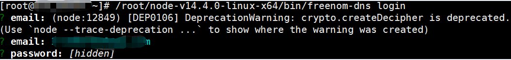
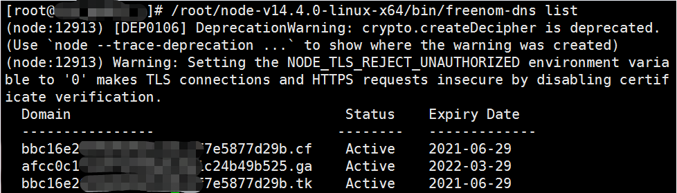

攻击阶段：权限维持

在软件中集成DGA（Domain Generation Algorithm）算法，产生速变域名，该方式作为备用或者主要的与C2服务器通信的手段，做到对感染肉鸡的持续性控制。由于传统DNS使用明文进行数据传输，造成严重的用户隐私泄露问题，DoT（DNS-over-TLS）、DoH（DNS-over-http）协议陆续通过RFC标准，用于保护用户隐私，但另一方面，加密DNS的使用将给DGA域名的检测带来新的挑战。

客户端通过DGA算法生成大量备选域名，并且进行查询，攻击者与恶意软件运行同一套DGA算法，生成相同的备选域名列表，当需要发动攻击的时候，选择其中少量进行注册，便可以建立通信，并且可以对注册的域名应用速变IP技术，快速变换IP，从而域名和IP都可以进行快速变化。

传统基于黑名单的防护手段无法起作用，一方面，黑名单的更新速度远远赶不上DGA域名的生成速度，另一方面，防御者必须阻断所有的DGA域名才能阻断C2通信，因此，DGA域名的使用使得攻击容易，防守困难。

Plohmann Daniel等人[3]对43个恶意软件家族做逆向分析，实现了DGA算法并对超过1亿个DGA域名做分析，结合WHOIS信息，统计出了不同DGA家族域名存活时间的分布。大部分dga域名的存活时间为1-7天。

https://github.com/360netlab/DGA

结合现有的域名，公网ip资源，写了一个简单的程序，模拟dga域名请求；

缩短域名的存活时间，同时灵活更换ip。

# **改动日志**

* 2021-09-07|<0.0.2>|

	1.修改了360lab的dga script(部分脚本不可运行进行了修复)，支持9个dga家族域名算法模拟

* 2021-04-01|<0.0.1>|

	1.配置文件可以配置访问域名的速率

	2.命令参数支持生成不同家族的dga算法

# 参考资料

[dga script来源](https://github.com/360netlab/DGA/issues/58)

[国外的dga seed算法程序集](https://github.com/baderj/domain_generation_algorithms/)

http://ocdman.github.io/2018/08/10/%E8%87%AA%E5%B7%B1%E5%8A%A8%E6%89%8B%E5%AE%8C%E6%88%90freenom%E5%8A%A8%E6%80%81%E5%9F%9F%E5%90%8D%E8%A7%A3%E6%9E%90/

npm install -g freenom-dns

/root/node-v14.4.0-linux-x64/bin/freenom-dns

