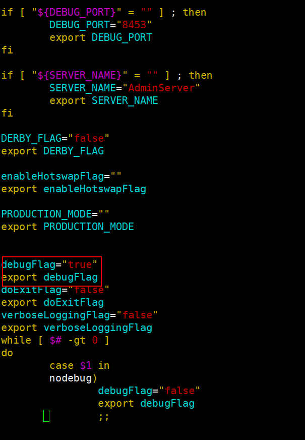
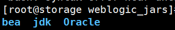
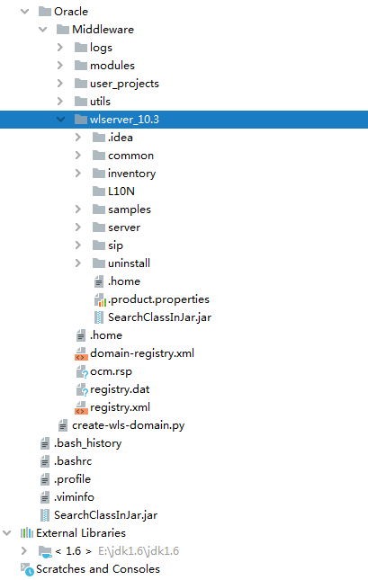
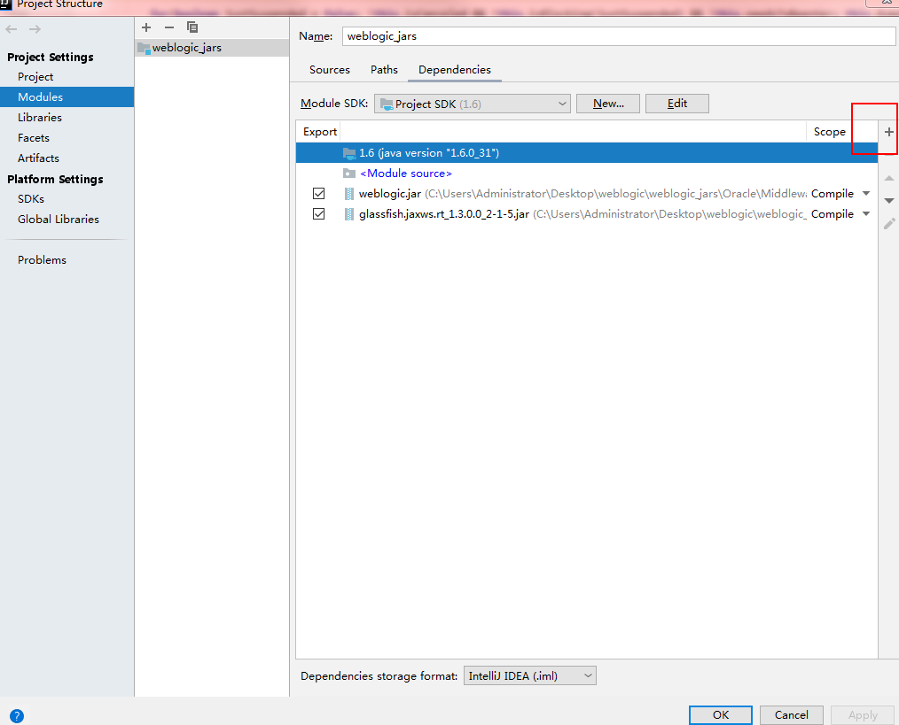
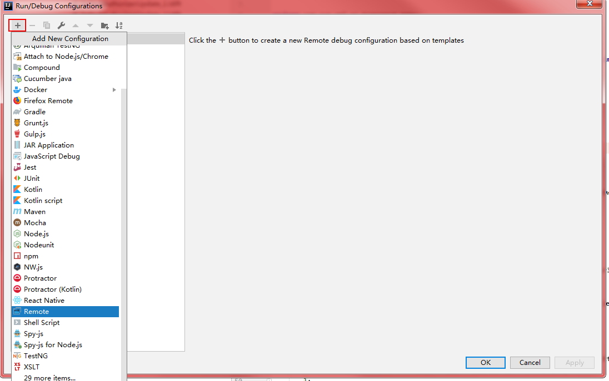
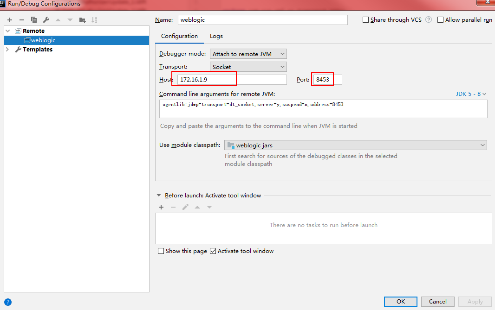
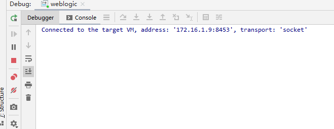
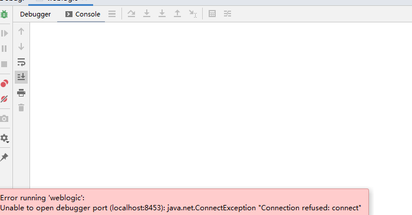

## docker远程调试

以 weblogic：10.3.6 (cve-2017-10271)为例。

## 环境搭建

docker: https://github.com/vulhub/vulhub/blob/master/weblogic/CVE-2017-10271

	vim docker-compose.yml

首先开启docker weblogic远程调试端口，可以设置任意端口，这里将docker的8453开启，作为weblogic服务器远程调试端口。

	version: '2'
	services:
	weblogic:
	image: vulhub/weblogic
	ports:
	- "7001:7001"
	- "8453:8453"


运行```docker-compose up -d```下载和启动镜像。

**```-d``` 是后台模式，不加为临时模式，可以看 debug信息。**

下载完成后进入docker容器，执行

	apt-get update

	apt-get install vim

 	vim /root/Oracle/Middleware/user_projects/domains/base_domain/bin/setDomainEnv.sh

添加两行代码

	debugFlag="true"
	
	export debugFlag 




然后 docker restart 容器id

远程调试需要保证本地和服务端代码完全一致。所以要把weblogic源码拷贝出来。

	docker cp 容器ID:/root ./weblogic_jars



用IDEA打开 Oracle/Middleware/wlserver_10.3/ 目录



在IDEA Libraries 添加jdk 1.6 （因为目标环境weblogic：10.3.6依赖jdk1.6，保持一致）

将 wlserver_10.3/server/lib/ 目录下的weblogic.jar build path，这样在IDEA里就可以查看源码并进入方法调试。

具体操作为：

File-Project Structure-Project Settings-Modules-Dependencies-右边有个"+"号，添加项目路径里的weblogic.jar。



接下来要添加远程服务器。IDEA右上角有个 Edit Configurations,点击进入，点左上角"+"号选择 Remote。



这里的Host填写远程docker服务器的ip,端口填写配置的debug端口。



配置完成后，开启debug,如果出现下图，表示配置成功。



如果出现下图，可能是docker未启动。或网络未连通。




## 其他资料

[使用 Idea 远程断点调试 Weblogic 服务器(非docker)的操作步骤](https://blog.csdn.net/defonds/article/details/83510668)