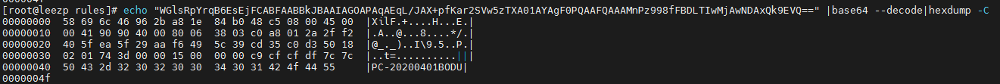

[hybrid blackmoon 分析](https://www.hybrid-analysis.com/sample/4a062335bd5d009a5ca0d1cdabfb1afee88eac26d79586eed302a9fd1e007440?environmentId=100)

	[{"seg_match":[{"ps":54,"pe":62},{"ps":62,"pe":64}],"seg_data":"WGlsRpYrqB6EsEjFCABFAABBkJBAAIAGOAPAqAEqL/JAX+pfKar2SVw5zTXA01AYAgF0PQAAFQAAAMnPz998fFBDLTIwMjAwNDAxQk9EVQ=="}]

	echo "WGlsRpYrqB6EsEjFCABFAABBkJBAAIAGOAPAqAEqL/JAX+pfKar2SVw5zTXA01AYAgF0PQAAFQAAAMnPz998fFBDLTIwMjAwNDAxQk9EVQ==" |base64 --decode|hexdump -C

## reference

[绿盟blackmoon 分析](http://blog.nsfocus.net/blackmoon-bank-trojan-sample-technical-analysis-report/)

[华为云blackmoon 分析](https://bbs.huaweicloud.com/forum/thread-189062-1-1.html)

https://baijiahao.baidu.com/s?id=1736847135395345825&wfr=spider&for=pc

[blackmoon 专杀工具](http://etc.xzit.edu.cn/7f/64/c3667a163684/page.htm)