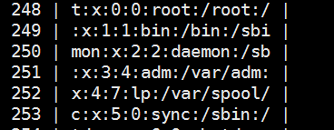
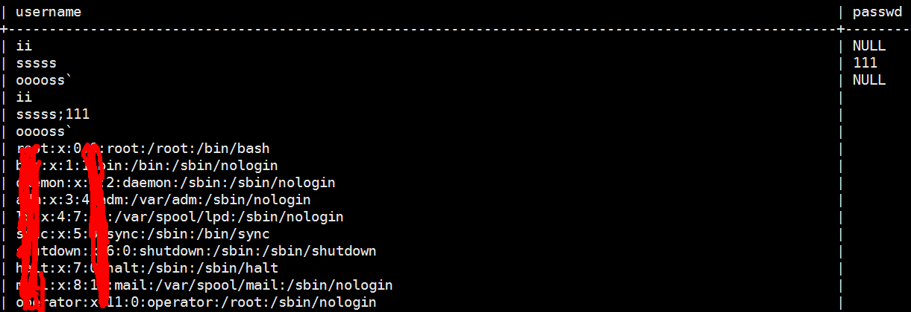
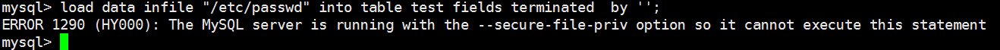
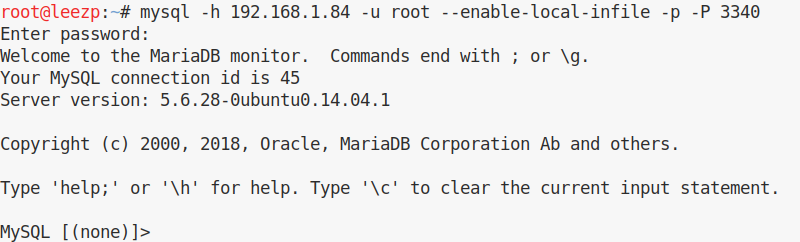
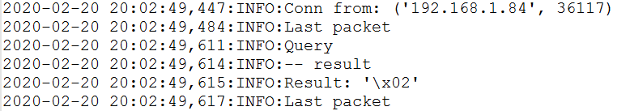
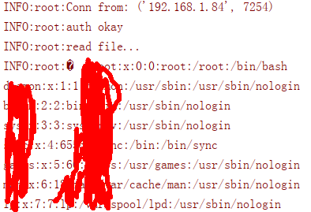

## 原理

[MYSQL官方文档中提到的潜在安全问题-Security Issues with LOAD DATA LOCAL](https://dev.mysql.com/doc/refman/8.0/en/load-data-local.html)


官方文档中提出的安全风险，<font color='red'>In theory, a patched server could be built that would tell the client program to transfer a file of the server's choosing rather than the file named by the client in the LOAD DATA statement.</font>


<font color='red'>"A patched server could in fact reply with a file-transfer request to any statement, not just LOAD DATA LOCAL"</font> 这句话意思是说伪造的服务端可以在任何时候回复一个 file-transfer 请求，不一定非要是在LOAD DATA LOCAL的时候。但如果想要利用此特性，客户端必须具有 CLIENT_LOCAL_FILES 属性即可以使用load data local infile，这也是为什么在前面kali连接mysql时需要添加--enable-local-infile的原因。


### 本地复现验证

创建一个用于测试的表：(注意不要有自增id列，否则那一列被占用且无法插入，会使插入的数据前几个字符被第一列吞掉)

在**kali**本地mysql测试，"users" 表示表名,```''```内为分割符，推荐不使用分隔符。

	load data local infile "/etc/passwd" into table users fields terminated  by '';

效果类似于,就很尴尬

select * from users;




所以新建一个test表：

	create table test(username varchar(100),passwd varchar(100));

插入数据：

	load data local infile "/etc/passwd" into table test fields terminated  by '';

select * from test;

整个/etc/passwd 都插入进来了，就很舒服



去掉 ```local```表示想加载服务端文件，因为我连的是本机127.0.0.1的mysql，所以客户端服务器是同一台主机，因为mysql设置的安全级别较高，不支持导入。




利用python或者其他语言伪造一个mysql服务器(开启监听)，这个伪造的mysql服务器可以不实现mysql任何功能（除了向客户端回复 greeting package外），当有别的客户端连接上该服务器时，就可以读取该客户端上的任意文件，前提是客户端具有该文件读写权限。

<br/>
<br/>


1.首先也是将脚本的监听端口改一下，然后再在filelist里加想要读的文件。

PORT 改为未被占用的端口。

filelist = (
	r'c:\windows\win.ini'
)

服务端我用的win7 , 执行 python rogue_mysql_server.py ,会在当前目录生成一个 mysql.log。

Mac 安装的 MySQL 版本默认没有开本地文件上传的功能，触发漏洞需要手动指定 --enable-local-infile 参数，测试环境kali默认开了

客户端我用的kali, mysql -h 192.168.1.84 -u root --enable-local-infile -p -P 3340

回车，密码随便输入。因为是伪造的服务器欺骗mysql客户端，没有校验密码。



连接成功，查看服务端 mysql.log 连接日志。



我的环境，服务端win7，客户端 kali，未复现成功，据说git脚本只在phpmyadmin成功。

别人理论的结果：


如果想抓包分析需要 关闭ssl,在客户端的配置文件的[mysql]节添加skip_ssl，或者关闭服务端的ssl支持。


## 修改别人的python ，自己构建socket

见 fake-mysqlserver.py

执行 ```python fake-mysqlserver.py```




## 参考链接

[本地测试未成功的git代码](https://github.com/allyshka/Rogue-MySql-Server)

[Mysql客户端任意文件读取](https://www.jianshu.com/p/3d26180268d7)

[Read MySQL Client's File](https://lightless.me/archives/read-mysql-client-file.html)


[2016/04/20 MySQL connect file read](http://russiansecurity.expert/2016/04/20/mysql-connect-file-read/)