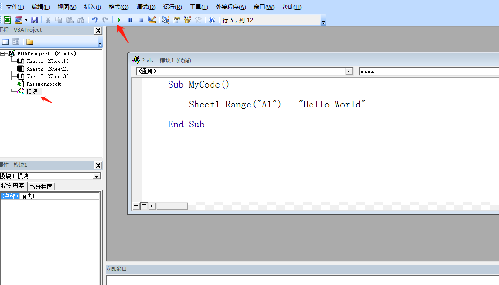
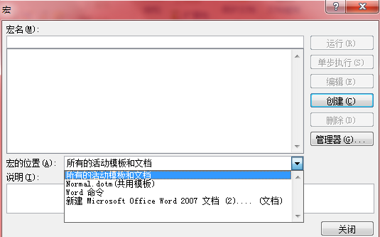
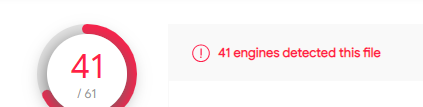
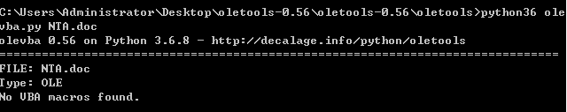
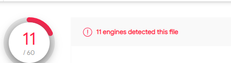
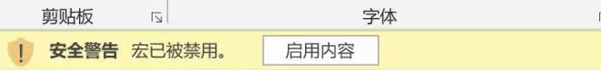
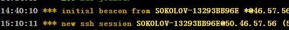
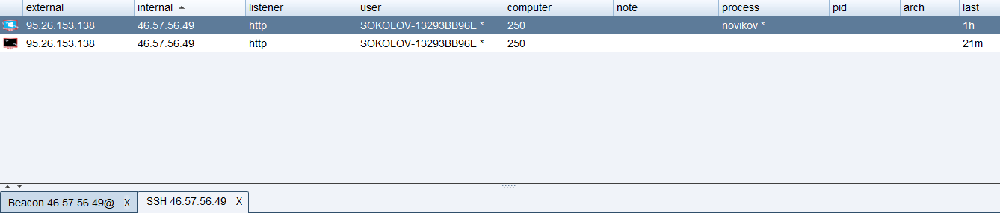

与传统的病毒相比，宏病毒的最新特色是它们不依赖操作系统。

宏病毒利用宏语言外部的例程的调用能力如使用Windows API函数，能进行任何操作。与传统的病毒相比，宏病毒的最新特色是它们不依赖操作系统。只要有应用程序支持解释，宏病毒无需改动可在许多平台上运行。例如Microsoft Word宏病毒能在任何安装过Microsoft Word的系统中运行（Windows3.1x,Windows 95,Windows NT,MAC等）。


打开 VB 编辑器 

方法一：从功能区打开。点击功能区—开发工具—Visual Basic 命令打开

方法二：快捷键打开。按「Alt + F11」打开。

方法三：从工作表查看代码命令打开。鼠标移动到任意一工作表名称处(如 sheet1),点击右键，在菜单中选择「查看代码」打开。

<br/>

点击 视图下拉菜单下的 立即窗口，打开 立即窗口

<br/>

office VB 视图界面重置：  点击 视图下拉菜单下的工程资源管理器  ，右键单击 VBAProject, 勾选 "可连接的"


在VBAProject 下新建 **模块1。**

写入代码
	
	Sub MyCode()
        
    	Sheet1.Range("A1") = "Hello World"

	End Sub

点击绿色的运行图标。在excel中查看 Sheet1工作表 A1 单元格已经写入了我们指定的内容。




	Sub DimTest()
    
	    Dim i As Integer '声明整数类型变量
	    
	    Dim name As String '声明文本类型变量
	    
	    Dim rng As Range '声明单元格类型对象
	    
	    Dim book As Workbook '声明工作簿对象
	    
	    name = "VBA 工作簿" '设置 name 变量的值
	    
	   
	    'book.name = name '设置工作簿名称
    
	End Sub


****
	
	
	Sub IfTest()
	
	    Dim i As Integer
	    i = 10
	    If i > 0 Then
	         MsgBox "我被执行了"
	    End If
	       
	End Sub
	
	
	Sub IfTest2()
	Dim i As Integer
	Dim sh As Worksheet
	    For i = 1 To 31
	        Set sh = Worksheets.Add  '新建一个工作表
	        sh.name = i
	    Next
	End Sub


**在视图，点击对象浏览器 可以查看VBA所有对象及属性**

#### Dim

Dim 是 Dimension(尺寸) 的缩写，用来声明代码中的变量。意思是我们告诉 VBA ，某一变量是文本还是数字还是单元格区域。


## EvilClippy


新建word，开发工具-宏，使用CS生成的VB宏代码。

**关于宏模板位置的选择，应选择当前文档(这里是```新建 Microsoft Office Word 97-2003 文档.doc```)，切记不要设置 "所有活动模板和文档" （等价于"Normal.dotm共用模板"），这样只会在本地全局宏触发，打开任意文档，自己上线，并不会使别人上线。**



VT查杀：



使用工具[EvilClippy](https://github.com/outflanknl/EvilClippy)进行免杀。

新建 a.vba：

	Sub Hello()
	Dim X
	X = MsgBox("Hello VBS")
	End Sub

执行：

	EvilClippy.exe -s a.vba a.doc

生成：```a_EvilClippy.doc```

如果报错，应使用工具 [olevba](https://github.com/decalage2/oletools) 检测是否添加了macro。

https://github.com/decalage2/oletools/wiki/olevba

如下是没检测到添加宏，原因是上面说的宏位置添加错了。

	error : put the macro in your normal.dotm template, not in the document


	
免杀后的文档VT查杀：



再用a.vba迭代包装一次，丢到VT，发现还是 11/60，说明迭代没用。

这时打开文档都会提示（宏默认是被禁用的）：



这里一般都是内容诱导，APT攻击了。

## 参考资料

[Cobalt Strike Spear Phish](https://evi1cg.me/archives/spear_phish.html)

[Evil Clippy: MS Office maldoc assistant--官方详细使用文档](https://outflank.nl/blog/2019/05/05/evil-clippy-ms-office-maldoc-assistant/)

[Office如何快速进行宏免杀](https://cloud.tencent.com/developer/article/1761344)

[Word宏钓鱼通过schtasks实现免杀](https://www.zhihuifly.com/t/topic/1241)

[**附件木马伪装的N种方法**](http://www.hackdig.com/07/hack-403619.htm)

[攻击者开始使用 **XLL** 文件进行攻击](https://www.freebuf.com/articles/network/320442.html)

## 后记

这篇文章[cobal strike 钓鱼----word宏木马（免杀）](https://www.cnblogs.com/nanjiangyue/p/14009407.html)未复现成功。

我的钓鱼邮件附件好像被丢到沙箱了，总是给我弄假上线，执行不了命令，且同一ip的beacon同时具备windows和linux环境。





后续待研究：

+  windows预览功能自动触发宏

+  如何判断靶机是否是假上线；

+  解压缩上线过火绒；

excel宏后缀名：

	.xla
	.xlam
	.xls
	.xlsb
	.xlsm
	.xlt
	.xltm
	.xll

payload 123.vba 为msf生成的msf上线载荷。


其中 ```.xll```是一种特殊格式的excel文件，由特殊工具[ExcelDna](https://github.com/Excel-DNA/ExcelDna)生成。

Microsoft Excel 提供了许多合法执行代码的方式，如 Excel 4.0 宏、DDE 和 VBA，这些都已经被攻击者滥用。


国外的EXCEL相关APT武器出售网站 https://warzone.ws/

Weaponization Thinking

[VB api](https://docs.microsoft.com/zh-tw/office/vba/api/excel.sheets.add)

	Sub ss()
	Dim sheet As Worksheet
	Set sheet = ActiveWorkbook.Sheets.Add(Type:=xlExcel4MacroSheet, After:=ActiveWorkbook.Worksheets(ActiveWorkbook.Worksheets.Count))
	End Sub

http://www.dzwebs.net/3067.html
