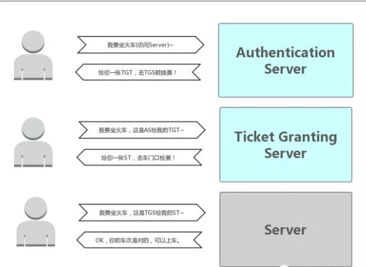
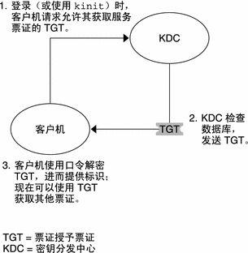
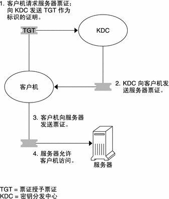
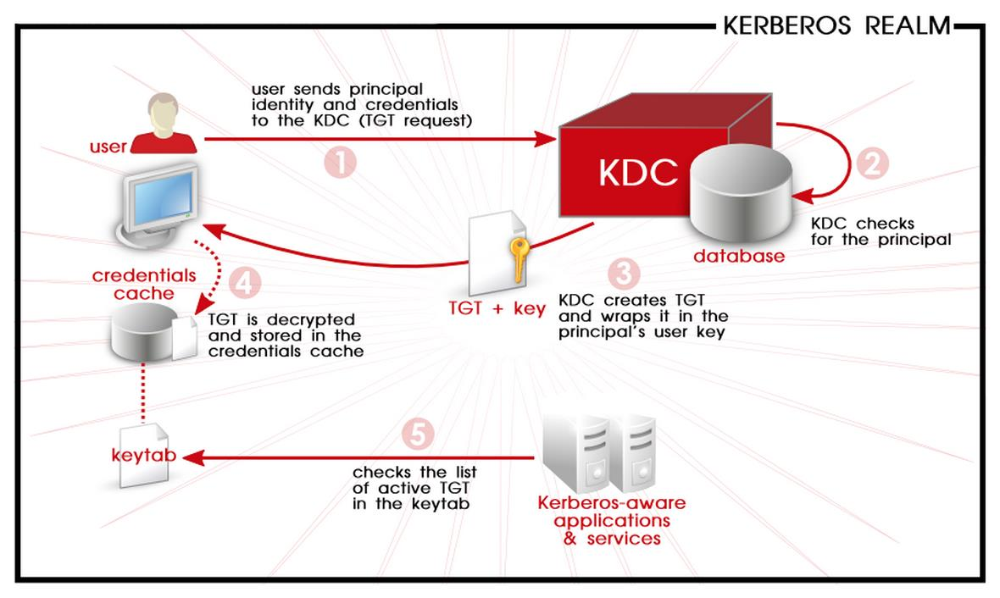
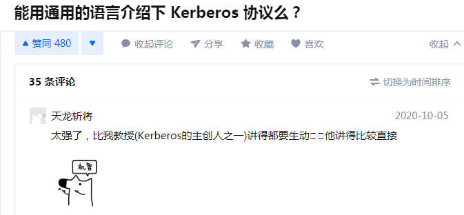

## 概述

Kerberos是由MIT创建的网络身份验证协议，它使用对称密钥加密来对用户进行网络服务身份验证，这意味着密码实际上从未通过网络发送。

因此，当用户使用Kerberos对网络服务进行身份验证时，试图监视网络流量来收集密码的未授权用户将受到有效阻止。

Kerberos 是一种网络认证协议，其设计目标是通过密钥系统为客户机 / 服务器应用程序提供强大的认证服务。该认证过程的实现不依赖于主机操作系统的认证，无需基于主机地址的信任，不要求网络上所有主机的物理安全，并假定网络上传送的数据包可以被任意地读取、修改和插入数据。在以上情况下， Kerberos 作为一种可信任的第三方认证服务，是通过传统的密码技术（如：共享密钥）执行认证服务的。

## 优点

Kerberos的主要设计目标是消除跨网络的未加密密码的传输。如果使用得当，Kerberos可有效消除数据包嗅探器会对网络造成的威胁。

Kerberos一个重要的优势在于它能够提供双向认证：不但Server可以对Client 进行认证，Client也能对Server进行认证。

## 缺点

尽管Kerberos消除了常见且严重的安全威胁，但由于多种原因，可能难以实施：

将用户密码从标准UNIX密码数据库（例如/etc/passwd或/etc/shadow）迁移到Kerberos密码数据库可能很乏味，因为没有自动机制可以执行此任务。

Kerberos与大多数Red Hat Enterprise Linux服务器使用的可插拔身份验证模块（PAM）系统仅部分兼容。有关此问题的更多信息，请参见第42.6.4节“ Kerberos和PAM”。

Kerberos假定每个用户都是受信任的，但在不受信任的网络上使用的是不受信任的主机。其主要目的是防止未加密的密码通过该网络传输。但是，如果除适当用户之外的任何人都可以访问颁发用于身份验证的票证的一台主机（称为密钥分发中心（KDC）），则整个Kerberos身份验证系统都将处于危险之中。

为了使应用程序使用Kerberos，必须修改其源代码以对Kerberos库进行适当的调用。以这种方式修改的应用程序被视为支持Kerberos或kerberized。对于某些应用程序，由于应用程序或其设计的大小，这可能会带来很多问题。对于其他不兼容的应用程序，必须更改服务器和客户端的通信方式。同样，这可能需要大量的编程。默认情况下，不支持Kerberos的封闭源应用程序通常是最成问题的。

Kerberos是一个全有或全无的解决方案。如果在网络上使用Kerberos，则任何传输到不支持Kerberos的服务的未加密密码都将受到威胁。因此，使用Kerberos不会使网络受益。要使用Kerberos保护网络，必须要么使用可传输未加密密码的所有客户端/服务器应用程序的Kerberos-aware版本，要么根本不使用任何此类客户端/服务器应用程序。

## Kerberos术语

credentials : 一组临时的电子凭证，用于验证特定服务的客户端身份。也称为ticket。

credential cache or ticket file : 一个文件，其中包含用于加密用户与各种网络服务之间的通信的密钥。Kerberos 5支持使用其他缓存类型（例如共享内存）的框架，但是更全面地支持文件。

KDC（Key Distribution Center : 密钥分发中心，发行Kerberos票证的服务，通常与票证授予服务器（TGS）在同一主机上运行。

authentication server (AS) 认证服务器 ： A server that issues tickets for a desired service which are in turn given to users for access to the service. The AS responds to requests from clients who do not have or do not send credentials with a request. It is usually used to gain access to the ticket-granting server (TGS) service by issuing a ticket-granting ticket (TGT). The AS usually runs on the same host as the key distribution center (KDC). 发行所需服务票证的服务器，该服务器又将票证发给用户以访问该服务。AS响应来自没有或没有发送凭据的客户端的请求。它通常用于通过颁发票据授予票证（TGT）来获取访问票据授予服务器（TGS）服务的权限。**AS通常与KDC在同一主机上运行。**  验证Client端的身份，验证通过就会给一张票证授予票证 TGT给 Client。

ticket-granting server 票证授予服务器(TGS) ： A server that issues tickets for a desired service which are in turn given to users for access to the service. The TGS usually runs on the same host as the KDC. 发行所需服务票证的服务器，该服务器又将票证发给用户以访问该服务。**TGS通常与KDC在同一主机上运行。** 通过 TGT（AS 发送给 Client 的票）获取访问 Server 端的票（Server Ticket，简称 ST）。ST（Service Ticket）也有资料称为 TGS Ticket。

ticket-granting ticket (TGT) ： A special ticket that allows the client to obtain additional tickets without applying for them from the KDC. 特殊票证，使客户端无需向KDC申请即可获得其他票证。

principal ： 使用Kerberos进行身份验证的用户或服务的唯一名称。A principal follows the form root[/instance]@REALM。(the root is the same as their login ID)。 域中的所有principal都有自己的密钥，对于用户而言，该密钥是从密码派生的，或者是为服务随机设置的。

一个用户会以一个独一无二的身份来被KDC认证，该身份被称为principal。一个Principal由三个部分组成：primary、instance、realm，其组成形式为primary/instance@realm。

	primary : 可以是OS中的username，也可以是service name；
	instance : 用于区分属于同一个user或者service的多个principals，该项为optional；
	realm : 一种使用Kerberos的网络，由一个或多个称为KDC的服务器和可能大量的客户端组成。Kerberos利用对称加密和受信任的第三方（即KDC, key distribution center）来鉴别要求使用网络服务的用户的身份。所有有KDC和secondary KDC管理的主机构成了一个域（realm）。

kinit ： kinit 命令允许已经登录的 principal 获取和缓存初始票证授予票证（TGT）。

keytab (or key table) ： 包含未加密的principals及其密钥列表的文件。服务器从keytab文件中检索所需的密钥，而不是使用kinit。缺省密钥表文件是/etc/krb5.keytab。KDC管理服务器/usr/kerberos/sbin/kadmind 是唯一使用任何其他文件的服务（它使用/var/kerberos/krb5kdc/kadm5.keytab）。

**Long-term Key/Master Key**：在Security的领域中，有的Key可能长期内保持不变，比如你在密码，可能几年都不曾改变，这样的Key、以及由此派生的Key被称为Long-term Key。对于Long-term Key的使用有这样的原则：被Long-term Key加密的数据不应该在网络上传输。原因很简单，一旦这些被Long-term Key加密的数据包被恶意的网络监听者截获，在原则上，只要有充足的时间，他是可以通过计算获得你用于加密的Long-term Key的——任何加密算法都不可能做到绝对保密。

**Short-term Key/Session Key**：由于被Long-term Key加密的数据包不能用于网络传送，所以我们使用另一种Short-term Key来加密需要进行网络传输的数据。由于这种Key只在一段时间内有效，即使被加密的数据包被黑客截获，等他把Key计算出来的时候，这个Key早就已经过期了。

以平时坐火车举例：

一个用户主要来自AS请求认证。AS 返回使用用户主体的 Kerberos密码加密 的TGT，该密码仅为用户主体和 AS 所知。用户主体使用其 Kerberos 密码在本地解密TGT，从那时起，直到ticket到期，用户主体可以使用 TGT 从 TGS 获取服务票据。服务票证允许委托人访问服务。

Kerberos 简单来说就是一个用于安全认证第三方协议，它采用了传统的共享密钥的方式，实现了在网络环境不一定保证安全的环境下，client 和 server 之间的通信，适用于 client/server 模型，由 MIT 开发和实现。

Kerberos 服务是单点登录系统，这意味着您对于每个会话只需向服务进行一次自我验证，即可自动保护该会话过程中所有后续事务的安全。

由于每次解密 TGT 时群集资源（主机或服务）都无法提供密码，因此它们使用称为 keytab的特殊文件，该文件包含资源主体的身份验证凭据。

Kerberos 服务器控制的主机，用户和服务集称为领域。

## Kerberos 验证过程

Kerberos 验证分为两个阶段：允许进行后续验证的初始验证以及所有后续验证自身。

1.初始验证：票证授予票证

客户端通过从密钥分发中心(Key Distribution Center, KDC)请求票证授予票证(Ticket-Granting Ticket, TGT)开始 Kerberos 会话。此请求通常在登录时自动完成。

KDC 可创建 TGT ，并采用加密形式将其发送回客户端。客户端使用其口令来解密 TGT 。

拥有有效的 TGT，只要该 TGT 未到期，客户机便可以请求所有类型的网络操作（如 rlogin 或 telnet）的票证。此票证的有效期通常为一天。每次客户端执行唯一的网络操作时，都将从 KDC 请求该操作的票证。

2.后续Kerberos验证

客户机收到初始验证后，每个后续验证都按下图所示的模式进行。

客户机通过向 KDC 发送其 TGT 作为其身份证明，从 KDC 请求特定服务（例如，远程登录到另一台计算机）的票证。

KDC 将该特定服务的票证发送到客户机。

客户机将票证发送到服务器。

服务器允许此客户机进行访问。

## 认证

KDC在整个Kerberos Authentication中作为Client和Server共同信任的第三方起着重要的作用，而Kerberos的认证过程就是通过这3方协作完成。**对于一个Windows Domain来说，Domain Controller扮演着KDC的角色。**KDC维护着一个存储着该Domain中所有帐户的Account Database（一般地，这个Account Database由AD来维护），也就是说，他知道属于每个Account的名称和派生于该Account Password的Master Key。

Kerberos的Authenticator实际上就是关于Client的一些信息和当前时间的一个Timestamp。

**Client通过自己的Master Key对KDC加密的Session Key进行解密从而获得Session Key**，随后创建Authenticator（Client Info + Timestamp）并用Session Key对其加密。**最后连同从KDC获得的、被Server的Master Key加密过的数据包（Client Info + Session Key）一并发送到Server端。我们把通过Server的Master Key加密过的数据包称为Session Ticket。**

当Server接收到这两组数据后，先使用他自己的Master Key对Session Ticket进行解密，从而获得Session Key。随后使用该Session Key解密Authenticator，通过比较Authenticator中的Client Info和Session Ticket中的Client Info从而实现对Client的认证。

Server维护着一个列表，这个列表记录着在这个可接受的时间范围内所有进行认证的Client和认证的时间。

在一个Domain中，一般通过访问同一个Time Service获得当前时间的方式来实现时间的同步。

**双向认证（Mutual Authentication）**

**Kerberos一个重要的优势在于它能够提供双向认证：不但Server可以对Client 进行认证，Client也能对Server进行认证。**

如果Client需要对他访问的Server进行认证，会在它向Server发送的Credential中设置一个是否需要认证的Flag。Server在对Client认证成功之后，**会把Authenticator中的Timestamp提出出来，通过Session Key进行加密**，当Client接收到并使用Session Key进行解密之后，如果确认Timestamp和原来的完全一致，那么他可以认定Server正是他试图访问的Server。

Session Ticket是Client进入Server领域的一张门票。而这张门票必须从一个合法的Ticket颁发机构获得，这个颁发机构就是Client和Server双方信任的KDC，同时这张Ticket具有超强的防伪标识：它是被Server的Master Key加密的。对Client来说，获得Session Ticket是整个认证过程中最为关键的部分。

这个认购权证在Kerberos中被称为TGT：Ticket Granting Ticket，TGT的分发方仍然是KDC。

### 认证过程

1、当用户在一个kerberos-aware网络中登录到他的workstation之后，authentication server将向KDC发送一个TGT请求（a request for a ticket-granting ticket），而他的principal将作为其中的组成部分。该请求可以由登录程序来负责发送（这样该过程对用户透明），也可以在用户登录后通过执行kinit来发送。

2、KDC在其数据库中检查该principal。

3、如果找到了该principal，则KDC将创建一个TGT，并用user key（user key并不是用户的密码，而是由用户密码计算而来，例如hash）进行加密，然后将加密后的TGT发送给该用户。

4、用户所在主机的Kerberos client的登录程序或者kinit程序在收到加密的TGT后，用该用户的user key进行解密。user key只会在client主机上被使用，绝不会在网络上传输。KDC发送的ticket将被保存在一个本地文件中（credentials cache），它可以被kerberized services查验。

5、用户的身份验证完成后，servers（运行着kerberized applciations & services）可以查验被识别的principals及其keys（这将被保存在keytab中），而不必用kinit来查验。

TGT有一个可设定的失效期（通常为10~24小时），这会被保存在client所在主机的credential cache中。在ticket过期之前，用户在请求kerberized services的服务时不需要再次输入用户密码，除非他们登出后再登录。

每当用户需要访问一个network service时，client会利用TGT向TGS（ticket-granting server）请求获得针对该特定网络服务的一个新的ticket。之后，用户可以利用该service ticket来向该network service实现authentication。

## 参考资料

[Kerberos 官方介绍](http://www.mit.edu/afs.new/athena/project/rhel-doc/5/RHEL-5-manual/Deployment_Guide-en-US/ch-kerberos.html)

[**能用通用的语言介绍下 Kerberos 协议么？**--知乎](https://www.zhihu.com/question/22177404/answer/492680179)

[看完您如果还不明白 Kerberos 原理,算我输](https://kknews.cc/code/nlgo8v8.html)

[Kerberos简介](https://www.anquanke.com/post/id/171552#h2-2)

## 后记

Kerberos认证服务器KDC安装在域控上，由AS和TGS组成。用户信息先发送给AS，由AS在AD数据库中查询是否有该用户记录，如果存在且信息吻合，就返回一个TGT。之后用户使用TGT向TGS请求Ticket，然后就能使用该Ticket访问特定服务了。