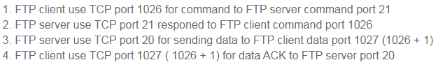
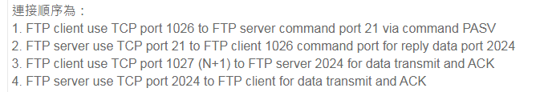
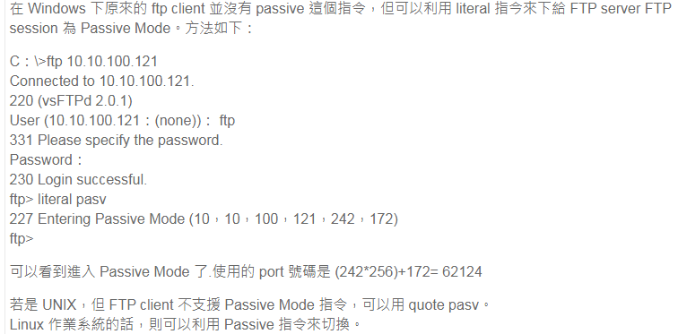

## FTP bounce

FTP跳转攻击（FTP bounce attack）是利用文件传输协议(FTP)中的一个设计缺陷。攻击者可能使用PORT命令来请求到端口的间接访问，通过使用受害机器作为一个请求中间人。这个技术能够被使用小心地来做端口扫描主机，和能够访问黑客通过直接连接不能访问的特定的端口。

ftp有2种工作模式，active和passive。

	FTP uses two ports, one for control and one for data. The client initiates a session on the server's control port (tcp:21), then the server initiates a session to the client from its data port (tcp:20). You just need to allow port 21 inbound, the port 20 session is established outbound to the requesting client.

active模式：

当两端需要传输资料时，client通过命令通道用一个```PORT``` command告诉server，client 可以用另一个TCP port做资料通道。然后server用port 20 和刚才client告知的TCP port建立连接。连接方向是 server->client 发送SYN包。然后client返回ACK包，并完成三次握手。

在active模式ftp client一开始会先使用一个大于 1023(N)的TCP port连接至ftp server的port 21，然后FTP client会打开该port的下一个数字的port(N+1)并发送至ftp server说期望下次沟通可以经由新的port(N+1)，这样比较不会占用到FTP server的port 21而影响别的FTP sessions，同时FTP server会使用port 20 连接至FTP client新发过来的port来传输资料。

所以在防火墙上需要打开：

	FTP server port 21 from anywhere # 给 FTP client 开始连接
	FTP server port 21 to port > 1023 # 给 FTP server 回应 client 命令
	FTP server port 20 to port > 1023 # 给 FTP server 开始资料传输
	FTP server port 20 from port > 1023 # 给 FTP client 传送data ACK给 server

连接顺序：



passive模式：

被动模式是对主动模式的优化，因为当client位于防火墙后面，server在外部无法建立与client的连接。

当两端需要传输资料时，client通过命令通道发送一个 ```PASV``` command 给server，server会找一个TCP port并告诉client，然后client用另一个TCP port呼叫server返回的TCP port建立资料通道。此时发送了SYN包。server返回ACK包，并完成三次握手。

被动模式，client打开2个port（N > 1023 及 N+1），使用第一个port连接至ftp server的port 21，并送出命令 PORT 让server连至 N port再送出 PASV 命令给server，这样会造成server使用一个大于1023的port连接至client并发出命令 PORT N(N>1023)给client，这样client会使用N+1 并开始传输资料。

这样子在防火墙上需要设定：

	FTP server TCP port 21 from anywhere # FTP client 开始连接至 FTP server
	FTP server TCP port 21 to port > 1023 # FTP server 回应 client 控制
	FTP server TCP port > 1023 from anywhere # FTP client 资料传输
	FTP server TCP port > 1023 to client port > 1023 # FTP server 回应资料 ACK 至client data port

连接顺序：






## ftp bounce

[FTP PORT bounce attack](https://www.rapid7.com/db/vulnerabilities/ftp-port-bounce/)

Description

	The FTP server is vulnerable to FTP bounce attacks. This vulnerability allows an FTP client to instruct the FTP server to make an outbound data connection to any IP and port, rather than restricting outbound connections back to the client's IP address only. This can be used to map and port scan any networks visible to the FTP server, possibly including internal networks not directly accessible to the attacker.
	
	FTP bouncing is such a popular and easy to exploit reconnaissance attack that tools such as nmap include an FTP bounce scan option.

## 后记

	主动 FTP :
	     命令：客户端>1023 -> 服务器21
	     数据：服务器20    -> 客户端>1023 

	被动FTP：
	     命令：客户端>1023 -> 服务器21
	     数据：客户端>1024 -> 服务器>1023

主动ftp对ftp服务器有利，但对客户端管理员不利。

## reference

[Active FTP vs. Passive FTP, a Definitive Explanation](https://slacksite.com/other/ftp.html)

[nmap_ftp.cc](https://gitee.com/mbw030714/nmap/blob/master/nmap_ftp.cc)

[浅谈FTP协议的工作方式](https://zhuanlan.zhihu.com/p/34109504)