## 查找域控

域内普通机器：

	net view /domain   //查AD域名

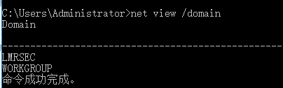

或

	set log           //查域控机器名

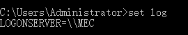

或

	net time /domain   //查域控机器名和AD域名

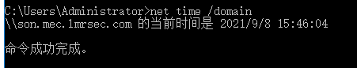

```son.mec.lmrsec.com``` 其中 son 为域控机器名，mec.lmrsec.com 为AD域名。从这里可以看出这里的域控疑似子域控。

域控：

	netdom query pdc  //查域控机器名

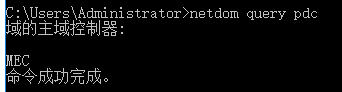

或

	net group "domain controllers"   //查域控机器名

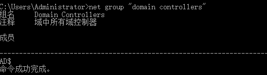

查域信任关系：

	nltest /domain_trusts

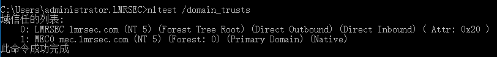

其他未验证：

1.通过srv记录

	nslookup -type=SRV _ldap._tcp.corp

2.使用nltest

	nltest /dclist:corp

3.使用dsquery

	DsQuery Server -domain corp

## 查域管用户 

	net group "domain admins" /domain

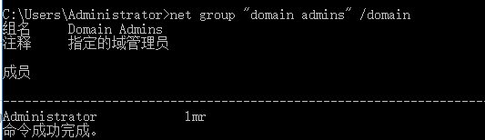

## 域控查看子域

在域控DNS管理器，主域控制器DNS服务器上看到子域的区域 mec:

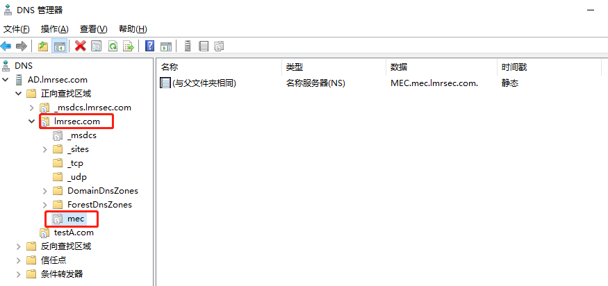


## reference

[Windows Server 2008 R2安装子域控制器](https://www.cnblogs.com/zoulongbin/p/6055523.html)

[Windows Server 2008 R2 主域控制器委派DNS到子域控控制器](https://www.cnblogs.com/zoulongbin/p/6068711.html)

## 后记

1.无法使用反向查找 nslookup，显示 unknown。

https://www.cnblogs.com/zoulongbin/p/6073217.html

2.计算机登录的时候显示的是netbios名：

查看netbios 名：

	nbtstat -n

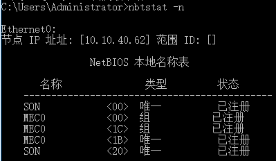

3.在渗透中最最实用的命令

	net user

	net user /domain

	net user tony
	
	net user /domain tony


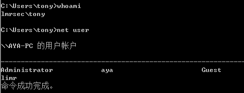

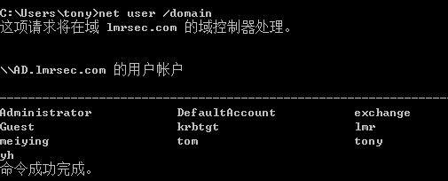

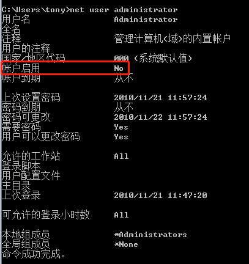

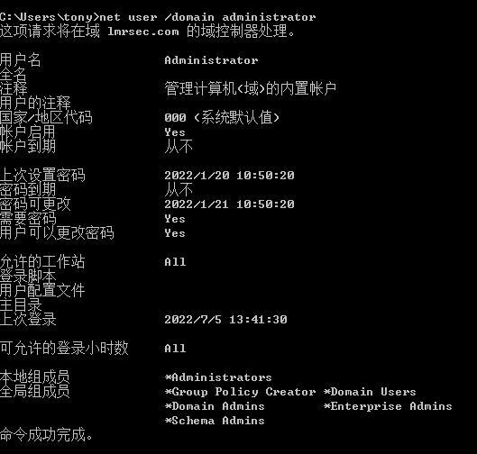

在计算机加入域时，系统自动把域管理员组domain admins加入到本地的administrators组中。

4.子域密码忘了，登录根域域管修改子域密码：

打开远程桌面设置：

https://blog.csdn.net/oXiaoWeiWuDi/article/details/123549052

点击 “ 用户账户”：

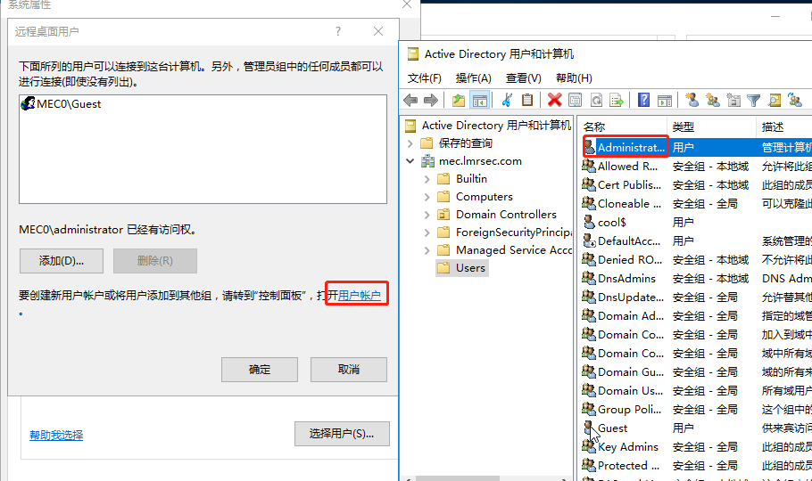

选择 administrator 用户 ，右击，

https://blog.csdn.net/h8178/article/details/78353889

点击重置密码，修改密码。